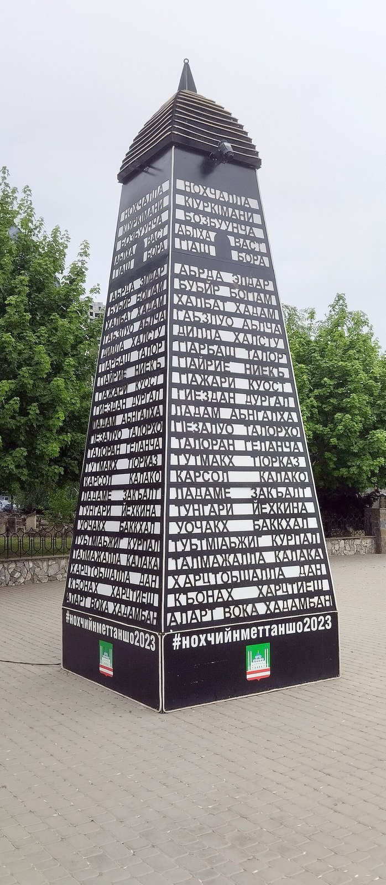

# 车臣／瓦伊纳赫传统信仰与苏菲祈福余绪（Chechen／Vainakh）

<!-- 来源：CC0 | https://commons.wikimedia.org/wiki/File:Chechen_tower_2023.jpg -->

## 概述

**车臣人（Chechens；自称 Nokhchiy）** 与 **印古什人（Ingush）** 合称 **瓦伊纳赫（Vainakh／Nakh）**，居于北高加索。公开民族志（everyculture／encyclopedia）指出：本土传统宗教具泛灵色彩，主神常称 **Deela／Dela（“神”）**，并有自然与庇护神祇、火塘崇拜与祖先崇拜；相信来世中祖先福祉与在世者行为相关，丧礼可分多阶段举行。历史上格鲁吉亚东正教曾在山区留下痕迹；近代低地车臣约十八世纪、印古什约十九世纪较大规模转向伊斯兰教，今日多数虔信 **哈纳菲逊尼派**，并以苏菲兄弟会（**tariqa**，公开叙述常及纳克什班迪与卡迪里／**Kunta-Haji** 传统）沿氏族网络传播与维系信仰，苏联压制反而强化了地下兄弟会组织。山地石塔（公开文化常称 **Galsh** 等塔楼景观）建筑、舞蹈与史诗歌唱是显著公共文化标志。本条目为教育概览；Loud Zikr 仅 **CONCEPT viewing**；hearth／funeral **HIGH SENSITIVITY**；**不提供**苏菲拜功口授、丧礼复现、血仇调解操作或任何可冒充穆里德指导的步骤。

## 核心观念（祈福 / 功德 / 祈祷如何被理解）

祈福常被理解为：在伊斯兰认主与高加索习惯法（adat）交织中，通过礼拜、纪念圣徒／谢赫（含 **Kunta-Haji** 传统记忆）、履行氏族与丧葬义务，求得护佑与尊严。功德贴近：款待、守信、维系家族名誉、在苦难记忆中坚持信仰与互助。访客的「福」体现为：把瓦伊纳赫传统看作仍活着的山地伦理与苏菲地方史，而非战争猎奇或“异教重建游戏”。

## 典型仪式

### 1. Loud Zikr 圈与 Kunta-Haji 苏菲公共层（概念／观礼）
- **场合**：主麻、斋月、地方谢赫纪念日；tariqa 在公开学术中被描述为沿氏族传播的虔修与互助网络；公开记述含响亮齐克尔圈（**Loud Zikr circle**）与 **Kunta-Haji** 卡迪里传统。
- **主要步骤（概念层）**：理解逊尼礼拜与苏菲师徒伦理的社会功能。**CONCEPT viewing only**；不提供齐克尔逐步操作或入会条件清单。
- **物品**：清真寺外观、山地村落风景。
- **谁来举行**：伊玛目、谢赫与信众；外人勿擅自闯入内部聚会；用户不可主持。

### 2. 火塘与多阶段丧礼（高度敏感层）
- **场合**：公开民族志所述之日后宴、二年／三年等阶段纪念；家族墓室（kash）传统；**hearth／funeral — HIGH SENSITIVITY**。
- **主要步骤（概念层）**：理解祖先福祉与在世道德相系、火塘伦理的观念。**仅概念层**；禁止描写可仿作的葬仪或性别化葬俗细节教程。
- **物品**：从略。
- **谁来举行**：家族；属内部义务。

### 3. Galsh 塔楼景观、舞蹈与史诗歌唱（公开文化层）
- **场合**：节庆、婚礼与公共文化展演；传统乐舞与池塘琴（pondar）伴奏的抒情／史诗歌唱；**Galsh** 等石塔作为山地景观符号。
- **主要步骤（概念层）**：观礼高加索式舞蹈与音乐、远观塔楼。可在公共场合礼貌欣赏。**不是**“祈福通关”。
- **物品**：石塔外观、手风琴／鼓乐与服饰。
- **谁来举行**：社区艺人与家庭；游客遵东道主安排。

## 日常与节庆

主麻、开斋、地方圣徒记忆与人生礼仪构成节奏；政治与流放历史使宗教—民族认同高度敏感。优先 everyculture、encyclopedia 民族志与 Britannica 族群条目。

## 注意与尊重

**勿把冲突新闻刻板印象投射到信仰实践。** 勿要求演示 Loud Zikr 或丧礼。神话重建材料（如现代对前伊斯兰神谱的整理）应标明为研究／复兴论述，不可当作游客可参与的“古教仪式”。摄影前征得同意。

## 手机互动适合度（Three.js 评估草稿）

- **档位：** B 仅氛围或图文场景
- **敏感度：** 中高
- **判断：** **仅氛围／无用户主持。** Galsh 石塔—山村风景与乐舞文化说明可做远观氛围；Loud Zikr／Kunta-Haji 仅 CONCEPT viewing；苏菲入会、齐克尔操作与多阶段丧礼／火塘属 HIGH SENSITIVITY，不宜做成可操作关卡。
- **若做成互动：** 只做可旋转／可走近的石塔—山谷风景与说明卡（Deela 观念史、苏菲地方史、乐舞简介）；不提供拜功、丧仪或兄弟会操作。
- **红线：** 禁止模拟 tariqa 入会、齐克尔课、丧礼复现或以真信仰宣言作通关。
- **评估状态：** 待后期统一评估

## 参考来源

- https://www.everyculture.com/Russia-Eurasia-China/Chechen-Ingush-Religion-and-Expressive-Culture.html
- https://www.encyclopedia.com/humanities/encyclopedias-almanacs-transcripts-and-maps/chechen-ingush
- https://www.britannica.com/topic/Chechen-people
