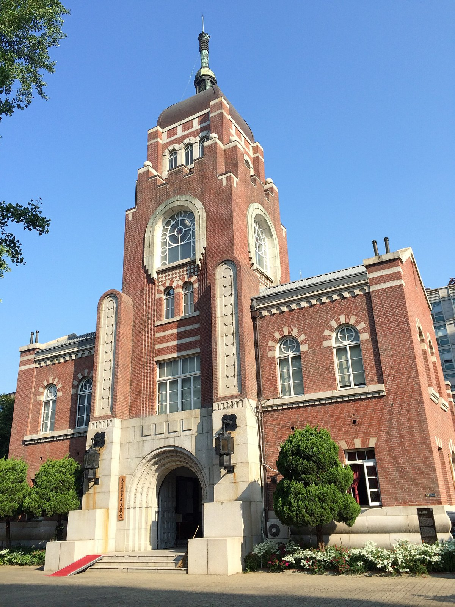

# 天道教（Ch’ŏndogyo／Cheondoism）

<!-- 来源：CC BY-SA 4.0 | https://commons.wikimedia.org/wiki/File:Cheondogyo_Jungang_Daegyodang.jpg -->

## 概述

天道教（韩语 Ch’ŏndogyo，亦作 Cheondoism）是朝鲜半岛本土宗教，前身为东学（Tonghak，“东方之学”），由崔济愚（Ch’oe Che-u）于 1860 年称受“天主”直接启示后创立，融合儒教、佛教、道教、萨满与部分天主教元素。教义视野聚焦于**在此世实现公义与和平**，并无“永恒奖赏”式来世结算的核心设定。第三任领袖孙秉熙于 1905 年提议改称“天道教”，以取代创始人所用的“东学”。核心命题是 **Innaecheon／In-Nae-Ch’ŏn（人乃天）**：人与神合一，须藉对自身身心统一及神之普遍性的真诚信仰来体认。东学信徒曾深度卷入 1894 年东学农民运动；创始人与第二任领袖崔时亨均因推动社会变革而遭当局处决。至二十世纪末，信徒约达数百万量级（百科记述）。本条目为教育性概览；**Sunday service viewing／daily devotion framing**；不提供咒文修炼口诀的操练手册。

## 核心观念（祈福 / 功德 / 祈祷如何被理解）

在天道教语境中，祈祷与奉献旨在**侍天、正心，并参与把公义与和平带到人间**。百科载明皈依者通过在祭坛上供清水的仪式（**ch’ŏngsu**）将自己献给神；应默想神、出门与返家时献祷（**kido**）、驱除贪欲等有害念头，并在周日于教会崇拜。开悟之路系于二十一字咒文（**21-syllable Jumun／chumun**）的持诵，其大意强调宇宙创造力充盈于我、天与我同在、不忘此理则万物可知——其中已含 **Innaecheon** 原则。功德更表现为**平等伦理、社会改革志向、日常诚心与周日集体崇拜**，而非秘传法术等级。

## 典型仪式

### 1. 清水奉献（ch’ŏngsu）— daily devotion framing
- **场合**：个人或家庭将自身献给神的标志性仪式。
- **主要步骤（概念层）**：在祭坛上安置清水，象征洁净与奉献。公开描述止于象征意义与 **daily devotion framing**，**不规定**可复现的坛场布置清单或秘传程序。
- **物品**：清水、祭坛。
- **谁来举行**：皈依信徒本人；应用侧不作用户主持通关。

### 2. 出入门祈祷（kido）与默想
- **场合**：每日离家与返家之际；以及日常对神的默想。
- **主要步骤（概念层）**：献祷、收心，去除贪与欲等念头。属生活化祈祷节律（教育 framing）。
- **物品**：无必需法器。
- **谁来举行**：信徒个人。

### 3. 周日教会崇拜与 21-syllable Jumun（viewing／概念）
- **场合**：周日集体崇拜；个人亦可持诵二十一字咒文作为开悟之路。
- **主要步骤（概念层）**：教会聚会敬拜；咒文内容强调天人合一与创造性力量，百科提供意译而不作密教口传。**Sunday service viewing**；教育性介绍**不训练**持诵次数、呼吸或“功效”操作。
- **物品**：教会空间；咒文文本（公开教义层面）。
- **谁来举行**：地方天道教教会与信徒；用户不主持教会礼仪。

## 日常与节庆

日常伦理要求正心、戒贪欲，并以清水礼与门前祷维持“侍天”意识。历史上海东学／天道教与朝鲜近代改革、农民运动及民族运动交织，理解仪式须回置于反等级、求平等的社会理想。今日韩国仍有天道教团体延续崇拜与社会参与；具体堂会实践因地而异。

## 注意与尊重

勿将天道教与韩国巫俗（musok）、基督教或统一教等新宗教混为一谈。清水礼与咒文是信仰实践，勿在未经邀请时模仿或舞台化。讨论东学运动时区分宗教仪轨与武装史事，避免把历史暴力美化为“仪式指南”。引用教义请依据可靠百科与学术概述，勿编造神谕。

## 手机互动适合度（Three.js 评估草稿）

- **档位：** B 仅氛围或图文场景
- **敏感度：** 中
- **判断：** **仅氛围／无用户主持。** Innaecheon／ch’ŏngsu／kido／Jumun 以 Sunday service viewing 与 daily devotion framing 呈现；咒文持诵不宜训练次数呼吸功效。勿在未经邀请时舞台化。
- **若做成互动：** 可不做操作关卡，只做可旋转/可走近的场景与说明卡。
- **红线：** 不以清水礼／咒文打卡为胜负；勿混同巫俗或编造神谕。
- **评估状态：** 待后期统一评估

## 参考来源

- https://www.britannica.com/topic/Chondogyo
- https://www.britannica.com/topic/In-Nae-Chon
- https://www.britannica.com/biography/Choe-Je-u
- https://www.britannica.com/event/Donghak-Uprising
- https://www.britannica.com/topic/Pochongyo
