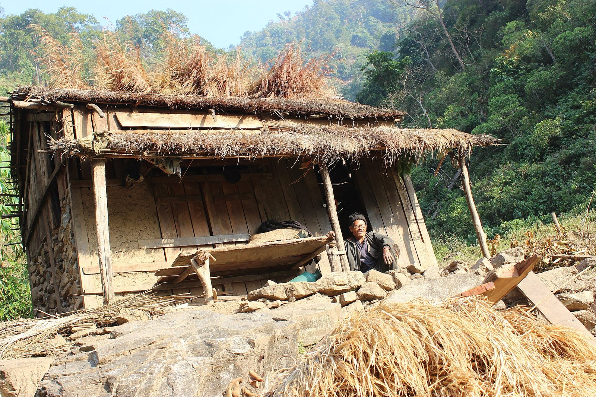

# 切庞传统信仰与山林祈福（Chepang）

<!-- 来源：CC BY-SA 3.0 | https://commons.wikimedia.org/wiki/File:Chepang_House.JPG -->

## 概述

**切庞人（Chepang）** 分布于尼泊尔中部丘陵，传统上与山林采集—农耕边缘生计相关。公开概述记述：传统宇宙含自然灵与祖先伦理；首获祭／初穗礼仪公开命名含 **Nwagi／Chonam**；**Pande** 萨满职分属 **CONCEPT ONLY — no ops**。今日并存印度教、基督教影响与公民身份议题；语言与土地权利是当代核心。本条目为教育概览；**不提供**献牲、萨满脚本或可冒充仪者的步骤。与坦芒、切庞邻近的帕哈里社群区分，补喜马拉雅缺口。

## 核心观念（祈福 / 功德 / 祈祷如何被理解）

祈福常被理解为：通过对山林灵力与祖先的敬意（含初穗／首获感恩叙事），并／或通过庙宇／教堂实践，求健康、食物与尊严。功德贴近：支持切庞语、教育与土地权利。访客的「福」体现为：不把「森林部落」写成落后刻板。

## 典型仪式

### 1. Nwagi／Chonam 初穗／首获祭（概念层）
- **场合**：农作／采集周期中的首获或初穗感恩公开记述（**Nwagi／Chonam first-fruits**）。
- **主要步骤（概念层）**：理解人对山林秩序与收成的敬意。**CONCEPT**；**禁止**复现祭仪或献牲。
- **物品**：从略。
- **谁来举行**：家庭与长者；用户不可主持。

### 2. Pande 萨满（高度敏感，仅概念）
- **场合**：疾病、危机与灵力叙事公开提及。
- **主要步骤（概念层）**：知晓 **Pande** 萨满职分存在。**CONCEPT ONLY — no ops**；**禁止**任何通灵／疗愈操作指引。
- **物品**：从略。
- **谁来举行**：被承认的 Pande（内部）；外人严禁扮演。

### 3. 印度教／基督教接触层与生命礼仪（概念层）
- **场合**：庙宇、教堂、出生／婚丧公开记述。
- **主要步骤（概念层）**：理解信仰光谱与社群祝福。**止于公开观礼／概念层**。
- **物品**：从略。
- **谁来举行**：各传统权威与亲族。

## 日常与节庆

优先尼泊尔中部丘陵公开文化／发展研究。Nwagi／Chonam 仅作文化命名。

## 注意与尊重

**勿强求萨满演示。** 禁止把贫困猎奇化。摄影须许可。Pande — no ops。

## 手机互动适合度（Three.js 评估草稿）

- **档位：** B 仅氛围或图文场景
- **敏感度：** 高
- **判断：** **仅氛围／无用户主持。** 山林生计与初穗命名可说明；Pande 萨满不可操作化。
- **若做成互动：** 只做语言—土地权利说明与丘陵外观。
- **红线：** 禁止献牲、萨满脚本、冒充仪者、贫困奇观。
- **评估状态：** 待后期统一评估

## 参考来源

- https://www.britannica.com/place/Nepal
- https://www.britannica.com/topic/ethnic-group
- https://www.britannica.com/place/Himalayas
