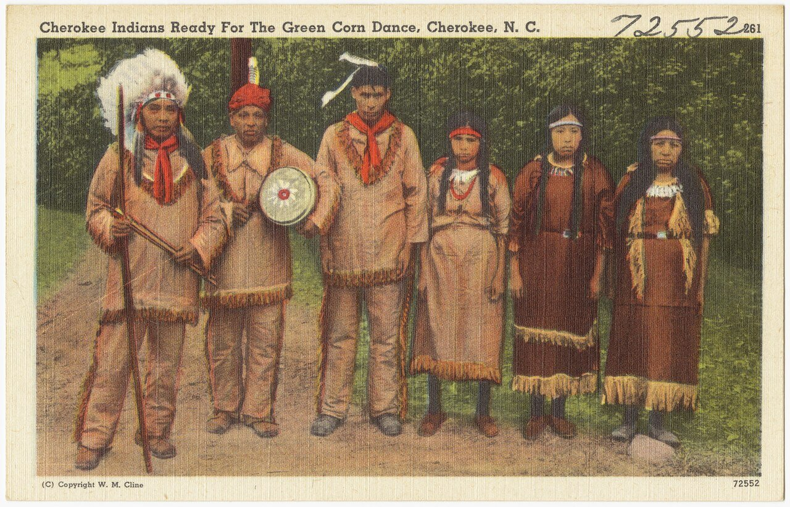

# 切罗基祈福与青玉米礼（Cherokee）

<!-- 来源：CC BY 2.0 | https://commons.wikimedia.org/wiki/File:Cherokee_Indians_ready_for_The_Green_Corn_Dance,_Cherokee,_N._C._(5755511285).jpg -->

## 概述

**切罗基（Cherokee，自称ᏣᎳᎩ／Tsalagi 等）** 是北美东南文化区的原住民民族，今有联邦承认的部落政府分布于俄克拉何马与北卡罗来纳等地。公开百科与民族志综述记述：传统宗教生活强调与造物、氏族、圣火与河川的关系；年度高峰之一是**青玉米礼（Green Corn Ceremony）**——在新玉米成熟时举行的净化、和解与更新庆典。另有 **Stomp Dance** 等广场舞蹈传统在当代部落生活中延续。许多礼仪知识仍属社群内部，本条目仅综合公开教育材料；**不提供**抓痕放血、致呕药饮、「下水」仪式操作、圣火重燃程序或可复现的医药／入会指引。

## 核心观念（祈福 / 功德 / 祈祷如何被理解）

祈福常理解为恢复个人与社群的平衡与和谐，使身体、家宅、议事火塘与人际关系重新洁净，从而迎接新一年的收成与公共生活。青玉米礼纪念玉米女 **Selu** 的馈赠叙事，并强调宽恕与和解（公开叙述中，除谋杀等极重事项外，节庆常伴随社会性更新）。功德贴近：在礼仪前清洁家园、和解争端、尊重氏族规范，以及服从当代部落对圣地与广场（stomp grounds）的管理。访客的「福」体现为不偷拍、不索要私密知识、不把圣火当作可玩道具。

## 典型仪式

### 1. 青玉米礼／Green Corn（公开教育层）
- **场合**：约在七月末至八月新玉米可食之时；传统上可持续数日。
- **主要步骤（概念层）**：公开综述提及斋戒与净化、清扫家宅与广场、熄灭旧火并重燃圣火、舞蹈歌唱、和解，以及之后共享新玉米的筵席。**止于公开教育概述**；不展开抓痕、致呕药或「下水」操作细节。
- **物品**：议事／广场火塘、新玉米、节庆场地。
- **谁来举行**：切罗基社群与礼仪负责人——非外部游客主持。

### 2. Stomp Dance 与广场聚会（当代公共／社群层）
- **场合**：部落 stomp grounds 上的夜间舞蹈与社交—礼仪聚会；对访客是否开放因场地与主办方而异。
- **主要步骤（概念层）**：围火而舞、歌唱、社群团聚。若获邀，严格服从着装、摄影与行为规定。**不提供**舞步教材冒充宗教授权。
- **物品**：广场、火、响壳等公开可见物。
- **谁来举行**：地主社群。

### 3. 水与净化观念（概念层）
- **场合**：重大礼仪前后；公开文献常概括「going to water」等净化主题。
- **主要步骤（概念层）**：仅说明「流水被理解为更新与力量的来源」这一文化事实。**禁止**把抓痕放血、药饮致呕写成可跟做步骤。
- **物品**：河流／溪流象征（概念）。
- **谁来举行**：社群成员在自身传统中进行——外人不得自行「体验式复刻」。

## 日常与节庆

当代切罗基生活同时包含基督宗教与本土礼仪复兴；博物馆（如 Museum of the Cherokee People）提供公共教育，但博物馆不等于礼仪许可。认识「泪水之路」等历史创伤时应保持庄重，勿将文化简化为赌场或观光符号。

## 注意与尊重

**勿购买或售卖**「切罗基仪式套装」。勿在未获部落许可时进入 stomp grounds 核心或拍摄圣火。勿模仿抓痕、致呕或宣称掌握医药人知识。勿把塞卢神话改编成可通关的「收获游戏」而不标注虚构致敬。涉及血量子、公民身份与部落主权议题时，以各部落政府表述为准，本档案不代言。

## 手机互动适合度（Three.js 评估草稿）

- **档位：** A 不可做成关卡
- **敏感度：** 高
- **判断：** 青玉米礼与 stomp grounds 涉及圣火、净化与社群和解，属原住民限制性知识与活态主权实践；公开教育可以文字介绍，但不应做成可操作关卡或「完成净化」胜负。与纳瓦霍祝福道、霍皮等条目一致，取 A。
- **若做成互动：** 不提供操作步骤。最多静态说明卡／地图级文化定位（非仪式复现）。
- **红线：** 禁止模拟圣火重燃、抓痕放血、致呕药饮、「下水」仪轨、Stomp Dance 通关，或以 Green Corn／切罗基真仪名称作胜负。
- **评估状态：** 待后期统一评估

## 参考来源

- https://www.encyclopedia.com/environment/encyclopedias-almanacs-transcripts-and-maps/cherokee-religious-traditions
- https://encyclopediaofalabama.org/article/green-corn-ceremony/
- https://kids.britannica.com/students/article/Cherokee/319437
- https://kids.britannica.com/kids/article/Cherokee/352944
