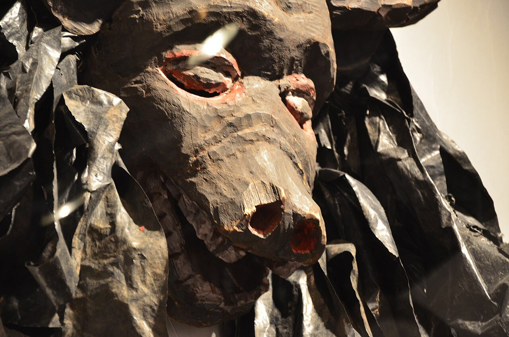

# 切瓦／尼奥与古勒瓦姆库鲁（Nyau／Gule Wamkulu）

<!-- 来源：CC BY 2.0 | https://commons.wikimedia.org/wiki/File:Gule_Wamkulu_mask.jpg -->

## 概述

**切瓦人（Chewa／Nyanja）** 主要分布于马拉维、赞比亚与莫桑比克。大英百科与联合国教科文组织记述：在切瓦母系社会传统中，男性秘密会社 **Nyau（尼奥）** 负责青年入会与公共道德教化；其核心公开可见形式为假面祭舞 **Gule Wamkulu（大舞／伟大之舞）**，教科文组织称为与祖先／灵界沟通的「大祈祷」（公开表述中亦作 *pemphero lalikulu* 一类说法）。表演多见于收割后季节、婚礼、葬礼与酋长就任／去世等场合。舞者戴木／草编制面具与服饰，扮演野兽、亡灵乃至晚近社会形象，以夸张行为反向教导社群规范。本条目为教育性概览；**不提供**入会程序、墓地驻留、附体诱导或面具制作／佩戴可复现步骤。

## 核心观念（祈福 / 功德 / 祈祷如何被理解）

祈福常被理解为：透过受承认的 Nyau 成员在公共场合呈现灵界与祖灵形象，使村落暂时与「死者／动物灵」世界和解，并更新 *mwambo*（道德与传统规矩）的公共记忆。功德贴近：完成入会义务、在葬礼与节庆中履行会社职责、尊重面具与舞者的圣俗边界。访客的「福」体现为：在获准观礼处保持距离、不揭面具、不把旅游展演当成完整入会。

## 典型仪式

### 1. Gule Wamkulu 公共假面舞（概念层）
- **场合**：收割后、婚礼、葬礼、酋长相关礼仪等。
- **主要步骤（概念层）**：公开记述概括为「入会社成员着装戴面具出场、击鼓歌舞、以角色寓言教化」。**仅概念介绍**；不提供编舞、鼓点或面具佩戴教程。
- **物品**：木／草面具与服饰外观（博物馆与教科文影像常见）。
- **谁来举行**：已入会的 Nyau 成员；非游客 DIY。

### 2. 青年入会与「成人之舞」（限制性公共知识层）
- **场合**：男青年迈入成年社会的会社程序终点常与 Gule Wamkulu 相连。
- **主要步骤（概念层）**：仅说明「秘密会社、专人、专时」框架见于教科文与新闻民族志。**不提供**入会阶段、墓地驻留或可复现考验。
- **物品**：会社专用场地与面具（概念）。
- **谁来举行**：Nyau；外人不得「扮演入会」。

### 3. 葬礼与酋长礼仪中的祖灵呈现（概念层）
- **场合**：丧礼、酋长就任或去世。
- **主要步骤（概念层）**：面具角色象征祖灵／灵界到场；公开文本强调教化与社群凝聚。不展开内部祷词。
- **物品**：仪式场合外观。
- **谁来举行**：社群承认的会社成员。

## 日常与节庆

当代许多切瓦人同时参与基督教会与 Nyau；殖民与传教压力下传统曾受压制，后以部分基督教表层并存方式存续。旅游与政治场合的简化展演不等同村落完整礼仪。

## 注意与尊重

**勿揭面具、勿尾随舞者进入禁忌空间、勿拍摄未获许可的葬礼／入会相关场面。** 勿把 Gule Wamkulu 写成可通关「附体假面游戏」。涉及入会与秘密会社知识时，仅作概念层理解。优先切瓦社群与教科文口径。

## 手机互动适合度（Three.js 评估草稿）

- **档位：** A 不可做成关卡
- **敏感度：** 高
- **判断：** 核心为秘密会社入会与祖灵假面「大祈祷」；公开可谈的是教科文遗产说明与道德寓言框架，但面具灵性、入会与葬礼不可互动化。取 A：可做静态图文百科，不可做操作关卡。
- **若做成互动：** 不提供操作步骤。仅可考虑只读图鉴（面具类型说明卡＋「禁止揭面具／禁止模拟入会」警示），无点击通关或胜负。
- **红线：** 禁止模拟入会、附体、揭面具、墓地驻留或以 Gule Wamkulu／Nyau 真仪名称作胜负。
- **评估状态：** 待后期统一评估

## 参考来源

- https://ich.unesco.org/en/RL/gule-wamkulu-00142
- https://www.britannica.com/topic/Gule-Wamkulu
- https://www.britannica.com/topic/Nyanja
- https://www.britannica.com/place/Malawi/People
