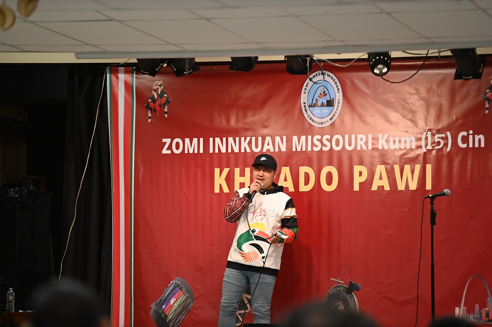

# 钦／佐米传统信仰与夸多节祈福（Chin／Zomi）

<!-- 来源：CC BY-SA 4.0 | https://commons.wikimedia.org/wiki/File:Keymungkhuadopm.jpg -->

## 概述

**钦人（Chin）** 为缅甸钦邦及印度东北（曼尼普尔、米佐拉姆等地）的藏缅语诸群体统称；许多北部社群更愿自称 **Zomi（佐米）** 等端onym。大英百科概述钦人为钦丘陵地带的藏缅语部落群体，传统生活含氏族外婚、宴饮与和狩猎相关的宗教习俗；基督教传教使多数人皈依，传统灵力观念仍以文化记忆与节庆形式存续。佐米公共文化写作详述最重要的年度庆典 **Khuado**：约在公历九—十月、秋收之后，兼具新年、感恩与村落洁净象征；传统叙述中以松明火把象征驱除致病致灾的恶灵（**torch-driving evil CONCEPT**），并伴宴饮、歌舞与社群聚会。前基督教宗教常被描述为对最高善神 **Pasian** 与需安抚之灵并存的宇宙观，祭司 **Puithiam** 主持村落公共祭仪（**CONCEPT**）。本条目为教育概览；**不提供**驱灵操作、动物献牲步骤、蜂巢占卜复现或任何可冒充祭司的程序。

## 核心观念（祈福 / 功德 / 祈祷如何被理解）

祈福常被理解为：在山地农作周期结束时，通过洁净象征、宴饮共享与对天气／收获之灵的迎送叙事，祈求来年健康、谷物与村落平安；皈依基督教后，许多社群将 **Khuado** 重释为文化认同与教会历中的团聚感恩。功德贴近：参与公地打扫与互助宴、赡养丧亲者、在侨居地仍聚庆 Khuado 以维系民族团结。访客的「福」体现为：尊重「Chin」他称与「Zomi」等自称之争，避免把复杂山地诸支系压成单一标签。

## 典型仪式

### 1. Khuado 收获—新年节（公共／文化层）
- **场合**：秋收后、村落择日；侨民社群亦常举办（**Khuado public culture**）。
- **主要步骤（概念层）**：公开文化记述——清扫备办、火把与灯光象征、宴饮歌舞、探访与纪念逝者等。传统驱灵与献牲环节**仅作历史／概念层**；当代许多庆祝已基督教化。**止于公共文化层**。
- **物品**：松明／灯光、鼓锣与盛装外观（概念）。
- **谁来举行**：村落长老／教会与文化组织；外人受邀才可参与；用户不可主持。

### 2. Puithiam／Pasian 与火把驱恶（高度敏感，仅概念）
- **场合**：疾病、灾异与年度公共祭；最高善神 **Pasian** 与祭司 **Puithiam** 公开命名。
- **主要步骤（概念层）**：公开宗教研究提及最高善神与需献牲安抚的灵；**torch-driving evil — CONCEPT only**。**Puithiam — CONCEPT**；**禁止**任何献牲或驱灵复现。
- **物品**：从略。
- **谁来举行**：传统权威（历史层）；当代多由教会牧者处理属灵关怀。

### 3. 生命礼仪与氏族伦理（概念层）
- **场合**：婚丧、命名与氏族互助。
- **主要步骤（概念层）**：公开文化介绍强调亲属义务与宴饮互惠。细节从略。
- **物品**：从略。
- **谁来举行**：家族与村落。

## 日常与节庆

钦邦与印缅边境形势复杂；了解消息时优先社群自治叙述与学术来源。尊重教会日历与传统节庆的双重认同。

## 注意与尊重

**勿猎奇「猎头」等殖民刻板印象。** 勿要求演示驱灵或献牲。勿在未区分支系的情况下用单一他称覆盖所有人。火把驱灵仅作文化象征认知，不可游戏化恐吓。

## 手机互动适合度（Three.js 评估草稿）

- **档位：** B 仅氛围或图文场景
- **敏感度：** 中
- **判断：** **仅氛围／无用户主持。** 丘陵秋收、侨民团聚与 Khuado 灯光节庆意象可做远观氛围；Puithiam／Pasian／torch-driving evil 仅 CONCEPT；传统驱灵、献牲与占卜属限制／伤害性实践，不宜操作化。
- **若做成互动：** 只做可旋转山地村落与丰收粮仓说明卡（Khuado 作为新年—感恩文化简介）；不提供火把驱灵、献牲或占卜通关。
- **红线：** 禁止模拟驱灵喊词、动物献牲、蜂巢占卜，或以真仪名称作胜负。
- **评估状态：** 待后期统一评估

## 参考来源

- https://www.britannica.com/topic/Chin-people
- https://zomipress.com/khuado-festival-the-zomi-new-year/
- https://www.britannica.com/place/Myanmar/Cultural-life
