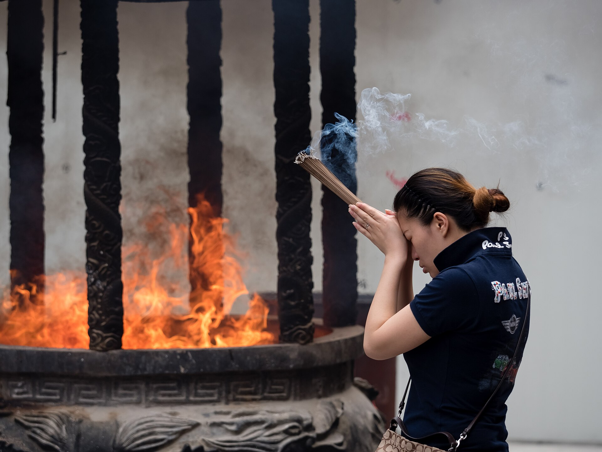

# 汉传佛教

<!-- 来源：CC BY-SA 4.0 | https://commons.wikimedia.org/wiki/File:China-Schanghai-Jade_Buddha-Temple-5176573.jpg -->

## 概述

汉传佛教在中国本土、台湾、港澳及海外华人社群中，形成以寺院为中心、净土念佛与各类忏法并重的实践面貌。对居士而言，祈福消灾、超荐亡亲、求智慧平安，往往通过**供养三宝、诵经持名、放生护生与功德回向**来完成。其目标不只是改善运气，更是培植福德资粮、净化业障，并与菩提心相应。大型仪轨须明确命名：**水陆法会**、**梁皇宝忏（梁皇忏）** 等均由**专业僧团**主持，居士随喜而非自行开坛；日常则以香花灯果、**持名**念佛、**放生**护生与**大悲水**相关共修更为普及（大悲水仍依附如法持诵与寺院规范）。

## 核心观念（祈福 / 功德 / 祈祷如何被理解）

“功德”指善行、持戒、禅诵所生的福德力量；汉地尤强调可通过**回向**将此福德分享给指定亡亲、冤亲债主或一切众生。祈愿（延寿、平安、往生净土）通常依附于皈依三宝与称念佛菩萨名号，而非把佛像当作可讨价还价的神祇。慈悲与戒杀使**放生**成为高度可见的积德形式；当代研究亦指出其生态争议，提醒发心与方法须并重。大悲咒加持之水（大悲水）在民间常与洒净、治病祈福联想，但仍以信心与如法持诵为前提。

## 典型仪式

### 1. 放生（放生）
- **场合**：佛诞、观音诞、个人或团体发心之日。
- **主要步骤**：举办法会时先皈依发愿；诵经持咒；或以大悲水洒净；将生物放归适宜环境；最后回向功德。关键是来源合法、物种与放归地匹配。
- **物品**：经本、净水、合法取得之生物、笼具等。
- **谁来举行**：僧众引导仪轨，居士随喜参与出资与协助。

### 2. 礼佛诵经与诸佛菩萨名号持念
- **场合**：早晚课、共修、佛七、个人静室定课。
- **主要步骤**：礼拜圣像；诵经、持咒或计数念佛；以回向文收摄愿心。
- **物品**：香花灯果、念珠、经书或电子课诵。
- **谁来举行**：僧俗皆可；大型法会由寺院维那、法师主持。

### 3. 大悲水加持与功德回向
- **场合**：放生、祈福消灾、病患或亡者超荐相关共修。
- **主要步骤**：如法诵《大悲咒》等；以净水供佛并视为加持；用于洒净或象征性供养；明确宣说回向对象与愿望。
- **物品**：净瓶、清水、咒本。
- **谁来举行**：出家人或依寺院规矩熟习课诵的居士；重大超荐仍以僧团为主。

## 日常与节庆

日常可见：吃素持斋、布施贫困、持名念佛、抄经。节庆方面，佛诞浴佛、盂兰盆孝亲超荐、观音成道／涅槃相关法会，以及**水陆法会**、**梁皇宝忏**与各类消灾普佛，构成寺院年历——大型忏法／水陆属专业僧伽仪轨。在家佛堂可设简易供养与定课持名；**放生**须合法生态；大悲水相关实践听从寺院指导。大型焰口、幽冥戒等不应由无资格者擅自开坛。

## 注意与尊重

放生若演变为“先捕后放”或异地引入物种，会造成生态伤害与法律风险，应听从专业与寺院指导。部分忏法、瑜伽焰口与密部内容有传承与坛场限制。勿将“浇大悲水”理解为脱离戒定慧的技术操作，亦勿在未经允许时闯入僧寮或干扰修行为拍摄素材。

## 手机互动适合度（Three.js 评估草稿）

- **档位：** C 可做致敬小品（非真仪）
- **敏感度：** 低
- **判断：** 礼佛上香与供灯属寺院常见公开虔敬；放生须合法生态、焰口密部有限制。适合做供香供灯致敬，而非放生／忏法关卡。
- **若做成互动：** 手机手势练习（致敬小品，非法会主持）：

1. 拖香入炉并微鞠躬。
2. 点按点亮一盏供灯。
3. 在说明卡上选择“回向意愿”标签（非诵密咒教程）。
4. 标题如「灯下合十」，不用“放生成功”作胜负。
- **红线：** 禁止先捕后放式放生玩法、焰口／密部步骤，或以大悲咒操作当关卡。
- **评估状态：** 待后期统一评估

## 参考来源

- https://buddhiststudies.utoronto.ca/wp-content/uploads/2021/10/Shiu_Stokes_2008_Animal-Release.pdf
- https://doi.org/10.1515/cdc-2015-0008
- https://doi.org/10.38144/TKT.2026.1.3
- https://doi.org/10.3390/rel14010110
- https://doi.org/10.1111/rec3.12483
- https://doi.org/10.7312/columbia/9780231168021.003.0004
- https://scholarhub.ui.ac.id/jai/vol42/iss2/3/
