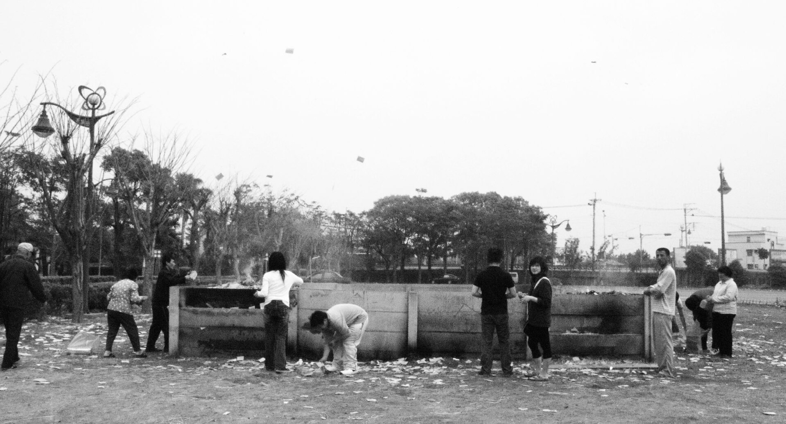

# 汉人民间信仰与祭祖／儒礼

<!-- 来源：CC BY 2.0 | https://commons.wikimedia.org/wiki/File:Burning_joss_paper_on_the_Tomb_Sweeping_Day.jpg -->

## 概述

在汉人社会中，祈福、报本与伦理教化长期交织于**祖先崇拜**、庙宇上香，以及儒家所说的礼（*li*）之中。祖先并不被理解为完全离开人间的“外人”，而是仍关切子孙祸福、需要香火与供养的家族成员。**家龛**、宗祠与墓地构成三重空间；岁时上**清明**扫墓、**冬至**祭祖等把个人愿望放进更大的亲缘与社区秩序。庙宇层常见**庙会进香还愿**；宫庙扩张语境下的**分香／分灵**（香火分香、分灵建庙）仅作高阶制度—民俗概念说明。此类实践可与佛教、道教并存于同一屋檐下，但其逻辑首先是孝亲、报恩与求安，而不必归入某一制度化宗教的教义系统。

## 核心观念（祈福 / 功德 / 祈祷如何被理解）

祈福常表现为向神祇或祖先陈情：求平安、子嗣、功名、财运与家宅和顺。儒家语境更强调**孝**与**礼**——仪节周正本身即是对天地人伦的回应，而不只是交换式许愿。民间口语中的“积德”“阴德”，侧重日常伦理与祭祀诚意；这与佛教体系化的“功德回向”相关却不完全等同。香被视为沟通媒介，烟雾上达；酒食、纸钱则供亡者或神灵“享用”其气。清明等节令把扫墓维修与追思祝福结合，体现“事死如事生”的态度。

## 典型仪式

### 1. 上香／敬香与庙会进香还愿（上香、敬香）
- **场合**：家龛／家祠、土地庙、城隍或地方神庙、墓地；庙会进香与许愿还愿；日常问安或临时求愿。
- **主要步骤**：净手整衣；双手持香鞠躬示敬；将香插入香炉；可默祷心事或跪拜叩首。茶果常一并陈设。庙会场合随香客秩序排队，勿阻塞正殿。
- **物品**：线香、香炉；茶、水果、鲜花视场合增减。
- **谁来举行**：家庭成员或普通信众即可，一般无需僧道资格。

### 2. 家龛祭祖与祖先牌位供奉
- **场合**：忌日、春节、清明、中元、冬至及婚嫁等重大告知时刻；家龛日常问安。
- **主要步骤**：陈设牌位或遗像；供熟食、米饭、果酒；上香叩拜；宣告事由；事毕家人共食或撤供。大型宗祠祭礼另有祝文与位次。涉及分香／分灵建庙的宫庙制度仅作高阶文化理解，不作操作指南。
- **物品**：祖先牌位、纸钱、烛台、食物与酒。
- **谁来举行**：嫡系亲属主导；宗祠大典可由族长或礼生主持。

### 3. 清明扫墓（清明祭）
- **场合**：春分后约十五日之清明及相关前后数日。
- **主要步骤**：清扫修整坟茔；除草添土；上香焚纸；献花与食品；部分家庭踏青郊游或放风筝。当代亦出现代扫与线上纪念。
- **物品**：香烛、纸钱、鲜花、食品、工具。
- **谁来举行**：家族集体；远距游子委托亲友代为祭扫。

## 日常与节庆

家中**家龛**或祖先桌可日常点香。春节开年祭祖、**清明**扫墓、中元普度、**冬至**祭祖构成常见节奏。**庙会进香还愿**、地方神诞，以及宫庙网络中的**分香／分灵**（高阶概念：香火与神灵分香立庙，非操作教程）亦属民间祈福景观。冠婚丧祭的儒式程序在各地有简化与变异，但仍可见“告庙／告祖”痕迹。

## 注意与尊重

宗祠、族谱与某些房派仪节属内部礼俗，外人不宜强行进入核心环节或随意拍摄牌位。纸钱焚烧受地方环保与消防规范约束。勿把“上香许愿”简化为可任意拼贴的旅游表演，也勿在未知神格与忌讳的情况下混用供品（如部分神祇忌荤腥）。

## 手机互动适合度（Three.js 评估草稿）

- **档位：** C 可做致敬小品（非真仪）
- **敏感度：** 低
- **判断：** 上香敬香为家庭与庙宇常见公开姿态；完整宗祠祭祖与纸钱仪节有内部性。取庙外／庭前上香致敬为 C，家祭通关则不可。
- **若做成互动：** 手机手势练习（致敬小品，非宗祠祭礼）：

1. 虚拟净手后持香，陀螺仪微鞠躬。
2. 将三柱香拖入香炉。
3. 点按献上一盘果或茶的说明卡。
4. 标题如「炉前一炷」，不写“祭祖完成”。
- **红线：** 不强行进入宗祠核心、随意拍摄牌位，或以清明扫墓／焚纸钱作通关。
- **评估状态：** 待后期统一评估

## 参考来源

- https://ich.unesco.org/en/RL/mazu-belief-and-customs-00227
- https://doi.org/10.54254/2753-7048/51/20240985
- https://doi.org/10.3389/fpsyg.2024.1471431
- https://ich.unesco.org/en/RL/dragon-boat-festival-00225
- https://www.ihchina.cn/project_details/12185.html
- https://doi.org/10.1163/23521341-12340052
