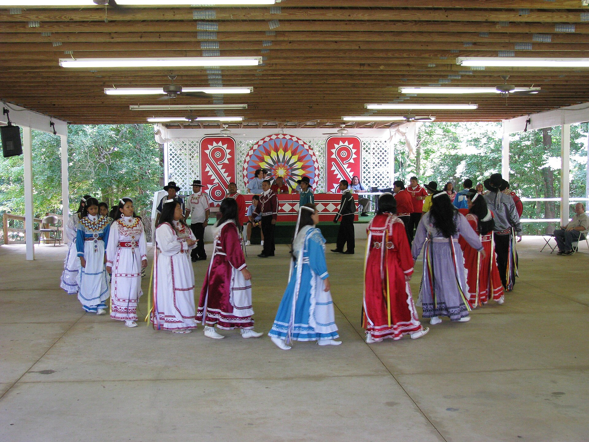

# 乔克托传统宗教与青玉米礼（Choctaw）

<!-- 来源：CC BY 2.0 | https://commons.wikimedia.org/wiki/File:Choctaw_fair_dancers.jpg -->

## 概述

**乔克托人（Choctaw；自称 Chahta）** 属马斯科吉语系，传统家园在今密西西比东南部；十九世纪被迫西迁至今俄克拉荷马（「泪水之路」），亦有社群存留于密西西比与路易斯安那。大英百科指出：乔克托曾为东南农业民族中技艺突出者，最重要的社群礼仪是仲夏 **Busk／青玉米礼（Green Corn／Okissa）**——初熟与新火更新；**Luak Pila** 圣火记忆见于公开文化叙述；**Stomp Dance** 属公共／教育展演层。everyculture 等公开综述强调人与自然、超自然力量之间的和谐，以及先知（hopaii）、医者（alikchi／healers）等角色——**healers CONCEPT**。当代许多乔克托人信奉基督教，同时传统舞蹈与青玉米／跺舞实践在部分社群中复兴。本条目为教育概览；**不提供**青玉米礼内部私密环节、净化草药配方、骨敛程序或任何可冒充仪式专家的操作。

## 核心观念（祈福 / 功德 / 祈祷如何被理解）

祈福常被理解为：在玉米成熟的季节循环中，通过禁食、净化、宽恕与围绕圣火的跺舞祈祷，恢复人与造物主、社群与土地的正当关系；Luak Pila 圣火记忆承载更新与和解象征。功德贴近：和解旧怨、履行社群义务、尊重圣火与舞地。访客的「福」体现为：把东南原住民的青玉米传统看作活态民族主权与季节伦理，而非可购买的「印第安体验」。

## 典型仪式

### 1. Green Corn／Okissa 青玉米礼（高度敏感，仅公开叙述层）
- **场合**：晚夏玉米初熟时节；多日社群聚会（公开记述常述约四日结构）。
- **主要步骤（概念层）**：公开民族材料概括：营集、禁食与净化、破斋共食、围绕中心圣火的跺舞与感恩祈祷。乔克托民族明确指出部分环节属私密、不宜公开发表。**止于概念**；不提供可复现步骤。
- **物品**：舞地、中心火、四方凉棚等公开空间象征；细节从略。
- **谁来举行**：社群与承认的仪式角色；外人不得僭越；用户仅氛围／观礼，不可主持。

### 2. Luak Pila 圣火记忆与 Stomp Dance（公共／概念层）
- **场合**：舞地圣火叙事（**Luak Pila sacred fire memory**）；部落公共文化活动中的跺舞。
- **主要步骤（概念层）**：理解圣火更新象征与 **Stomp Dance** 公共文化表达。**勿把公共跺舞等同于完整青玉米圣仪**；圣火细节止于记忆／概念层。
- **物品**：服饰、响器等外观（概念）。
- **谁来举行**：部落文化传承者与参与者；用户不可操作圣火。

### 3. Healers 医者（CONCEPT）
- **场合**：疾病、冲突与日常道德教导。
- **主要步骤（概念层）**：**healers CONCEPT**——公开综述提及草药、仪式净化与灵力协助的传统医病叙事；基督教牧者在许多社群中亦重要。**不提供**草药配方或驱邪脚本。
- **物品**：从略。
- **谁来举行**：传统医者／先知或教会牧者（依社群而定）；用户不可扮演。

## 日常与节庆

俄克拉荷马乔克托民族与密西西比乔克托等当代政府机构主办文化教育与节庆；尊重各社群对舞地与私密礼仪的边界。优先 Britannica、everyculture 与乔克托民族官方公开栏目。

## 注意与尊重

**勿擅闯跺舞场地或拍摄未同意的礼仪。** 勿要求演示青玉米礼「全套」或购买仿仪式体验。丧葬与骨敛仅作历史概念认知。尊重部落主权与文化知识产权。

## 手机互动适合度（Three.js 评估草稿）

- **档位：** B 仅氛围或图文场景
- **敏感度：** 中
- **判断：** **仅氛围／无用户主持。** 东南农业景观与公共 Stomp Dance 教育可做远观氛围；Green Corn／Okissa 核心、Luak Pila 圣火与 healers 属限制／概念知识，不宜做成可操作关卡。
- **若做成互动：** 只做可旋转／可走近的舞地外观示意与说明卡（青玉米季节伦理、民族官方教育简介）；不提供禁食净化、跺舞通关或圣火操作。
- **红线：** 禁止模拟青玉米圣仪、冒充 alikchi／healers、复现丧葬骨敛，或以真仪名称作胜负。
- **评估状态：** 待后期统一评估

## 参考来源

- https://www.britannica.com/topic/Choctaw
- https://www.everyculture.com/North-America/Choctaw-Religion-and-Expressive-Culture.html
- https://www.choctawnation.com/news/iti-fabvssa/green-corn-ceremony/
