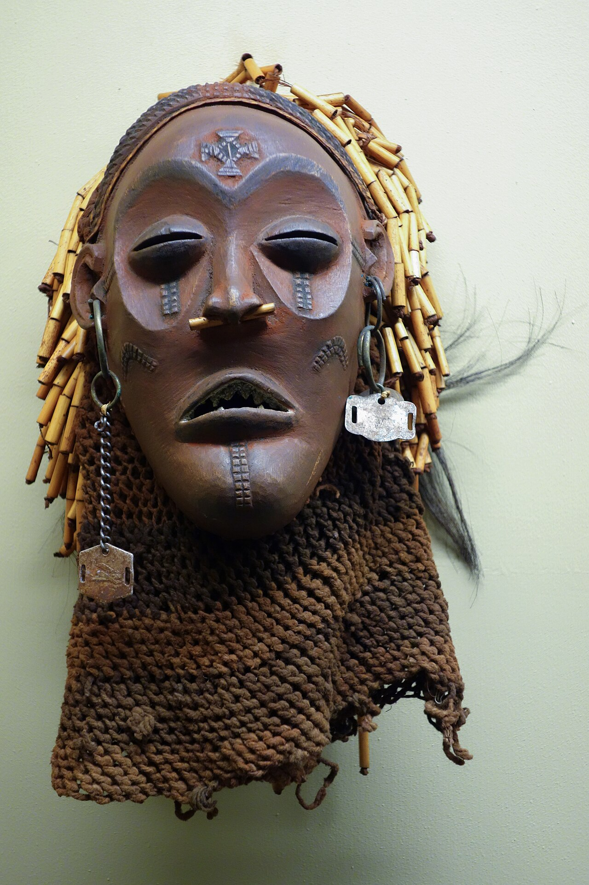

# 乔奎传统宗教与祖先—面具祈福（Chokwe）

<!-- 来源：CC0 | https://commons.wikimedia.org/wiki/File:Dance_mask_(pwo)_-_Chokwe_-_Royal_Museum_for_Central_Africa_-_DSC05873.JPG -->

## 概述

**乔奎人（Chokwe）** 分布于安哥拉、刚果民主共和国与赞比亚交界地带，以精美面具、雕刻与复杂入会／祖先礼仪闻名于艺术史。公开民族志记述：祖先与自然灵在健康、丰饶与政治权威中作用关键；**Pwo** 与 **Cikunza** 等面具舞属公开展演／文化层；**Mukanda** 入会传统见于 UNESCO 概念层公开叙述，内部程序**密封**。基督教在多地并行。本条目为教育概览；**Mukanda UNESCO CONCEPT ONLY sealed**；**不提供**入会操作、面具秘仪内部程序或可冒充仪者的步骤。

## 核心观念（祈福 / 功德 / 祈祷如何被理解）

祈福常被理解为：通过对祖先的正确纪念与社群规范的维护，恢复力量与秩序；公开展演层的面具舞亦承载教育与社群认同。功德贴近：支持文化遗产主权，反对盗掘与无授权商业面具「开光」营销。访客的「福」体现为：在博物馆欣赏公开展品，不索要「真入会」。

## 典型仪式

### 1. Pwo 与 Cikunza 面具舞（公共文化层）
- **场合**：节庆、教育性公开表演与博物馆／文化展演语境。
- **主要步骤（概念层）**：理解 **Pwo**、**Cikunza** 等面具连接祖先／规范教导的公开艺术叙述。**止于公共文化层**；**勿闯入封闭入会场**。
- **物品**：面具外观（概念／展品层）。
- **谁来举行**：被承认的舞者／仪者与社群；用户仅氛围／观礼，不可主持。

### 2. 祖先敬礼（概念层）
- **场合**：疾病、丧葬、家族事务公开记述。
- **主要步骤（概念层）**：理解祖先须受敬的公开叙述。**CONCEPT ONLY**；**禁止**复现祭仪细节。
- **物品**：从略。
- **谁来举行**：家长与仪式权威；外人不可扮演。

### 3. Mukanda 入会（UNESCO CONCEPT ONLY sealed）与教会并行
- **场合**：公开遗产／UNESCO 概念叙述中的入会传统；以及教堂礼仪与传统并行社区。
- **主要步骤（概念层）**：知晓 **Mukanda** 为密封／限制知识——**UNESCO CONCEPT ONLY sealed**，**禁止**任何入会 how-to。教会并行则止于公开礼拜观礼。
- **物品**：从略。
- **谁来举行**：社群内部权威／教牧；用户不可主持或索要入会。

## 日常与节庆

优先艺术博物馆与民族志公开层；并与巴刚果、洛齐、本巴条目区分。Pwo／Cikunza 公共文化展演为访客入口。

## 注意与尊重

**严禁入会内容操作化。** Mukanda 密封。勿购买来源可疑的「仪式面具」。未经许可勿摄影仪式。

## 手机互动适合度（Three.js 评估草稿）

- **档位：** B 仅氛围或图文场景
- **敏感度：** 高
- **判断：** **仅氛围／无用户主持。** 博物馆风格面具说明可以；Mukanda UNESCO CONCEPT ONLY sealed；入会不可操作化。
- **若做成互动：** 只做艺术品鉴赏＋Pwo／Cikunza 公共命名＋祖先概念卡。
- **红线：** 禁止入会通关、献牲、冒充仪者、Mukanda how-to。
- **评估状态：** 待后期统一评估

## 参考来源

- https://www.britannica.com/topic/Chokwe
- https://www.metmuseum.org/toah/hd/chok/hd_chok.htm
- https://www.britannica.com/place/Angola
