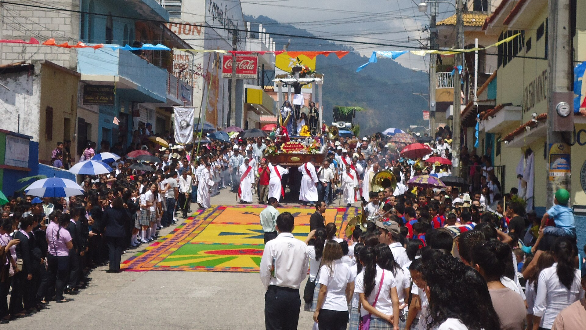

# 乔尔蒂玛雅民间天主教与危地马拉—洪都拉斯祈福（Ch'orti'）

<!-- 来源：CC BY-SA 3.0 | https://commons.wikimedia.org/wiki/File:Procesi%C3%B3n_del_Cristo_Negro_de_Esquipulas.JPG -->

## 概述

**乔尔蒂人（Ch'orti'）** 为玛雅语系社群，分布于危地马拉东部与洪都拉斯西部。公开宗教生活常见民间天主教圣徒崇拜——区域朝圣网络常连结 **Esquipulas 黑基督**——与玉米生长／雨水伦理；**Padrinos de la Lluvia（雨神甫／雨水教父）** 属 **CONCEPT ONLY**。本卡聚焦可公开的教堂—节庆层。与乔尔（Chol）、约科坦、拉坎东等条目区分——Ch'orti' ≠ Chol。

## 核心观念（祈福 / 功德 / 祈祷如何被理解）

祈福常被理解为：通过圣徒（含埃斯基普拉斯黑基督）、十字架与玉米—雨水伦理，求健康、丰收与家庭平安。功德贴近：堂区奉献、支持土地权利与母语。访客的「福」体现为：在**公开瞻礼／朝圣**谦逊参与，不索求雨仪操作。

## 典型仪式

### 1. Esquipulas 黑基督朝圣／敬礼（公开层）
- **场合**：埃斯基普拉斯（Esquipulas）黑基督及相关城镇瞻礼。
- **主要步骤（概念层）**：弥撒、奉献、列队与朝圣（从众）。**止于公开朝圣层**；**勿干扰本地秩序。**
- **物品**：蜡烛、鲜花（依公开习惯）。
- **谁来举行**：神父与堂区；用户仅氛围／观礼，不可主持。

### 2. 玉米生长伦理（概念层）
- **场合**：播种／收获相关公开习俗。
- **主要步骤（概念层）**：理解 **maize growth** 与雨水的公共意义。**禁止**未授权田间仪轨介入。
- **物品**：从略。
- **谁来举行**：家庭；外人不可僭越。

### 3. Padrinos de la Lluvia（雨水教父）（CONCEPT ONLY）
- **场合**：学术／口述提及的求雨中介角色。
- **主要步骤（概念层）**：**CONCEPT ONLY**——知晓存在地方雨水礼仪权威。**禁止**复现求雨操作或坐标分享。
- **物品**：从略。
- **谁来举行**：社群内部；用户不可扮演雨仪角色。

## 日常与节庆

优先科潘周边等公开文化与教堂活动；Esquipulas 朝圣为区域公开入口。遵守摄影规范。

## 注意与尊重

勿将考古遗址旅游与活人仪典混为一谈。拒绝「玛雅预言」商品话术。Padrinos de la Lluvia 不可操作化。

## 手机互动适合度（Three.js 评估草稿）

- **档位：** B 仅氛围或图文场景
- **敏感度：** 中高
- **判断：** **仅氛围／无用户主持。** 可做教堂／朝圣氛围；Padrinos de la Lluvia CONCEPT ONLY。
- **若做成互动：** 静态 Esquipulas／瞻礼场景与玉米生长尊重说明。
- **红线：** 禁止圣地坐标、冒充雨仪角色、巫术通关。
- **评估状态：** 待后期统一评估

## 参考来源

- https://www.britannica.com/topic/Chorti
- https://www.britannica.com/topic/Maya-people
- https://www.britannica.com/place/Copan
