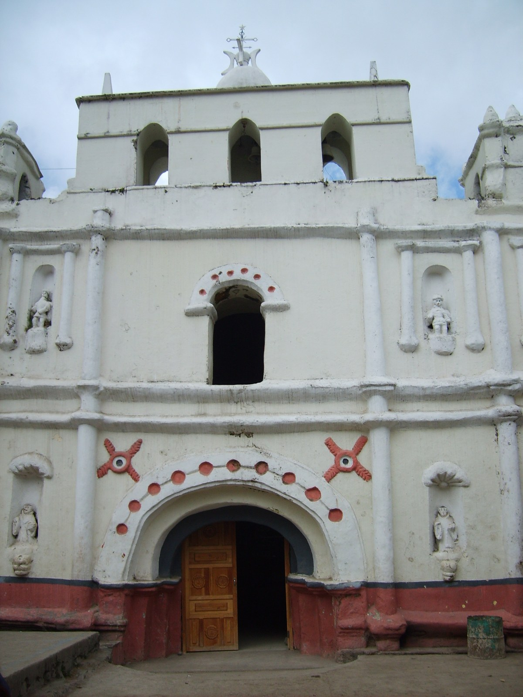

# 丘赫玛雅民间天主教与跨界祈福（Chuj）

<!-- 来源：CC BY-SA 4.0 | https://commons.wikimedia.org/wiki/File:San_Mateo_Ixtat%C3%A1n_16.jpg -->

## 概述

**丘赫人（Chuj）** 分布于危地马拉韦韦特南戈西北与墨西哥恰帕斯交界，跨界社群特征显著。公开记述：玛雅宇宙观与天主教圣徒交织；**San Mateo Ixtatán** 主保节与盐矿祝福叙事见于公开文化层；山神龛／山灵圣地与 **Ajk'in（日师／daykeeper）** 传统属高度敏感——**Ajk'in CONCEPT ONLY**。迁徙、边境与难民记忆常进入当代祈祷叙述。本条目为教育概览；**不提供**日数占卜操作、献牲或可冒充日师的步骤。

## 核心观念（祈福 / 功德 / 祈祷如何被理解）

祈福常被理解为：通过对祖先、山灵与圣人的敬意，求家庭平安、丰收与跨境亲人安康；盐与土地亦进入地方祝福叙事。功德贴近：支持丘赫语与体面迁徙权利。访客的「福」体现为：非邀莫入圣地，不把边境写成探险。

## 典型仪式

### 1. San Mateo Ixtatán 主保节与盐矿祝福叙事（公开／概念层）
- **场合**：圣马修·伊斯塔坦（San Mateo Ixtatán）瞻礼；盐矿／盐泉相关公开祝福叙事。
- **主要步骤（概念层）**：理解弥撒、游行与地方盐—土地祝福的公开叙述。**止于公开观礼／叙事层**；不提供仪程 how-to。
- **物品**：从略。
- **谁来举行**：神职与社群；用户仅氛围／观礼，不可主持。

### 2. 山神龛／山灵圣地（概念层）
- **场合**：播种、求雨、山间圣地公开记述（**mountain shrines**）。
- **主要步骤（概念层）**：理解玉米—雨水伦理与山灵地理。**CONCEPT**；**禁止**复现祭仪或擅入。
- **物品**：从略。
- **谁来举行**：家庭与地方权威；外人非邀莫入。

### 3. Ajk'in 日师（CONCEPT ONLY）
- **场合**：生命礼仪、危机叙事、日历礼仪。
- **主要步骤（概念层）**：**Ajk'in daykeeper CONCEPT ONLY**——知晓存在日历—礼仪专家。**禁止**占卜／日数 how-to。
- **物品**：从略。
- **谁来举行**：被承认的专家；用户不可扮演日师。

## 日常与节庆

优先跨界玛雅公开研究；San Mateo Ixtatán 节庆为公开入口。注意与恰帕斯／危地马拉政治语境。

## 注意与尊重

**勿强求日师服务。** Ajk'in 不可操作化。边境地区遵守许可。禁止消费难民叙事。

## 手机互动适合度（Three.js 评估草稿）

- **档位：** B 仅氛围或图文场景
- **敏感度：** 高
- **判断：** **仅氛围／无用户主持。** 文化地理与主保节可说明；Ajk'in CONCEPT ONLY；占卜与边境创伤不可游戏化。
- **若做成互动：** 只做语言—玉米—盐矿叙事概念卡与节庆氛围。
- **红线：** 禁止占卜操作、献牲、冒充日师、消费创伤、山神龛闯关。
- **评估状态：** 待后期统一评估

## 参考来源

- https://www.britannica.com/topic/Chuj
- https://www.britannica.com/place/Guatemala
- https://www.britannica.com/place/Chiapas
