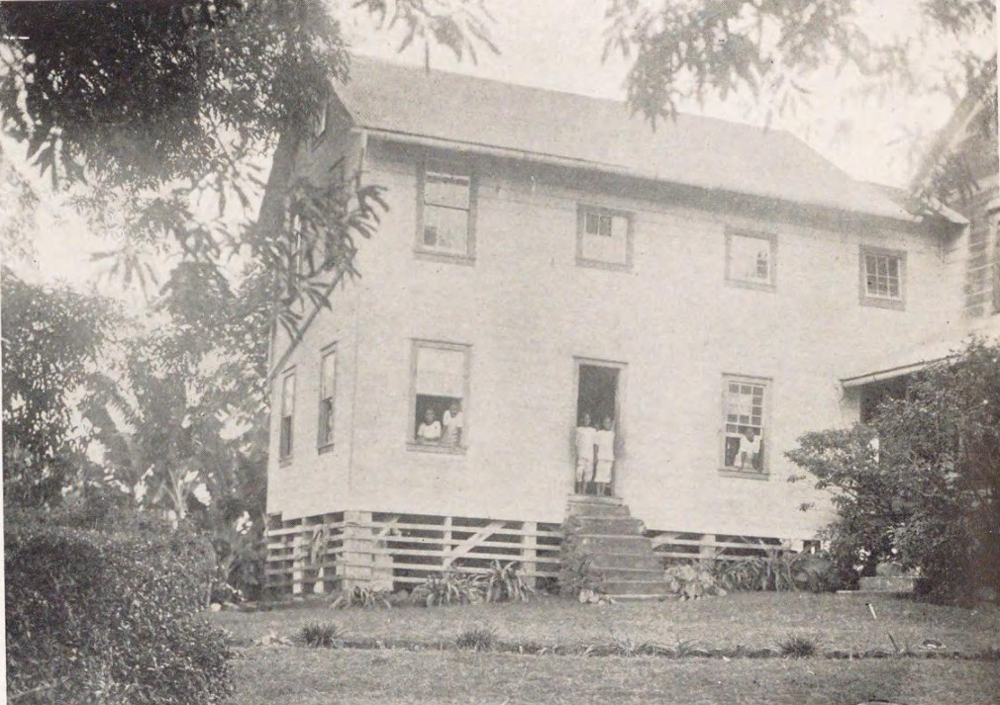

# 楚克传统信仰与村社祈福余绪（Chuukese／Truk）

<!-- 来源：Public domain | https://commons.wikimedia.org/wiki/File:Protestant_Church_in_Truck_(from_a_book_published_in_1932).png -->

## 概述

**楚克人（Chuukese；旧称 Truk）** 居住于密克罗尼西亚联邦楚克州——珊瑚环礁环抱多座火山高岛的潟湖群岛。Pulotu 与区域文化综述指出：皈依基督教前，崇拜对象包括天空神、神化高等首领与多样善恶诸灵；今日天主教与新教（含公理会传统）占主导，祖先灵魂影响事态、精灵与附体等前基督教要素仍常与教会实践交织。公开知识层可命名传统知识阶级 **Itang**、仪式／专责角色如 **Soufo／Souro**，以及与航海相关的护航概念 **Karak**（voyage charms）——均**仅作概念**，不泄露秘传配方。教堂是聚落最醒目的神圣建筑（教会公共层 OK）；与传说相关的地点仍可被视为有力圣地。本条目为教育概览；**不提供**秘密法术配方、占卜步骤、附体脚本或任何可冒充仪式专家的程序。

## 核心观念（祈福 / 功德 / 祈祷如何被理解）

祈福常被理解为：在教会日历与村社宴饮竞争中，通过礼拜、初熟／丰收感恩的教会化形式，巩固航海—农作共同体；前基督教层则以祖先与地方灵解释保护与灾祸。功德贴近：支持堂区头衔竞争中的慈善与事工、葬礼互助、尊重圣地。访客的「福」体现为：尊重楚克潟湖的生态脆弱与习惯法，而非只拍「攻壳」式热带明信片。

## 典型仪式

### 1. 教会礼拜与基督教日历（公共层）
- **场合**：主日、圣诞、复活节；竞争性宴饮并入教会节期的公开叙述。
- **主要步骤（概念层）**：礼拜、唱诗、聚餐。**止于概念**。
- **物品**：教堂外观（概念）。
- **谁来举行**：神父／牧师与会众。

### 2. Itang 知识阶级与祖先／地方灵叙事（概念层）
- **场合**：疾病解释、家庭护佑、传说圣地；Itang 作为口传政治—修辞—宇宙知识承载者的公开命名。
- **主要步骤（概念层）**：理解祖先仍可影响人事的公开信念；认识 Itang／Soufo／Souro 等专责角色的**社会—文化功能命名**。**禁止**招魂、附体游戏或索取秘传词句。
- **物品**：从略。
- **谁来举行**：长辈、家庭与传统知识持有者（外人不可冒充）。

### 3. 航海戒忌与 Karak 护航概念（概念层）
- **场合**：出海与礁湖资源利用。
- **主要步骤（概念层）**：区域综述提及传统专责者曾司天气、丰饶与航程顺利等祈请；**Karak** 作为航海护佑／voyage charm 的概念命名。**止于概念**；**不提供**护符制作或咒语配方。
- **物品**：从略。
- **谁来举行**：渔人、航海者与长老。

## 日常与节庆

楚克与波纳佩、雅浦同属密克罗尼西亚联邦但历史与语言不同。优先 Pulotu、everyculture 区域条目与楚克人自身叙述。

## 注意与尊重

**勿把附体叙事做成惊悚内容。** 勿闯入传说圣地。尊重主日与葬礼规范。勿将楚克与雅浦、波纳佩条目混同。

## 手机互动适合度（Three.js 评估草稿）

- **档位：** C 可做致敬小品（非真仪）
- **敏感度：** 低–中
- **判断：** 潟湖—教堂公共层适合轻量致敬；法术与附体不可操作化。取 C：原创手势练习，明确非真仪。
- **若做成互动：** 手势练习示例——(1) 陀螺仪眺望环礁潟湖说明卡；(2) 拖动将「初熟感谢」放入教堂宴席示意；(3) 写下对海洋／祖先的一句祝福；(4) 点亮礼拜灯火。禁止附体闯关。
- **红线：** 禁止模拟法术、附体、占卜通关。
- **评估状态：** 待后期统一评估

## 参考来源

- https://pulotu.com/culture/chuuk
- https://ich.unesco.org/en/decisions/16.COM/8.A.4
- https://ich.unesco.org/en/USL/carolinian-wayfinding-and-canoe-making-01735
- https://ich.unesco.org/en/state/micronesia-fs-FM
