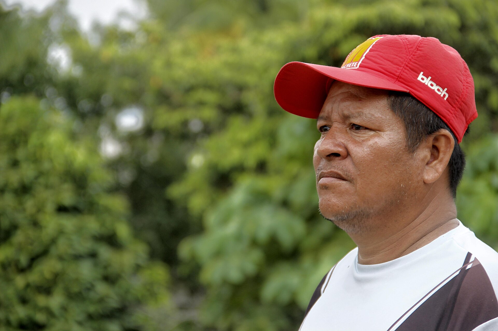

# 科卡马传统信仰与亚马逊河祈福（Cocama / Kokama）

<!-- 来源：CC BY 2.0 | https://commons.wikimedia.org/wiki/File:CACIQUE_KOKAMA_JACINTO_MORAES_PANURO_FOTO_FABIO_PONTES_(36956801383).jpg -->

## 概述

**科卡马人（Cocama，亦作 Kokama）** 分布于秘鲁、巴西与哥伦比亚交界的亚马逊干流一带。公开叙述涉及河岸生计、村落礼仪与护佑观念——**高度敏感，本卡仅概念层**。今日并存城市迁移与资源开采张力。教育概览；**严禁**药方或可冒充仪者的步骤。与伊内、希皮博、蒂库纳等条目区分；不另开 kokama 同义卡。

## 核心观念（祈福 / 功德 / 祈祷如何被理解）

祈福常被理解为：通过对河流、祖先与知识持有者伦理的正确关系，求航行—渔猎顺利与健康。功德贴近：支持母语与反对把河岸信仰商品化。访客的「福」体现为：**非邀莫入**。

## 典型仪式

### 1. 河岸生计伦理（敏感，仅概念）
- **场合**：公开文化叙述。
- **主要步骤（概念层）**：理解分享与尊重河流。**禁止**猎具／毒药制法。
- **物品**：从略。
- **谁来举行**：家庭。

### 2. 护佑传统（极高敏感，仅概念）
- **场合**：公开学术概述。
- **主要步骤（概念层）**：知晓存在护佑实践。**禁止任何药方或复现。**
- **物品**：从略。
- **谁来举行**：获授权知识持有者。

### 3. 基督教与城市社群层（公开层）
- **场合**：教会与城市原住民组织。
- **主要步骤（概念层）**：理解信仰并存。**止于公开层**。
- **物品**：从略。
- **谁来举行**：相关权威。

## 日常与节庆

优先公开语言／文化振兴叙述。

## 注意与尊重

**严禁「丛林疗愈游」。** 摄影须同意。

## 手机互动适合度（Three.js 评估草稿）

- **档位：** A 不建议做成操作型互动
- **敏感度：** 极高
- **判断：** 护佑知识绝不可游戏化。
- **若做成互动：** 不建议；最多河岸地理—权利图文。
- **红线：** 禁止药方、入会、冒充仪者。
- **评估状态：** 待后期统一评估

## 参考来源

- https://www.britannica.com/place/Amazon-River
- https://www.britannica.com/place/Peru
- https://www.britannica.com/topic/South-American-Indian
