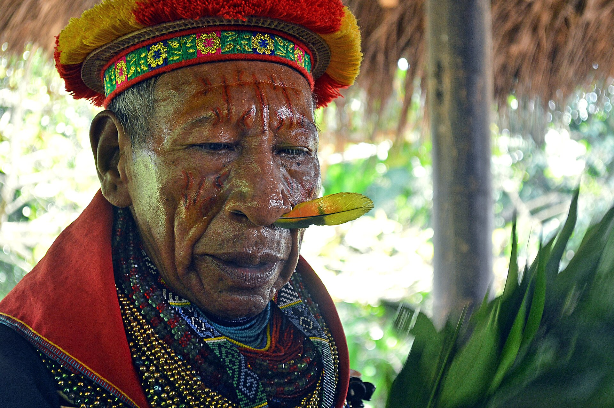

# 科凡传统信仰与雨林祈福（Cofán／A'i）

<!-- 来源：CC BY-SA 2.0 | https://commons.wikimedia.org/wiki/File:COMUNIDAD_COF%C3%81N_LAGUNA_DE_LA_PERLA_(16972076028).jpg -->

## 概述

**科凡人（Cofán；自称常作 A'i）** 分布于厄瓜多尔—哥伦比亚交界亚马逊。公开概述记述：传统宇宙强调主人灵与萨满伦理；石油开采、保护区与文化自治是当代核心叙事——**勿消费抗争**。本条目为教育概览；**严禁**致幻操作、疗愈脚本或可冒充萨满的步骤。与西奥纳、瓦奥拉尼、舒阿尔条目区分。

## 核心观念（祈福 / 功德 / 祈祷如何被理解）

祈福常被理解为：通过对森林主人灵的正确关系，求健康、渔猎平安与领地存续。功德贴近：支持科凡语与反污染／土地权利。访客的「福」体现为：非邀莫入，拒绝疗愈旅游。

## 典型仪式

### 1. 森林主人灵伦理（概念层）
- **场合**：渔猎、农事公开记述。
- **主要步骤（概念层）**：理解人与森林秩序。**禁止**复现祭仪。
- **物品**：从略。
- **谁来举行**：家庭与长者。

### 2. 治疗中介（极高敏感，仅概念）
- **场合**：疾病叙事。
- **主要步骤（概念层）**：知晓存在萨满—治疗传统。**禁止操作化。**
- **物品**：从略。
- **谁来举行**：被承认的专家。

### 3. 基督教／公共权利叙事（概念层）
- **场合**：教堂、公共集会公开记述。
- **主要步骤（概念层）**：理解信仰光谱与护地诉求。**勿猎奇旁观。**
- **物品**：从略。
- **谁来举行**：社群与相关权威。

## 日常与节庆

优先厄瓜多尔东北／哥伦比亚南部公开叙述。

## 注意与尊重

**严禁致幻旅游。** 石油冲突勿观光化。摄影须许可。

## 手机互动适合度（Three.js 评估草稿）

- **档位：** A 不建议做成操作型互动
- **敏感度：** 极高
- **判断：** 萨满与资源冲突不宜游戏化。
- **若做成互动：** 不建议；最多静态权利—生态说明。
- **红线：** 禁止致幻剂、疗愈脚本、冒充萨满、消费抗争。
- **评估状态：** 待后期统一评估

## 参考来源

- https://www.britannica.com/topic/Cofan
- https://www.britannica.com/place/Ecuador
- https://www.britannica.com/place/Amazon-Rainforest
