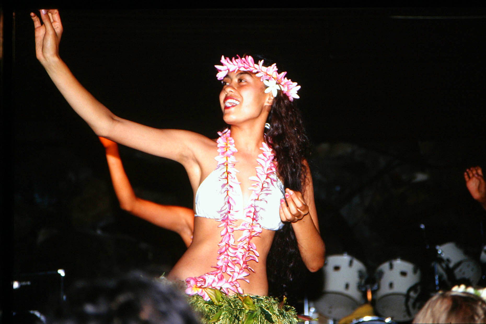

# 库克群岛毛利文化与 marae 祈福余绪（Cook Islands Māori／Māori Kūki ʻĀirani）

<!-- 来源：CC BY-SA 4.0 | https://commons.wikimedia.org/wiki/File:00_4362_Rarotongo_Cookinseln_-_Fo%C3%B6klore.jpg -->

## 概述

**库克群岛毛利人（Cook Islands Māori；亦称 Māori Kūki ʻĀirani）** 居住于南太平洋库克群岛（以拉罗汤加 Rarotonga 为行政与人口中心）。其文化属东波利尼西亚支系。大英百科记述：19 世纪伦敦传教会进入后基督教迅速普及；前基督教时期的信仰围绕 **atua**、祖先与 **mana**，并以 **marae**／**Ariki** 为礼仪—政治遗产中心。公开文化年历以 **Te Maeva Nui** 等节庆为核心；迎宾／口述传统常见 **Turou／Peʻe** 命名。本条目聚焦库克群岛自身传统余绪与公开文化层，**不与**新西兰毛利或塔希提条目混同；**不提供**家族谱系祭仪、祭司授职或任何可复现的“召神／开 marae”步骤。

## 核心观念（祈福 / 功德 / 祈祷如何被理解）

祈福在历史叙述中常被理解为：在 atua 与祖先临在的岛屿世界中，通过维护 marae、遵守酋长／长老秩序与互惠伦理，使航海、丰收与村社和平得到护佑。当代公开生活中，祝福更多体现于基督教会礼拜、**Te Maeva Nui**、舞蹈（ura）与 **Turou／Peʻe** 迎宾／吟诵文化层。访客的「福」体现为：把库克群岛毛利语与 marae 遗址当作有主的文化遗产。

## 典型仪式

### 1. Te Maeva Nui（公开文化层）
- **场合**：库克群岛年度文化庆典（公开记述常称 **Te Maeva Nui**）。
- **主要步骤（概念层）**：岛际歌舞、服饰与文化竞赛／展演的公开叙述。**止于公开节庆层**；不是古代献祭复原。
- **物品**：鼓、舞裙、花环外观。
- **谁来举行**：文化团、学校与村社；用户仅氛围／观礼，不可主持。

### 2. Turou／Peʻe 迎宾与吟诵（文化层）
- **场合**：欢迎仪式、文化中心与口述教育场合。
- **主要步骤（概念层）**：理解 **Turou／Peʻe** 作为迎宾致辞／吟诵传统的公开命名。**止于文化教育层**。
- **物品**：从略。
- **谁来举行**：文化传承者；游客经邀请观礼或教学性环节。

### 3. Marae／Ariki 遗产（历史—遗产层）
- **场合**：拉罗汤加等地古代 marae；**Ariki** 等传统头衔的公共礼节。
- **主要步骤（概念层）**：理解 marae 曾是祭祀、族系集会与酋长就任的中心；当代参观止于解说与尊重遗址。**不提供**重建献祭或授职程序。
- **物品**：石砌平台、直立石外观。
- **谁来举行**：历史上为祭司与族系首领；今日遗址管理与文化权威属岛民机构；外人不可冒充 Ariki。

## 日常与节庆

教会年历、Te Maeva Nui 与岛屿公共节日构成节奏。优先 Britannica、教科文组织暂定遗产说明与库克群岛公开文化叙述；阅读时与 `maori.md`、`tahitian-maohi.md` 区分岛屿主体。

## 注意与尊重

**勿擅自登上仍具族系意义的 marae 或移动立石。** 勿把库克群岛毛利简化为“小版新西兰毛利”。摄影、文身图案商业化与谱系 peddling 需征得同意。涉及前基督教仪式仅作历史认知。

## 手机互动适合度（Three.js 评估草稿）

- **档位：** B 仅氛围或图文场景
- **敏感度：** 中
- **判断：** **仅氛围／无用户主持。** 潟湖、Te Maeva Nui 与公开文化舞蹈景观适合氛围／说明卡；真 marae 献祭、Ariki 授职与教会圣事不可互动化。
- **若做成互动：** 只做可旋转岛屿—marae 远景与 Te Maeva Nui／Turou／Peʻe 说明卡；不作献祭、召神或冒充 ariki 手势通关。
- **红线：** 禁止模拟古代献祭、冒充祭司／酋长授职，或以真仪名称作通关。
- **评估状态：** 待后期统一评估

## 参考来源

- https://www.britannica.com/place/Cook-Islands
- https://www.britannica.com/place/Rarotonga
- https://www.britannica.com/topic/marae
- https://whc.unesco.org/en/tentativelists/6700/
