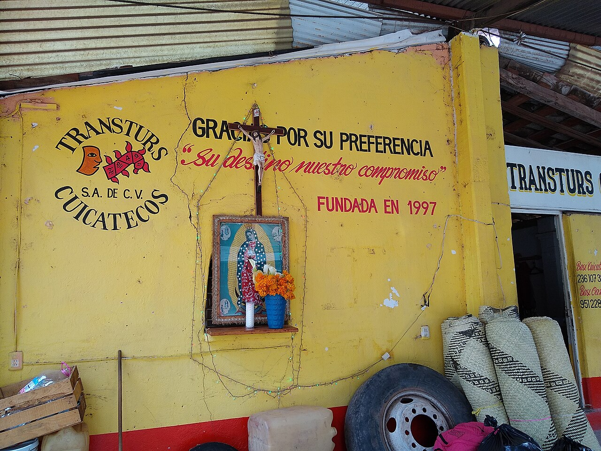

# 奎卡特克民间天主教与山灵祈福（Cuicatec）

<!-- 来源：CC BY 4.0 | https://commons.wikimedia.org/wiki/File:San_Juan_Bautista_Cuicatlan-_shrine_at_bus_stop.jpg -->

## 概述

**奎卡特克人（Cuicatec）** 分布于墨西哥瓦哈卡北部，与奇南特克、马萨特克邻近但语言—认同分立。公开概述记述：天主教圣徒——尤以 **San Juan Bautista Cuicatlán** 主保语境——与山灵、玉米—雨水伦理交织；洞穴自然灵叙事属 **CONCEPT**；**Curandero CONCEPT ONLY**。本条目为教育概览；**不提供**疗愈脚本、献牲或可冒充仪者的步骤。与奇南特克、马萨特克、查蒂诺条目区分。

## 核心观念（祈福 / 功德 / 祈祷如何被理解）

祈福常被理解为：通过对主保圣人与山灵／洞穴自然灵的敬意，祈求雨水、健康与社群平安。功德贴近：支持奎卡特克语与高地生计。访客的「福」体现为：非邀莫入圣地与洞穴礼仪空间。

## 典型仪式

### 1. San Juan Bautista Cuicatlán 主保节（公开／概念层）
- **场合**：夸卡特兰（Cuicatlán）施洗约翰主保瞻礼、主日。
- **主要步骤（概念层）**：理解弥撒与游行。**止于公开观礼层**。
- **物品**：从略。
- **谁来举行**：神职与社群；用户仅氛围／观礼，不可主持。

### 2. 洞穴自然灵（CONCEPT）
- **场合**：求雨、还愿公开记述（**cave nature spirits CONCEPT**）。
- **主要步骤（概念层）**：理解圣地神圣地理与自然灵叙事。**CONCEPT**；**禁止**复现祭仪或擅入。
- **物品**：从略。
- **谁来举行**：家庭与地方权威；外人非邀莫入。

### 3. Curandero（CONCEPT ONLY）
- **场合**：疾病叙事。
- **主要步骤（概念层）**：**Curandero CONCEPT ONLY**——知晓存在疗愈中介。**禁止**疗愈／清洗 how-to。
- **物品**：从略。
- **谁来举行**：被承认的专家；用户不可扮演。

## 日常与节庆

优先瓦哈卡北部公开文化层；San Juan Bautista Cuicatlán 为公开入口。

## 注意与尊重

**非邀莫入洞穴圣地。** Curandero 不可操作化。勿强求萨满清洗。摄影须许可。

## 手机互动适合度（Three.js 评估草稿）

- **档位：** B 仅氛围或图文场景
- **敏感度：** 高
- **判断：** **仅氛围／无用户主持。** 高地村寨与主保节可说明；cave spirits／Curandero CONCEPT ONLY。
- **若做成互动：** 只做山—玉米—主保节概念卡。
- **红线：** 禁止献牲、疗愈脚本、冒充仪者、洞穴闯关。
- **评估状态：** 待后期统一评估

## 参考来源

- https://www.britannica.com/topic/Cuicatec
- https://www.britannica.com/place/Oaxaca-state-Mexico
- https://www.britannica.com/place/Mexico
