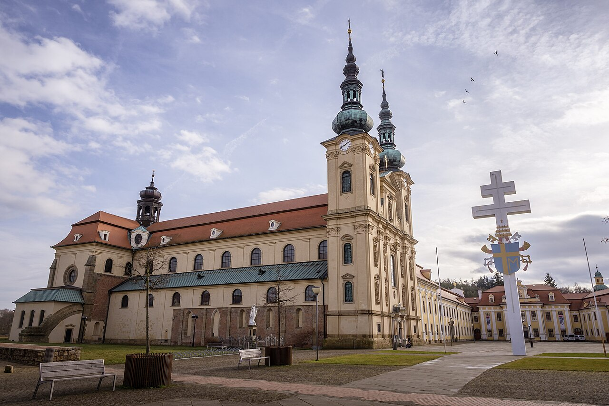

# 捷克—摩拉维亚民间天主教朝圣祈福（Czech／Moravian folk Catholicism）

<!-- 来源：CC BY-SA 4.0 | https://commons.wikimedia.org/wiki/File:Velehrad-2020.jpg -->

## 概述

**捷克与摩拉维亚民间天主教朝圣传统** 深嵌于中欧罗马天主教日历与地方圣所网络。公开文化报道强调摩拉维亚两大朝圣中心：**维莱赫拉德（Velehrad）**——纪念向斯拉夫人传教的圣西里尔与圣美多德（Cyril and Methodius），每年七月吸引全国家庭与青年朝圣；以及圣母朝圣地 **圣霍斯廷（Svatý Hostýn）**，以疗愈与守护叙事著称，全年多场朝圣弥撒。两地之间有步行朝圣路线相连，并接入更长的国际「西里尔与美多德之路」。民俗层另有联合国教科文组织认定的 **Jízda králů（国王巡游）** 等公开文化实践。家户层则延续圣枝、圣诞、复活节食物祝福与守护圣人瞻礼等中欧天主教民俗。本条目为教育概览；**不提供**可冒充圣事的操作，亦不涉及圣餐／告解的复现教程。

## 核心观念（祈福 / 功德 / 祈祷如何被理解）

祈福常被理解为：通过弥撒、圣母祷文、朝圣步行与家庭节庆祝福，把个人忧苦交托于基督、圣母与地方主保，并更新民族—教会记忆（尤其大摩拉维亚传教叙事）。功德贴近：参与堂区与朝圣、慈善捐献、为病者祈祷、在家庭餐桌祝福中维系代际信仰。访客的「福」体现为：尊重后社会主义社会中信仰复兴的多样性（含大量文化天主教徒），勿嘲笑「形式信仰」。

## 典型仪式

### 1. 维莱赫拉德西里尔与美多德朝圣（公共层）
- **场合**：每年 7 月 5 日瞻礼前后；全国朝圣与文化纪念。
- **主要步骤（概念层）**：公开报道——弥撒、游行、讲道与青年聚会。**止于概念**；非天主教徒可作静默访客，勿领圣餐。
- **物品**：宗座圣殿外观与朝圣徽章（概念）。
- **谁来举行**：主教／神父与朝圣团体。

### 2. 圣霍斯廷圣母朝圣与步行路线（公共层）
- **场合**：全年多场朝圣（公开报道提及元旦弥撒等）；通往维莱赫拉德的多日步行。
- **主要步骤（概念层）**：登山／步行、弥撒、献花与私人祈愿。**勿把许愿当交易魔法**。
- **物品**：圣母殿与山丘景观外观（概念）。
- **谁来举行**：朝圣者与堂区组织者。

### 3. 家庭日历祝福与 Jízda králů（公共民俗层）
- **场合**：将临期／圣诞、圣枝主日、复活节篮祝福等；摩拉维亚等地 **Jízda králů（国王巡游，UNESCO）** 民俗节庆。
- **主要步骤（概念层）**：中欧常见的圣枝、圣诞马槽与复活节食物篮请神父祝福；国王巡游作公开文化观礼理解。**止于家庭／公共民俗层**；保留 Velehrad／Hostýn 朝圣主轴，不把民俗巡游写成圣事。
- **物品**：圣枝、彩蛋、祝福食品、巡游服饰外观（概念）。
- **谁来举行**：家庭与堂区神父；巡游由地方社群组织。

## 日常与节庆

捷克社会世俗化程度较高，但朝圣地在身份与家庭记忆中仍具力量；摩拉维亚乡村礼仪密度往往高于大城市。写作应优先 Radio Prague International 等公共报道与教会官方说明，并与波兰、匈牙利、葡萄牙等民间天主教条目区分地域特色。

## 注意与尊重

**弥撒中勿领圣餐除非符合教会规范。** 勿在礼典中高声摄影闪光。勿嘲笑朝圣许愿墙或残疾朝圣者。政治纪念与宗教礼仪场合须分清，勿煽动民族主义挪用圣人符号伤害少数群体。

## 手机互动适合度（Three.js 评估草稿）

- **档位：** C 可做致敬小品（非真仪）
- **敏感度：** 低
- **判断：** 朝圣步道、圣殿外观与家庭节日祝福适合轻量致敬；圣事本身不可模拟为通关。取 C：原创手势练习，明确非真仪。
- **若做成互动：** 手势练习示例——(1) 陀螺仪缓转眺望霍斯廷山丘说明卡；(2) 拖动将「和平意向」放入朝圣意向簿示意（非真弥撒）；(3) 写下为病者／旅人的一句祝福；(4) 点亮蜡烛象征希望。禁止模拟告解或圣餐。
- **红线：** 禁止模拟圣事、告解内容或以真弥撒名称作胜负。
- **评估状态：** 待后期统一评估

## 参考来源

- https://english.radio.cz/believers-go-pilgrimage-velehrad-cyril-and-methodius-celebrations-8553001
- https://english.radio.cz/bystrice-pod-hostynem-8612067
- https://www.south-moravia.com/en/pilgrimage-through-south-moravia/cyril-and-methodius-routes/
- https://ich.unesco.org/en/RL/ride-of-the-kings-in-the-south-east-of-the-czech-republic-00564
- https://www.visitczechia.com/en-us/things-to-do/places/landmarks/religious-monuments/c-velehrad-cistercian-monastery-st-cyril-and-metho
- https://www.visitczechia.com/de-de/things-to-do/places/landmarks/religious-monuments/c-holy-hostyn
