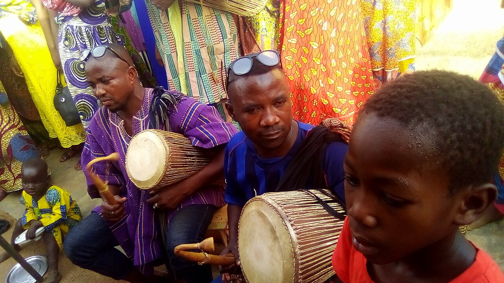

# 达贡巴传统信仰与加纳北部祈福（Dagomba / Dagbamba）

<!-- 来源：CC BY-SA 4.0 | https://commons.wikimedia.org/wiki/File:Lunsi_(Drummers).jpg -->

## 概述

**达贡巴人（Dagomba／Dagbamba）** 分布于加纳北部（含塔马利一带）。公开叙述涉及酋长制——**Ya-Na** 为达贡巴王／最高传统权威公开命名——祖灵观礼、**Lunsi** 宫廷鼓手，以及伊斯兰教／基督教接触；**Damba** 节庆见于 UNESCO 相关公开遗产叙述。教育概览；不提供宫廷／祭祀操作。与莫西、贡贾、马姆普鲁西等萨赫勒—草原条目区分。

## 核心观念（祈福 / 功德 / 祈祷如何被理解）

祈福常被理解为：通过对祖灵、土地与合法权威（含 Ya-Na 伦理）的正确关系，求丰产、司法公正与社群安宁；Damba 与 Lunsi 鼓乐承载公开节庆与宫廷文化记忆。功德贴近：支持和平继位叙事与地方鼓乐版权。访客的「福」体现为：尊重**公开**节庆与清真寺／教堂。

## 典型仪式

### 1. Damba UNESCO 节庆（公开遗产层）
- **场合**：**Damba** 节（公开文化／UNESCO 相关叙述）。
- **主要步骤（概念层）**：理解骑马游行、鼓乐与宫廷—社群欢庆的公开层。**止于公开观礼层**；不提供宫廷仪轨 how-to。
- **物品**：从略。
- **谁来举行**：传统权威与社群；用户仅氛围／观礼，不可主持。

### 2. Ya-Na 与 Lunsi 宫廷鼓手（概念／公开交界）
- **场合**：合法文化节与获授权公开展演。
- **主要步骤（概念层）**：理解 **Ya-Na** 权威伦理与 **Lunsi** 宫廷鼓手传统的公开命名。**禁止**未授权采录音效或冒充鼓语。
- **物品**：从略。
- **谁来举行**：鼓手与宫廷音乐家（依场合）；外人不可僭越。

### 3. 祖灵观礼与伊斯兰／基督教并存（概念／公开层）
- **场合**：公开历史与文化概述；清真寺、教堂与家庭（**ancestors viewing**）。
- **主要步骤（概念层）**：理解祖灵与权威合法性——**观礼／概念**；信仰光谱止于公开层。**禁止**宫廷祭祀复现。
- **物品**：从略。
- **谁来举行**：传统权威／宗教权威与家庭；用户不可主持祖灵仪。

## 日常与节庆

优先塔马利等公开文化活动与 Damba 公开层；关注地方政治敏感期。

## 注意与尊重

**严禁王冠／鼓语游戏化。** 继位争议时期尤须低调。Ya-Na／Lunsi 不可冒充。

## 手机互动适合度（Three.js 评估草稿）

- **档位：** B 仅氛围或图文场景
- **敏感度：** 中高
- **判断：** **仅氛围／无用户主持。** 可做市集—Damba／鼓乐氛围；不可做宫廷祭祀操作；ancestors viewing only。
- **若做成互动：** 静态北部加纳图文与 Damba／Lunsi 尊重说明。
- **红线：** 禁止登基模拟、鼓语通关、冒充酋长／Ya-Na。
- **评估状态：** 待后期统一评估

## 参考来源

- https://www.britannica.com/topic/Dagomba
- https://www.britannica.com/place/Ghana
- https://www.britannica.com/place/Tamale-Ghana
