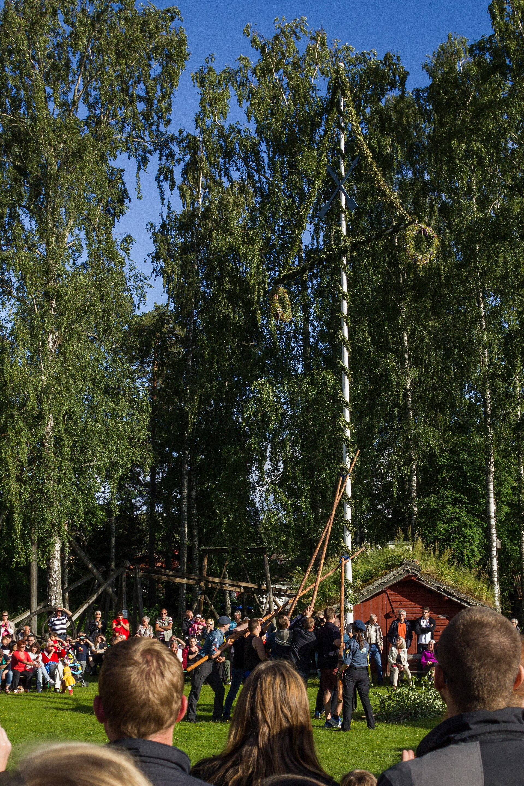

# 达拉纳民间基督教与节期祈福（Dalecarlian／Dalarna）

<!-- 来源：CC BY-SA 3.0 | https://commons.wikimedia.org/wiki/File:Majst%C3%A5ng_Lilla_midsommar_S%C3%A4ter_2014.jpg -->

## 概述

**达拉纳（Dalarna）** 位于瑞典中部，以路德宗堂区、湖区教堂村、仲夏节花柱（**Midsommarstång**）与达拉纳方言／民歌遗产著称。公开文化记述亦常提及湖区 **Kyrkbåtar（教堂船）**：历史上信众划船前往湖心／岸边教堂礼拜的交通与共同体记忆；以及 **Dalahäst（达拉纳木马）**——作为省区文化象征与家屋护佑意象的民间工艺符号（**文化／象征层，非魔法配方**）。常被国家浪漫主义图像化——本卡强调尊重活态社区礼仪，而非把达拉纳写成主题公园。本条目为教育概览；**不提供**可冒充神职的脚本，亦**不提供**「木马护身术」或符咒操作。与斯堪尼亚、哥特兰、耶姆特兰条目可比较但达拉纳认同独立。

## 核心观念（祈福 / 功德 / 祈祷如何被理解）

祈福常被理解为：通过礼拜与岁时感恩，求家庭平安、丰收与邻里凝聚。功德贴近：支持堂区慈善与方言—手工艺传承。访客的「福」体现为：仲夏节礼让本地社区，教堂内保持安静；把 Dalahäst 当作文化认同象征而非可购买的「法术道具」。

## 典型仪式

### 1. 路德宗礼拜与 Kyrkbåtar 湖区教会记忆（概念层）
- **场合**：主日、大节、生命礼仪；湖区教堂村的历史往返记忆。
- **主要步骤（概念层）**：理解公开教会实践，以及历史上以教堂船前往湖岸／岛上教堂的社群礼拜传统。**止于公开教会与文化记忆层**。
- **物品**：教堂、湖面与教堂船外观（概念）。
- **谁来举行**：牧师与会众；历史交通为地方共同体。

### 2. Midsommarstång 仲夏花柱等公共民俗层（概念层）
- **场合**：夏至、岁时节庆。
- **主要步骤（概念层）**：理解竖立／环绕 **Midsommarstång**、花环与公共欢庆。**区分民俗与圣事。**
- **物品**：花柱、花环外观（概念）。
- **谁来举行**：社区。

### 3. 丰收感恩与 Dalahäst 文化象征（概念层）
- **场合**：秋收、圣诞公开民俗；家屋与手工艺展示。
- **主要步骤（概念层）**：理解家庭聚会与感恩叙事；Dalahäst 作为达拉纳文化认同与「护佑意象」的工艺符号。**止于文化象征层**；禁止写成魔法配方或护身符制作教程。
- **物品**：木马工艺外观（概念）。
- **谁来举行**：家庭、堂区与工匠传统。

## 日常与节庆

可与瑞典其他省区民间基督教比较；警惕明信片刻板。

## 注意与尊重

**教堂保持安静。** 仲夏节勿扰乱居民。摄影先征得同意。勿把 Dalahäst 写成可复现「法力」道具。

## 手机互动适合度（Three.js 评估草稿）

- **档位：** C 可做轻度公共文化致敬
- **敏感度：** 中
- **判断：** 村落教堂、湖区教堂船与节庆外观可互动；圣事不可戏玩。
- **若做成互动：** 节期说明＋礼仪提示；木马仅作文化符号说明。
- **红线：** 禁止戏仿圣餐、把仲夏写成派对闯关、把 Dalahäst 做成「法术配方」关卡。
- **评估状态：** 待后期统一评估

## 参考来源

- https://www.visitdalarna.se/artikel/allt-om-midsommar-i-dalarna
- https://www.visitdalarna.se/artikel/midsommardrommen-vantar
- https://webbshop.nordiskamuseet.se/collections/dalahastar
- https://zorn.se/besok/zorns-gammelgard-och-textilkammaren/
- https://dalarnasmuseum.se/utstallningar/fasta-utstallningar/dalahastar/
- https://dalarnasmuseum.se/dalarnas-museum/besokoss/utstallningar-2/
