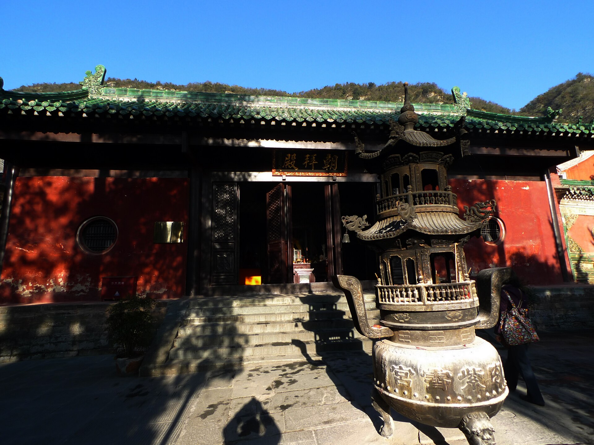

# 道教

<!-- 来源：CC BY 3.0 | https://commons.wikimedia.org/wiki/File:%E6%AD%A6%E5%BD%93%E5%B1%B1%E7%B4%AB%E9%9C%84%E5%AE%AB%E6%9C%9D%E6%8B%9C%E6%AE%BF.JPG -->

## 概述

道教作为中国本土的大型宗教传统，其公共与私人生活中的祈福、禳灾、超荐，高度依赖**斋醮科仪**。斋偏重清心、悔过、洁净；醮偏重延请真圣、呈献供养、乞恩请福。**高功**主持斋／醮——用户仅观礼／随喜参与，**不可自任高功**。受箓道士在坛场中以文书、印诀与赞唱，象征性地与天界官僚体系沟通。对社区而言，周期性建醮可更新地方与神祇的约定；对家庭而言，“做功德”常指为亡者举行的拔度仪式——纪念／章奏止于 **CONCEPT viewing**。

## 核心观念（祈福 / 功德 / 祈祷如何被理解）

“功德”一词既泛指行善合道所积之德，也特指超度亡魂的科仪服务。上表、进章，是把事由写成行政文书上达天曹——用户侧以观礼／概念理解。祈福目标包括解冤释结、祈嗣延寿、祈晴祷雨、地方平安。与一般庙宇烧香相比，完整斋醮强调坛图方位、班次职责与经文法派传承。宋明以来，斋与醮渐趋合流，民间遂以“斋醮”统称大型道场。

## 典型仪式

### 1. 斋醮（高功主持—用户观礼／参与）
- **场合**：宫观落成或晋神、社区三五年一届的祈安庆成、疫灾旱涝等危机响应。
- **主要步骤（概念层）**：取择日、设坛、启请、诵经拜忏、行道、上表、宴神、送圣（概念概述）。**高功主持；用户仅 view／participate，不主持。**
- **物品**：旌旗伞盖、香案灯烛、章表、法器、供品（外观概念）。
- **谁来举行**：高功与经师班子；斋主为社区理事会或出资家庭。**禁止用户自任高功（无用户作为高功）。**

### 2. 上表／章奏与请愿（CONCEPT viewing）
- **场合**：醮仪高潮，或针对特定乞求的专场（**memorials／petitions CONCEPT viewing**）。
- **主要步骤（概念层）**：依格式书写或宣读表文；按科仪呈递、用印（象征）；焚化以示上达——**止于观礼／概念**。
- **物品**：表文纸帛、香火、法印（仅受箓者使用）。
- **谁来举行**：高功法师主导，文书道士协助；用户不可自行拼凑上表。

### 3. 功德拔度仪式（概念／观礼层）
- **场合**：丧期、三七、周年、中元或特为先祖超荐。
- **主要步骤（概念层）**：安灵、诵经拜忏；各地可有破狱、过桥、炼度等象征性节目（概念）。家属跪拜、喊名、上香配合——**观礼／随喜**，不作主持。
- **物品**：灵位、经忏卷册、纸扎、桥板或城墙布景（视地方传统）。
- **谁来举行**：道士团队；家属配合。

## 日常与节庆

日常：在家供奉太上道祖、文昌、关帝或地方守护神，持诵《清静经》等；全真宫观另有早晚功课。三元节、玉皇诞、吕祖诞、城隍诞等常启建法事。公共庙会与家庭私醮并行不悖。

历史文献如隋唐记载已将醮与星辰、太一等崇拜及上章之法相连；近世台湾与华南的功德拔度，仍可见行政隐喻：为亡者销罪、移文、放赦。理解道教祈福，关键是把“文书—焚化—天曹批复”的象征链看清楚，而不是只看热闹的鼓乐与纸扎。

## 注意与尊重

法印、秘咒、受箓谱系与部分破狱、翻坛节目属于内部传承，本档案只作概念说明，不提供可操作程序。切勿自行拼凑“上表”或模仿度亡环节。**用户不可作为高功。** 尊重正一、全真及其他地方道派差异，勿以旅游演出代替真实科仪权威。

## 手机互动适合度（Three.js 评估草稿）

- **档位：** B 仅氛围或图文场景
- **敏感度：** 高
- **判断：** **仅氛围／无用户主持。** 斋醮、上表与功德拔度由高功经师班子主持；用户 view／participate only；法印、秘咒与受箓属内部传承。游客式上香可概念展示，但整场科仪不可关卡化。
- **若做成互动：** 可不做操作关卡，只做可旋转/可走近的场景与说明卡。可选：以手机陀螺仪缓缓环顾圣地外围，不作主持或献祭。
- **红线：** 禁止自行拼凑上表、破狱翻坛或法印秘咒操作；禁止用户扮演高功。
- **评估状态：** 待后期统一评估

## 参考来源

- https://goldenelixir.com/publications/eot_jiao.html
