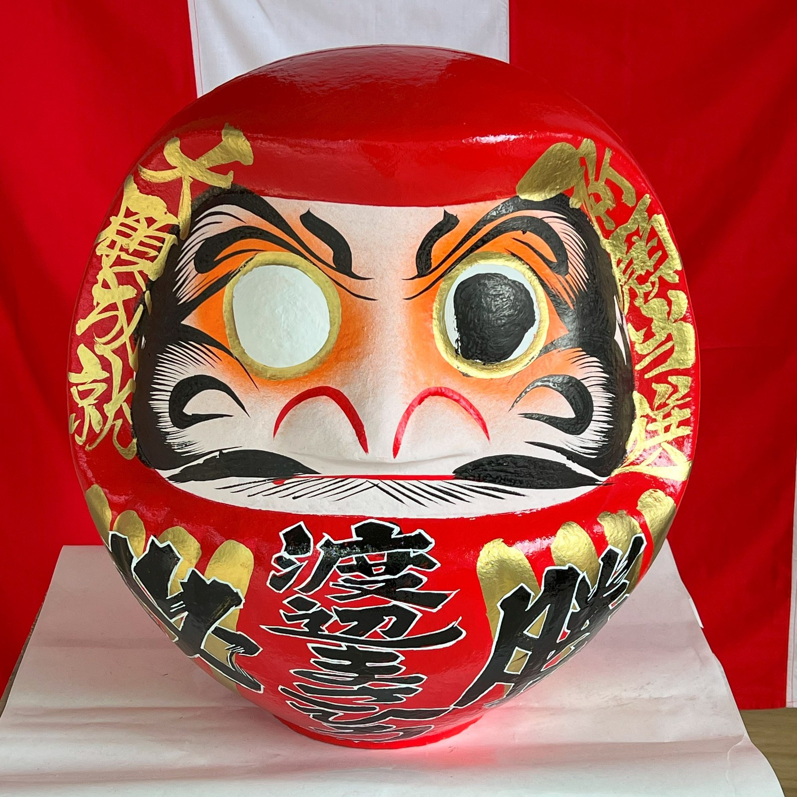

# 达摩不倒翁点睛（daruma）

<!-- 来源：CC0 1.0 | https://commons.wikimedia.org/wiki/File:Takasaki_Daruma_doll_2023-04-23_(1).jpg -->

## 概述

达摩（*daruma*）是日本常见的**民俗祈愿工艺摆偶（A/B）**：圆身、名为「不倒翁」，形制令人联想禅宗初祖达摩，但大众的点睛实践属民俗与工艺祈愿，**不是**寺院必修的宗教仪轨，研究明确提示勿并入 `shinto.md` 或笼统的「佛教卡」。群马县高崎市为全国主要产地，市府与县观光局均记述其习惯：迎入空白双眼的达摩，**先点一目许愿**，愿望实现（或平安度过一年）后**再点另一目还愿**，新年常换新。左右目的先后，高崎市府日文页（「向かって右目」）与县观光英文页（fill left then right）表述不一，源于对己／对观者的视角差——叙述统一采用保守表述：「先点一目、事成点另一目」。

## 核心观念（祈福 / 功德 / 祈祷如何被理解）

达摩的祈愿逻辑是**许愿—达成的闭环（A/B 民俗层）**：空白双眼代表「尚未立愿」，点上一目即立下目标；另一目留待愿望实现或平安一年后补上，谓之还愿完满。常见主题为目标达成、家内安全、生意兴隆等；肩部可写愿词（高崎特征的金文字）。这一实践不含宗教加持或功德结算——市售达摩是民俗工艺品，点睛不等于寺院仪轨，也无「开光」语义。

## 典型仪式

### 1. 点睛许愿与补目还愿
- **场合**：新年立愿、开业、考试与赛季开始、年度目标设定。
- **主要步骤（概念层）**：迎入一尊空白双眼的达摩；以毛笔点上一目并许愿，可在肩部写愿词；置于案头日日相对；愿望实现或平安一年后点另一目完满。左右先后各地叙述不一，保守表述为「先点一目、事成点另一目」。
- **物品**：达摩（高崎为著名产地）、毛笔墨。
- **谁来举行**：个人、家庭、店家；无宗教职务要求。

### 2. 新年换新与旧物处理（科普层）
- **场合**：岁末年初。
- **主要步骤（概念层）**：旧达摩依地方习惯送神社焚纳等处理，再迎新的一尊；此为民俗习惯而非仪轨义务。
- **物品**：旧达摩、新达摩。
- **谁来举行**：持偶家庭；神社提供焚纳承接（各地有差）。

## 日常与节庆

达摩的使用高度集中于**新年立愿**：买新、点目、写愿词，一年后补眼换新，形成年度循环。高崎为全国主要产地，市府与县观光局对点睛习惯均有公开记述。本卡定位为民俗工艺祈愿（A/B）：形制虽联想禅宗初祖，但**不写成寺院仪轨或佛教修行**，也不与神社仪礼混同。

## 注意与尊重

达摩是民俗工艺品，勿宣传「宗教加持」「开光」效果；点睛顺序各地表述不一，勿宣称唯一正确顺序。处置旧达摩尊重地方习惯。作为文化符号使用时避免戏谑变形。

## 手机互动适合度（Three.js 评估草稿）

- **档位：** C 可做致敬小品（非真仪）
- **敏感度：** 低
- **判断：** 「点一目许愿→延迟补目还愿」的双阶段结构适合手机致敬；民俗工艺层（A/B）无秘仪风险。
- **若做成互动：** 手机手势练习（致敬小品，非民俗实务）：

1. 选一尊奶油暖色、空白双眼的达摩。
2. 指尖作笔轻点第一目，写下本季短愿。
3. 达摩坐上案头小架，日常回访可见愿词。
4. 愿望达成日回来点上另一目，移入「完满架」，安静收尾。
- **红线：** 不做「开光成功」「神明应允」类反馈；不宣称宗教加持；补目不设倒计时催逼。
- **评估状态：** 待后期统一评估

## 参考来源

- https://www.city.takasaki.gunma.jp/site/sightseeing/3052.html
- https://www.visit-gunma.jp/en/spots/takasaki-daruma/
