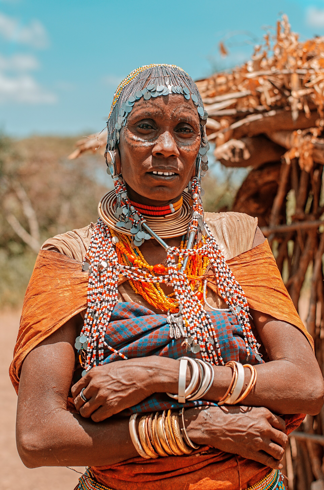

# 达托加传统信仰与牧畜祈福（Datoga／Tatoga）

<!-- 来源：CC BY-SA 4.0 | https://commons.wikimedia.org/wiki/File:A_typical_Datoga_tribe_woman.jpg -->

## 概述

**达托加人（Datoga／Tatoga；亦有 Barabaig 等支系公开名称）** 分布于坦桑尼亚北中部，为牧畜生计突出的社群。公开概述记述：传统宇宙强调祖先、牲畜与地方灵力；今日并存基督教与本土实践；与伊拉克伍、哈扎等邻近社群互动复杂。本条目为教育概览；**不提供**献牲、战争或可冒充仪者的步骤；**非**马赛卡片的复制。

## 核心观念（祈福 / 功德 / 祈祷如何被理解）

祈福常被理解为：通过对祖先与牲畜伦理的正确关系，并／或通过教堂祈祷，求雨水、畜群平安与和解。功德贴近：支持语言与土地协商公正。访客的「福」体现为：不把牧区写成「勇士秀」旅游线。

## 典型仪式

### 1. 牲畜—祖先伦理（概念层）
- **场合**：牧养周期、危机公开记述。
- **主要步骤（概念层）**：理解牛群在社会—宇宙中的位置。**禁止**复现献牲。
- **物品**：从略。
- **谁来举行**：家庭与长者。

### 2. 教堂崇拜（概念层）
- **场合**：主日、生命礼仪。
- **主要步骤（概念层）**：理解基督教公开层。**止于公开教会层**。
- **物品**：从略。
- **谁来举行**：教牧与会众。

### 3. 和解与雨水叙事（概念层）
- **场合**：冲突后、旱灾公开记述。
- **主要步骤（概念层）**：理解社群和解与祈雨努力。**禁止**战争仪轨复现。
- **物品**：从略。
- **谁来举行**：长老与宗教权威。

## 日常与节庆

优先坦桑尼亚北中部牧区公开研究；与马赛、伊拉克伍区分。

## 注意与尊重

**勿强求武士／献牲表演。** 禁止把牧区冲突写成观光。摄影须许可。

## 手机互动适合度（Three.js 评估草稿）

- **档位：** A 不建议做成操作型互动
- **敏感度：** 极高
- **判断：** 牧畜冲突与献牲语境不宜游戏化。
- **若做成互动：** 不建议；最多静态牧畜伦理说明。
- **红线：** 禁止献牲、战争、冒充仪者。
- **评估状态：** 待后期统一评估

## 参考来源

- https://www.britannica.com/topic/Datoga
- https://www.britannica.com/place/Tanzania
- https://www.britannica.com/topic/Nilotic-languages
