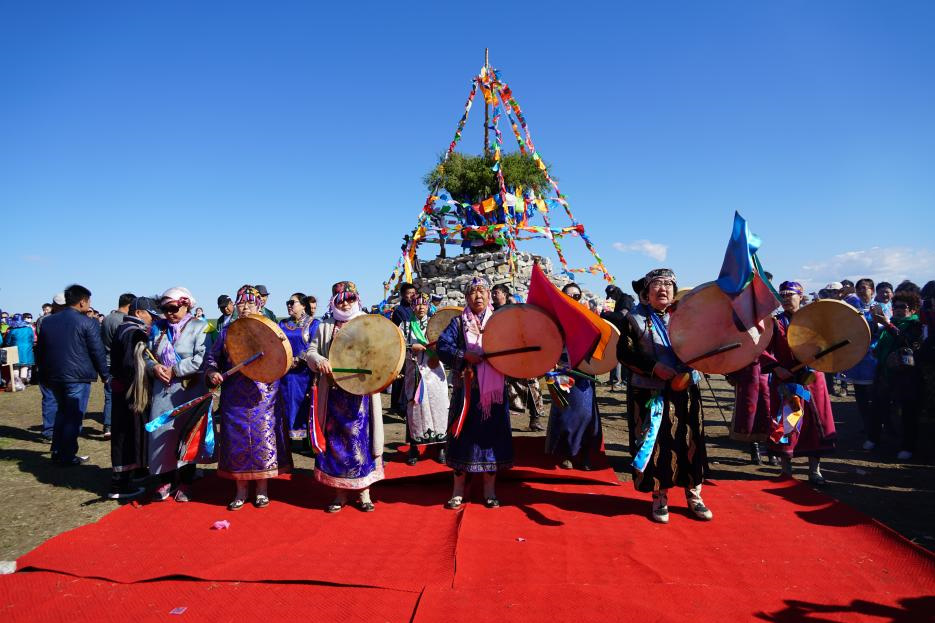

# 达斡尔传统信仰与萨满—敖包祈福（Daur）

<!-- 来源：CC BY 4.0 | https://commons.wikimedia.org/wiki/File:Daur_Shamanic_Oboo_Ritual.jpg -->

## 概述

**达斡尔族（Daur）** 主要分布于中国内蒙古莫力达瓦、黑龙江齐齐哈尔及新疆塔城等地。公开百科与当代研究记述：传统宗教以萨满教为核心，天神（tenger）体系、自然神、氏族祖先神并重；**Aoboo／oboo（敖包）** 公共祭祀为重要公共表达；**Anian** 新年等岁时公开层见于文化叙述；**Yadgan** 萨满属 **CONCEPT ONLY no ops**。1990 年代起出现公开复兴。本条目为教育概览；**不提供**萨满出神、河灵疗愈操作或可冒充萨满的步骤。

## 核心观念（祈福 / 功德 / 祈祷如何被理解）

祈福常被理解为：通过对天神、敖包与氏族守护的敬意，祈求人畜平安与地方丰饶；Anian 新年承载岁时更新象征。功德贴近：支持达斡尔语与非物质文化遗产自主表述，反对把复兴仪轨做成收费「萨满秀」。访客的「福」体现为：尊重莫昆内部知识边界。

## 典型仪式

### 1. Aoboo／oboo 敖包公共祭祀（公开／概念层）
- **场合**：岁时与社区公共祭（**Aoboo／oboo public**）。
- **主要步骤（概念层）**：理解敖包作为圣地与集体祈福焦点的公开叙述。**止于公共／概念层**；**禁止**复现献牲细节。
- **物品**：从略。
- **谁来举行**：萨满与莫昆／社区；用户仅氛围／观礼，不可主持。

### 2. Anian 新年（公开／概念层）
- **场合**：达斡尔岁时／新年公开文化记述（**Anian New Year**）。
- **主要步骤（概念层）**：理解新年团聚、祝福与社群更新的公开层。**止于公开文化层**。
- **物品**：从略。
- **谁来举行**：家庭与社群；用户不可僭越内部仪轨。

### 3. Yadgan 萨满（CONCEPT ONLY no ops）
- **场合**：疾病、生育、家事危机与当代复兴公开记述。
- **主要步骤（概念层）**：**Yadgan shaman CONCEPT ONLY no ops**——理解萨满中介的公开记述。**禁止**通灵／出神复现或任何 ops。
- **物品**：从略。
- **谁来举行**：被承认的萨满（常强调血缘传承叙述）；用户不可扮演。

## 日常与节庆

优先 encyclopedia 与同行评审公开研究；Aoboo／Anian 为公开入口。并与鄂伦春、鄂温克、蒙古萨满、布里亚特条目区分。

## 注意与尊重

**勿购买「达斡尔萨满服」旅游仿品当真器。** 勿闯入敖包禁区。禁止速成萨满课程话术。Yadgan 不可操作化。

## 手机互动适合度（Three.js 评估草稿）

- **档位：** B 仅氛围或图文场景
- **敏感度：** 高
- **判断：** **仅氛围／无用户主持。** 草原敖包与 Anian 外观可说明；Yadgan CONCEPT ONLY no ops，通灵不可操作化。
- **若做成互动：** 只做敖包远景＋Anian／概念卡。
- **红线：** 禁止请神、出神、献牲通关、冒充 Yadgan。
- **评估状态：** 待后期统一评估

## 参考来源

- https://www.encyclopedia.com/humanities/encyclopedias-almanacs-transcripts-and-maps/daur
- https://doi.org/10.3390/rel14050661
- https://doi.org/10.3390/rel10010052
