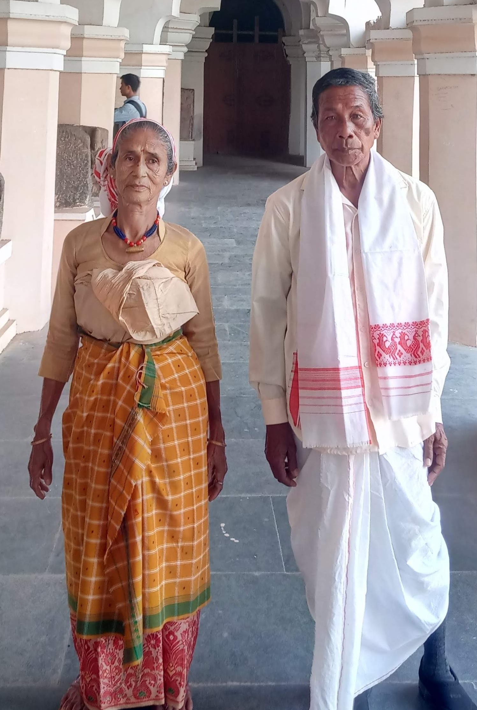

# 德奥里传统信仰与昆迪—妈妈祈福（Deori）

<!-- 来源：CC BY-SA 4.0 | https://commons.wikimedia.org/wiki/File:Deori_people.jpg -->

## 概述

**德奥里人（Deori）** 分布于印度阿萨姆与阿鲁纳恰尔毗邻地带，自称常作 Jimochãya（「太阳之子」公开自称叙述）。公开记述：传统宗教常称 **Kundism**，以 **Kundi-Mama**（及相关 **Kundigira／Girasi** 公开神系叙述）等至上神偶与氏族圣地、自然力敬礼为核心；岁时可见 **Bohag／Ibaku Bisu** 等公开文化层；**Bor Deori** 等氏族传统上主持 **Thani** 神龛——**users view**（用户观礼，不可主持）。行政分类或归入印度教，但社群常强调独立认同。本条目为教育概览；**Kundi-Mama CONCEPT**；**不提供**献牲、祭司操作或可冒充仪者的步骤。

## 核心观念（祈福 / 功德 / 祈祷如何被理解）

祈福常被理解为：通过对 Kundi-Mama／Kundigira／Girasi 与氏族神祇的敬意，求健康、丰收与社群延续；Bohag／Ibaku Bisu 承载岁时更新与社群认同。功德贴近：支持德奥里语（尤其 Dibongiya 支）与圣地保护。访客的「福」体现为：不擅自进入氏族圣地；Thani 神龛仅观礼。

## 典型仪式

### 1. Bohag／Ibaku Bisu（公开／概念层）
- **场合**：岁时新年／Bisu 公开文化记述（**Bohag／Ibaku Bisu**）。
- **主要步骤（概念层）**：理解节庆团聚、祝福与社群更新的公开层。**止于公开文化层**；**禁止**复现封闭祭仪。
- **物品**：从略。
- **谁来举行**：社群与文化组织；用户仅氛围／观礼，不可主持。

### 2. Bor Deori 主持 Thani 神龛 — users view（概念／观礼层）
- **场合**：氏族圣地／Thani 神龛公开记述。
- **主要步骤（概念层）**：**Bor Deori hosts Thani shrine — users view**。理解神龛与氏族礼仪中心地位。**禁止**复现祭仪或僭越主持。
- **物品**：从略。
- **谁来举行**：Bor Deori／氏族仪式权威；用户仅观礼。

### 3. Kundi-Mama／Kundigira／Girasi（CONCEPT）
- **场合**：家庭、社群与公开宗教叙述。
- **主要步骤（概念层）**：**Kundi-Mama CONCEPT**；理解 Kundigira／Girasi 等神系公开命名。**止于概念**；**禁止**请神 how-to。
- **物品**：从略。
- **谁来举行**：氏族与祭司传统；外人不可扮演。

## 日常与节庆

Bohag／Ibaku Bisu 为公开入口。可与博多、米辛、迪马萨等阿萨姆语支条目比较；注意支系差异。

## 注意与尊重

**非邀莫入氏族圣地／Thani。** 禁止献牲旅游。勿把行政「印度教」标签强加于自我认同。Kundi-Mama 仅 CONCEPT。

## 手机互动适合度（Three.js 评估草稿）

- **档位：** B 仅氛围或图文场景
- **敏感度：** 高
- **判断：** **仅氛围／无用户主持。** 太阳之子认同与 Bohag／Ibaku Bisu 可说明；Thani 观礼；Kundi-Mama CONCEPT；祭仪不可操作化。
- **若做成互动：** 只做神祇名称与伦理／节庆说明卡。
- **红线：** 禁止献牲、冒充祭司、擅闯圣地、Thani 主持通关。
- **评估状态：** 待后期统一评估

## 参考来源

- https://www.britannica.com/place/Assam
- https://www.britannica.com/place/Arunachal-Pradesh
- https://www.britannica.com/topic/Bodo
