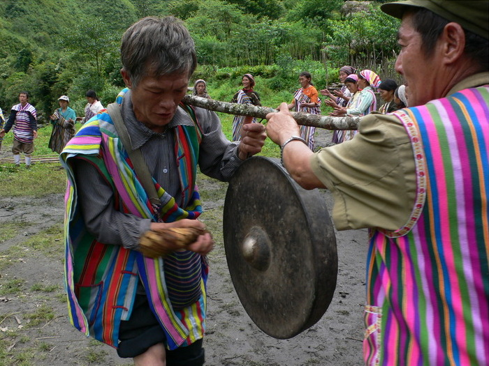

# 独龙传统信仰与万物有灵祈福（Derung／Drung）

<!-- 来源：CC BY-SA 3.0 | https://commons.wikimedia.org/wiki/File:H.the_Mangluo_dance.jpg -->

## 概述

**独龙族（Derung／Drung／Dulong）** 为中国人口较少的官方民族之一，主要分布于云南贡山独龙江河谷。公开百科记述：传统宗教为万物有灵，萨满／仪式专家安抚恶灵；十二月前后新年有对天献祭的公开叙述；部分人接触基督教。历史上的文面等身体标记属高度敏感文化遗产，本条目**绝不提供**文面或任何身体改造操作。亦**不提供**献牲程序或可冒充萨满的步骤。

## 核心观念（祈福 / 功德 / 祈祷如何被理解）

祈福常被理解为：通过对天地与地方灵的敬意，祈求河谷农猎平安。功德贴近：支持独龙语、公路开通后的文化自主，反对把「最后文面」写成猎奇消费。访客的「福」体现为：尊重极小族群的隐私与解释权。

## 典型仪式

### 1. 新年与对天敬礼（概念层）
- **场合**：农历十二月前后公开记述的新年。
- **主要步骤（概念层）**：理解集体欢庆与对天献祭叙事的存在。**禁止**复现献牲。
- **物品**：从略。
- **谁来举行**：社群与仪式专家。

### 2. 万物有灵与恶灵安抚（高度敏感，仅概念）
- **场合**：疾病、厄运公开记述。
- **主要步骤（概念层）**：理解萨满中介的公开角色。**禁止**通灵复现。
- **物品**：从略。
- **谁来举行**：被承认的萨满／仪式专家。

### 3. 基督教并行社区（概念层）
- **场合**：部分村落堂会实践。
- **主要步骤（概念层）**：理解改宗与传统并行。**勿审判**。
- **物品**：从略。
- **谁来举行**：教牧与信众。

## 日常与节庆

优先 encyclopedia／国家民族介绍；并与怒族、傈僳、普米条目区分。

## 注意与尊重

**严禁文面／身体改造任何操作化或旅游营销。** 勿无人机低飞扰民。禁止萨满表演请求。

## 手机互动适合度（Three.js 评估草稿）

- **档位：** A 不建议做成操作型互动
- **敏感度：** 极高
- **判断：** 极小族群与身体标记遗产不宜游戏化。
- **若做成互动：** 不建议；最多静态河谷地理说明。
- **红线：** 禁止献牲、通灵、文面相关任何通关。
- **评估状态：** 待后期统一评估

## 参考来源

- https://www.encyclopedia.com/humanities/encyclopedias-almanacs-transcripts-and-maps/drung
- https://en.wikipedia.org/wiki/Derung_people
- http://english.scio.gov.cn/m/chinafacts/2017-06/06/content_40974205.htm
