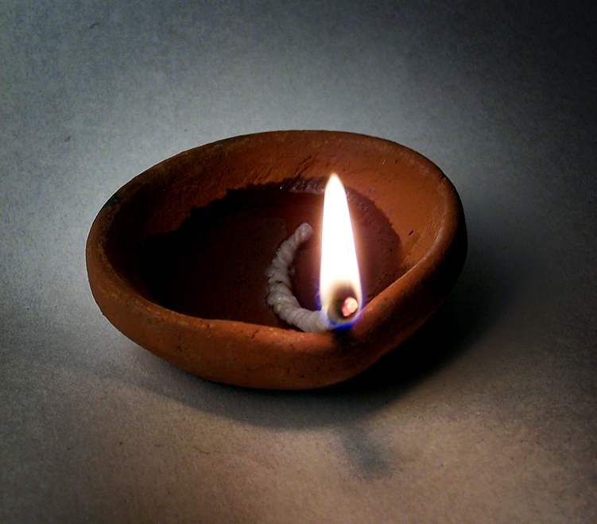

# Diya 油灯（diya／dīpa）

<!-- 来源：CC BY 2.0 | https://commons.wikimedia.org/wiki/File:Diya.jpg -->

## 概述

*Diya*（*dīpa*，灯盏）是**印度教家庭与节庆中最常见的油灯（A）**：陶或铜的小盏注油置芯，日常家庭 *puja*（普迦）与 *aarti*（旋灯）中点亮，排灯节（Diwali）等节庆时在门槛与窗台点起成排。Science Museum Group 藏**带印度教母题、或为北印度风格的黄铜油灯**与 **Lakshmi 立于象座、手捧五连盏油灯的造像**（均 1801–1900）可为器物例证。`hinduism.md` 已完整叙述 puja／aarti／prasada 框架；本卡**聚焦灯盏物件与「点亮一排、旋灯一瞥」的短互动**。Diya 与汉传／藏传供灯同属「光明」意象但神系与语境不同，产品皮肤必须分开（见 `specs/notes-wish-lamps-disambiguation.md`）。

## 核心观念（祈福 / 功德 / 祈祷如何被理解）

Diya 的心意是**以一点光明迎请与礼敬**：日常 puja 中点亮灯盏是向圣像献光、并领受 *darshan*（「看见也被看见」）的一环；aarti 时灯在圣像前绕旋，光成为人与神相互注视的可见形式。排灯节的成排灯火则被叙述为迎光入宅、驱散黑暗。灯盏是敬礼与节庆的语言，不是功德点数——没有「点几盏得几分福」的计量，意义在于点亮与旋绕时那份专注的敬意。

## 典型仪式

### 1. 家常点灯与旋灯（概念层）
- **场合**：家庭神龛日常 puja 与 aarti；Diwali 等节庆的门槛与窗台。
- **主要步骤（概念层）**：灯盏注油、置芯；点亮后先献于圣像前；aarti 时以手托灯绕旋，合十致意；节庆时于门槛点起成排。**只作概念层叙述**，不描摹祭司科仪细节（神庙层见 `hinduism.md`）。
- **物品**：陶／铜 diya、油、灯芯；aarti 常配 thali 盘与铃。
- **谁来举行**：家庭成员日常自行；神庙由 *pujari* 主持。

## 日常与节庆

点灯嵌在家庭 puja 的高日常节奏中：晨昏敬礼、亲临圣像、节庆斋戒都常有灯盏在场；一年中最亮的时刻是 Diwali——家户点起成排 diya，与公共灯彩并置。本卡不展开各地方节历与灯盏形制谱系差异，puja／aarti／vrata 整体框架见 `hinduism.md`。

## 注意与尊重

标明印度教身份：与东亚佛教供灯、天主教还愿烛是**不同传统的光明语言**，产品不得共用皮肤或混名（见灯类辨析笔记）。不把点灯写成「完成普迦」，不模拟 pujari 科仪。Diwali 叙述保持节庆的温暖与庄重，不做猎奇化。现实点灯注意明火安全。

## 手机互动适合度（Three.js 评估草稿）

- **档位：** C 可做致敬小品（非真仪）
- **敏感度：** 中（印度教家庭敬礼与节庆语境）
- **判断：** 「点亮成排→绕圈旋灯」手势简洁，旋灯弧线与其他灯类互动的手感区分明显，适合做南亚灯的独立皮肤；标题可用「灯旋一瞥」，与 `hinduism.md` 既有措辞一致。
- **若做成互动：** 手机手势练习（致敬小品，非 puja 实务）：

1. 奶油暖色的一排小 diya 静静待点。
2. 指尖依次点亮，一盏、两盏、一小排。
3. 拖住其中一盏缓缓绕圈，光晕画出一道小小的弧。
4. 界面留一句：一点光，慢慢转。
- **红线：** 不用「完成普迦」「功德+」类措辞；不模拟完整祭司科仪；不与东亚供灯、还愿烛共用特效包；不复刻特定神像外观；不做点数化功德。
- **评估状态：** 待后期统一评估

## 参考来源

- https://collection.sciencemuseumgroup.org.uk/objects/co123880
- https://collection.sciencemuseumgroup.org.uk/objects/co123696
