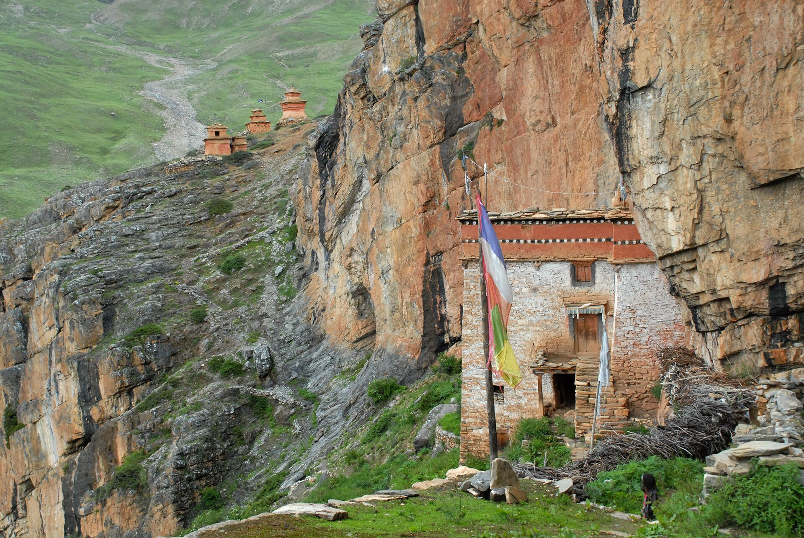

# 多尔波藏传与山神祈福（Dolpo）

<!-- 来源：CC BY 3.0 | https://commons.wikimedia.org/wiki/File:Temple_founded_in_the_8th_century,_Dolpo,_Nepal_in_2014.jpg -->

## 概述

**多尔波（Dolpo）** 位于尼泊尔西北喜马拉雅，文化上与藏区苯教—藏传佛教传统深度交织。公开宗教生活可见 **Shey Gompa** 等寺院、转经与 **Riwo Palbar**（水晶山）**kora** 朝圣叙述；**Shey Festival** 为公开节庆／朝圣层；山神 **yul lha** 供奉属 **CONCEPT**——**中高敏感**。本卡仅公开朝圣／寺院层；不提供密续或闭关操作。与珞巴、门巴、上木斯塘、拉达克等条目区分。

## 核心观念（祈福 / 功德 / 祈祷如何被理解）

祈福常被理解为：通过念诵、转经、供灯与对山神—护法的恭敬，求旅途平安、畜群与功德资粮；Shey Gompa／Riwo Palbar kora 与 Shey Festival 承载公开朝圣节奏。功德贴近：布施寺院、少扰野生动物与尊重摄影禁忌。访客的「福」体现为：在**开放寺院／转经道**谦逊随喜；yul lha 仅 CONCEPT。

## 典型仪式

### 1. Shey Gompa 与寺院供灯转经（公开层）
- **场合**：Shey Gompa 等寺院开放时间。
- **主要步骤（概念层）**：顺时针转经、供灯（随当地指示）。**勿闯入僧舍／密坛。**
- **物品**：黄油灯、哈达（依公开习惯）。
- **谁来举行**：僧众与信徒；用户仅氛围／观礼，不可主持。

### 2. Riwo Palbar 水晶山 kora 与 Shey Festival（公开／概念层）
- **场合**：水晶山转山与 **Shey Festival** 公开朝圣／节庆记述。
- **主要步骤（概念层）**：理解 **Riwo Palbar crystal mountain kora** 与节日朝圣的公开层。**止于公开朝圣层**；遵守路线与禁拍规定。
- **物品**：从略。
- **谁来举行**：僧众、朝圣者与地方社区；用户随许可观礼／随喜。

### 3. yul lha 山神（CONCEPT）
- **场合**：山口、村落公开记述。
- **主要步骤（概念层）**：**yul lha CONCEPT**——知晓存在地方神供奉。**禁止**自制「山神召唤」仪式。
- **物品**：从略。
- **谁来举行**：地方宗教权威；用户不可扮演。

## 日常与节庆

Shey Festival 与 Riwo Palbar kora 为公开入口。优先持许可的徒步路线与开放寺院；遵守禁飞／禁拍规定。

## 注意与尊重

高海拔医疗风险自负。勿采集「神山灵石」。yul lha 仅 CONCEPT。勿闯入密坛。

## 手机互动适合度（Three.js 评估草稿）

- **档位：** B 仅氛围或图文场景
- **敏感度：** 中高
- **判断：** **仅氛围／无用户主持。** 可做 Shey Gompa／水晶山 kora／Shey Festival 氛围；yul lha CONCEPT；不可做密续／闭关。
- **若做成互动：** 静态喜马拉雅寺院／转山场景与礼仪提示。
- **红线：** 禁止密咒教程、神山坐标猎奇、冒充喇嘛、山神召唤通关。
- **评估状态：** 待后期统一评估

## 参考来源

- https://www.britannica.com/place/Nepal
- https://www.britannica.com/topic/Tibetan-Buddhism
- https://www.britannica.com/topic/Bon
