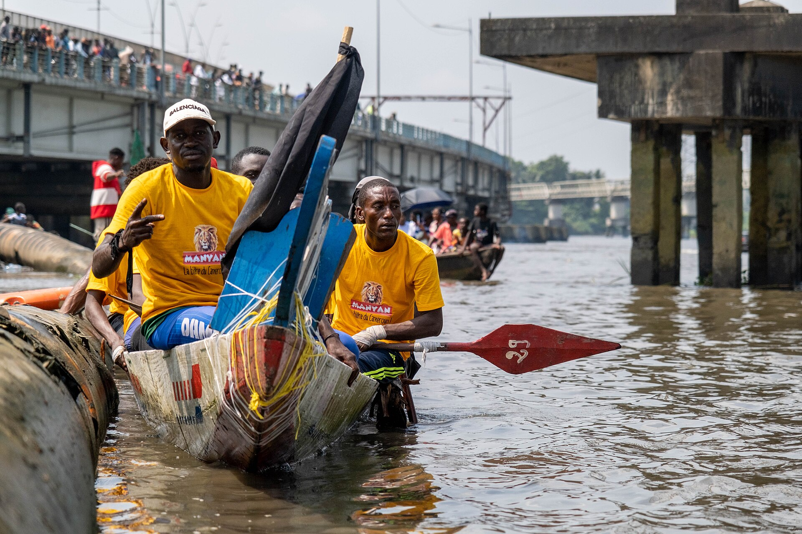

# 杜阿拉传统信仰与河口—基督教祈福（Duala）

<!-- 来源：CC BY-SA 4.0 | https://commons.wikimedia.org/wiki/File:NGONDO_2024_Festival_01.jpg -->

## 概述

**杜阿拉人（Duala）** 分布于喀麦隆滨海河口（杜阿拉一带），历史上以贸易酋长国与河口礼仪闻名。公开概述记述：传统宇宙含祖先与水灵伦理——**Miengu** 等水灵叙述见于公开文化层；**Ngondo**（Wouri 河水域节）为重要公开水节／文化节；**diving oracle**（潜水神谕）属 **HIGH SENSITIVITY CONCEPT ONLY**。今日多数为基督徒，城市与习俗并存。本条目为教育概览；**不提供**献牲、入会、神谕操作或可冒充仪者的步骤。与巴米累克草原王国、芳／布维蒂等条目核心不同。

## 核心观念（祈福 / 功德 / 祈祷如何被理解）

祈福常被理解为：通过对祖先与河口水域（含 Miengu 公开叙述）的敬意，并／或通过教堂祈祷，求航行／商旅平安、健康与社群繁荣；Ngondo Wouri 水节承载公开社群认同。功德贴近：支持杜阿拉语与城市文化遗产。访客的「福」体现为：礼仪中保持尊重；diving oracle 仅 HIGH SENSITIVITY CONCEPT ONLY。

## 典型仪式

### 1. Ngondo Wouri 水节（公开／概念层）
- **场合**：Wouri 河水域公开文化节记述（**Ngondo Wouri water festival**）。
- **主要步骤（概念层）**：理解水节、舟渡与社群展演的公开层。**止于公开文化层**。
- **物品**：从略。
- **谁来举行**：社群与文化组织；用户仅氛围／观礼，不可主持。

### 2. Miengu 水灵伦理（概念层）
- **场合**：水域、家庭危机与公开民族志记述。
- **主要步骤（概念层）**：理解 **Miengu** 与祖先—水域联结的公开叙述。**禁止**复现祭仪或请灵。
- **物品**：从略。
- **谁来举行**：家庭与长者；用户不可扮演。

### 3. Diving oracle（HIGH SENSITIVITY CONCEPT ONLY）
- **场合**：公开史述／民族志中的水域神谕叙述。
- **主要步骤（概念层）**：**diving oracle HIGH SENSITIVITY CONCEPT ONLY**——仅作存在性概念提及。**禁止**任何神谕／潜水仪式 how-to 或复现。
- **物品**：从略。
- **谁来举行**：历史上社群内部权威；用户严禁扮演或操作。

## 日常与节庆

Ngondo 为公开入口。优先喀麦隆滨海公开文化层；教堂崇拜并行。

## 注意与尊重

**勿强求仪者演示。** Diving oracle HIGH SENSITIVITY CONCEPT ONLY。禁止献牲旅游。摄影须许可。

## 手机互动适合度（Three.js 评估草稿）

- **档位：** B 仅氛围或图文场景
- **敏感度：** 高
- **判断：** **仅氛围／无用户主持。** 河口城市与 Ngondo 可说明；Miengu 概念；diving oracle HIGH SENSITIVITY CONCEPT ONLY；祭仪不可操作化。
- **若做成互动：** 只做港口历史＋Ngondo／信仰光谱说明。
- **红线：** 禁止献牲、入会、冒充仪者、神谕通关、殖民商战闯关。
- **评估状态：** 待后期统一评估

## 参考来源

- https://www.britannica.com/topic/Duala
- https://www.britannica.com/place/Douala
- https://www.britannica.com/place/Cameroon
