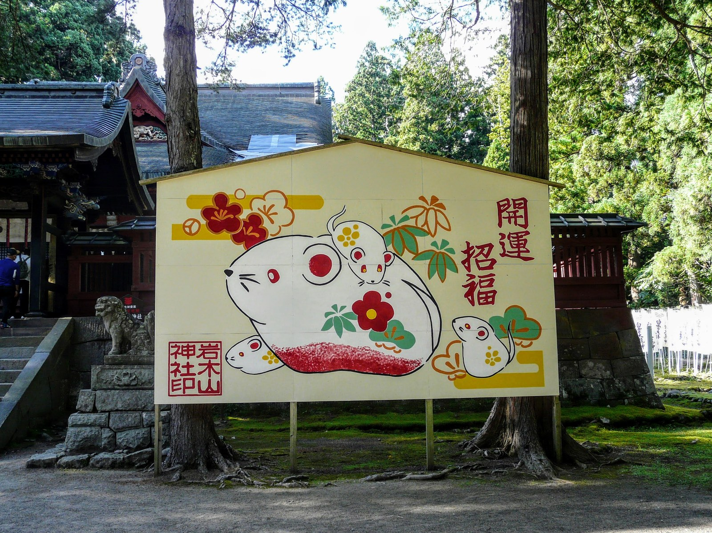

# 绘马（ema）

<!-- 来源：CC BY-SA 4.0 | https://commons.wikimedia.org/wiki/File:Iwakiyama_shrine_Ema.jpg -->

## 概述

绘马（*ema*）是**神社（亦见于部分寺院）的还愿木牌（A）**：小木牌上书写祈愿或感谢，挂于绘马架，是公开可见的心意记号。国学院大学 EOS 电子博物馆记述：古来以马为神明坐骑而献马，后简化为马形／绘马木牌；奈良期遗址已有考古例，室町以降题材扩展，今日多为神社向信众发放的主题小牌。神道整体语境与参拜礼仪见 `shinto.md`；本卡**聚焦书写＋悬挂的短物件互动**，合格祈愿等主题用例归入本物件，不另开专行。

## 核心观念（祈福 / 功德 / 祈祷如何被理解）

绘马的逻辑是**把心愿或谢意「写下来、挂上去」**：书写本身是整理心意，悬挂是把私人愿望交给公开的绘马墙。它没有「神明已批准」的回执，也没有功德点数——神社本厅强调参拜首先是问候与礼敬，愿望可以陈说，却不宜简化为投币买效果。还愿时亦可写感谢，与「先许后要」形成呼应；产品中「许愿墙」与「谢恩区」可分，但不得替用户宣布神意。

## 典型仪式

### 1. 书愿悬挂（概念层）
- **场合**：初诣、考试前、人生转折、旅行出发；日常参拜延伸。
- **主要步骤（概念层）**：在社务所或指定处取得绘马；于背面（或指定面）书写短愿／感谢；挂上绘马架。实地遵守各社书写与悬挂规范，不仿特定神纹作商用。
- **物品**：绘马木牌、笔。
- **谁来举行**：信众个人；神社授与木牌。

## 日常与节庆

绘马**不按单一节历**：正月初诣人潮最大，但考试季、安产、交通安全等主题全年可见。它是参拜延伸，不是每日课诵。题材与尺寸的历史演变以 EOS 为准，本卡不作断代展开；完整参拜流程（手水、二拜二拍手一拜）见 `shinto.md`。

## 注意与尊重

不仿特定神社神纹／纹样作商标或通关皮肤。不宣称「神明已批准」或生成灵验证明。现实中不移除、涂改他人绘马。与七夕短册（`tanzaku-tanabata.md`）同为「书写＋悬挂」但**岁时／笹竹语境不同**，须分物件。

## 手机互动适合度（Three.js 评估草稿）

- **档位：** C 可做致敬小品（非真仪）
- **敏感度：** 低
- **判断：** 「书写短愿→挂奶油绘马墙」手势完整，可与还愿「移至谢区」形成闭环；与短册、milagros 分皮肤。
- **若做成互动：** 手机手势练习（致敬小品，非神社实务）：

1. 奶油色绘马墙前，一块空白小木牌。
2. 指尖写下短短一句心愿或感谢。
3. 拖到墙上挂好；若选「谢」，移到暖色「谢」区。
4. 界面留一句：记下了。
- **红线：** 不显示「神明已批准」；不仿特定神纹；不做功德／通关反馈；不称完成正式参拝。
- **评估状态：** 待后期统一评估

## 参考来源

- https://d-museum.kokugakuin.ac.jp/eos/detail/?id=9608
- https://www.jinjahoncho.or.jp/en/at-a-jinja/entering/
