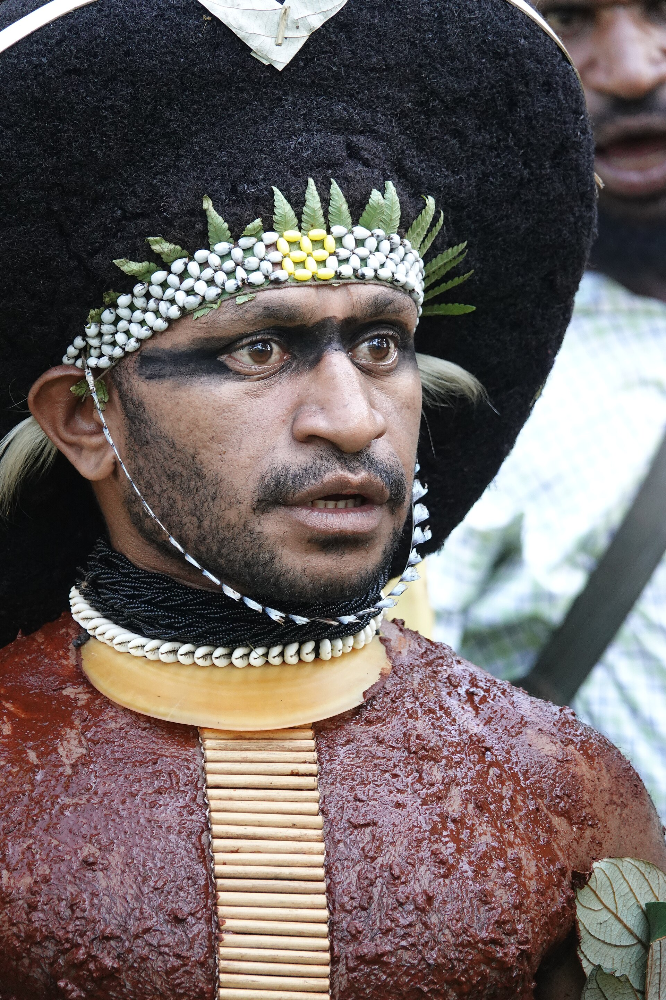

# 恩加传统信仰与特交换—祖灵祈福（Enga）

<!-- 来源：CC BY 4.0 | https://commons.wikimedia.org/wiki/File:Enga_Warrior.jpg -->

## 概述

**恩加人（Enga）** 为巴布亚新几内亚高地主要族群之一。公开概述记述：传统宇宙强调祖先与猪只互惠；著名的 **Tee** 交换体系曾深度塑造声望与和解；今日并存基督教与高地冲突语境——**须克制，勿消费暴力**。本条目为教育概览；**不提供**献牲操作、战争仪轨或可冒充仪者的步骤。与胡里、钦布条目区分。

## 核心观念（祈福 / 功德 / 祈祷如何被理解）

祈福常被理解为：通过对祖先与互惠交换伦理的正确关系，并／或通过教堂祈祷，求丰收、和解与家庭平安。功德贴近：支持和平教育与恩加语。访客的「福」体现为：**高风险地区勿以采风名义前往**。

## 典型仪式

### 1. Tee 交换与互惠伦理（概念层）
- **场合**：公开民族志记述的大型交换。
- **主要步骤（概念层）**：理解猪只—声望—和解网络。**禁止**复现献牲操作。
- **物品**：从略。
- **谁来举行**：氏族网络（内部）。

### 2. 祖先敬礼（概念层）
- **场合**：丧葬、危机公开记述。
- **主要步骤（概念层）**：理解祖先在伦理中的位置。**禁止**复现祭仪。
- **物品**：从略。
- **谁来举行**：家庭与长者。

### 3. 教堂崇拜（概念层）
- **场合**：主日、奋兴、生命礼仪。
- **主要步骤（概念层）**：理解基督教公开层。**止于公开教会层**。
- **物品**：从略。
- **谁来举行**：教牧与会众。

## 日常与节庆

优先恩加省公开文化层；安全语境优先。

## 注意与尊重

**冲突地区勿冒险。** 禁止献牲／战争旅游化。摄影须许可。

## 手机互动适合度（Three.js 评估草稿）

- **档位：** A 不建议做成操作型互动
- **敏感度：** 极高
- **判断：** 交换核心可概念说明，但暴力与献牲不宜游戏化。
- **若做成互动：** 不建议；最多静态互惠伦理说明（无通关）。
- **红线：** 禁止献牲、战争闯关、冒充仪者。
- **评估状态：** 待后期统一评估

## 参考来源

- https://www.britannica.com/topic/Enga
- https://www.britannica.com/place/Enga
- https://www.britannica.com/place/Papua-New-Guinea
