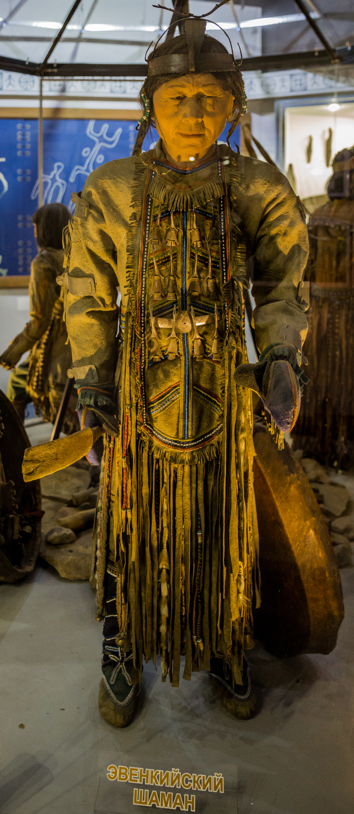

# 埃文基／通古斯萨满传统（Evenki／Evenk Shamanism）

<!-- 来源：CC BY 2.0 | https://commons.wikimedia.org/wiki/File:Evenki_shaman.jpg -->

## 概述

**埃文基人（Evenki／Evenk）** 是西伯利亚北部分布最广的通古斯语民族之一，亦有社群居于中国东北与蒙古。大英百科记述其传统生计以泰加林狩猎与驯鹿畜牧为主。公开民族志强调：传统宇宙观区分上界、中界（人间）与下界；**萨满（saman／khaman）** 一词本身即来自埃文基语，经俄语传入西方学术。萨满在辅助灵帮助下沟通三界、治病、护佑氏族与狩猎／驯鹿事务。十七世纪以降的东正教接触带来部分融合；苏联时期萨满遭受系统性压制。近年学术仍记录日常灵性感知与部分「行萨满之事」的个人实践。本条目为教育性概览；**不提供**出神旅程脚本、入会教程、熊祭操作或可复现招魂仪程。

## 核心观念（祈福 / 功德 / 祈祷如何被理解）

祈福常被理解为：维持与动植物、驯鹿、祖先及地方灵的互惠关系；透过萨满或家庭层面的奉献，求猎获顺利、疾病缓解与氏族安宁。上界常关联守护性存在（公开记述提到 **Seveki** 等植物／动物界守护者叙事）。功德贴近：遵守狩猎禁忌、敬重熊等关键动物、不轻慢氏族圣物与萨满职分。访客的「福」体现为：不把「萨满」做成可装备技能树。

## 典型仪式

### 1. 萨满仪轨／Kamlaniye（限制性公共知识层）
- **场合**：治病、送魂、氏族危机、与敌对灵力周旋等。
- **主要步骤（概念层）**：公开博物馆／民族志概述萨满在鼓与辅助灵帮助下沿神话河流穿行三界。**仅概念介绍**；禁止出神与招魂操作教程。
- **物品**：萨满鼓、服饰与法器外观（概念）。
- **谁来举行**：传统上受承认的萨满；当代情况因地区而异。

### 2. 狩猎前祈请与熊礼（概念层）
- **场合**：出猎；猎熊後的多日庆祝与对熊灵的致谢／安抚（公开记述）。
- **主要步骤（概念层）**：求吉兆、分享肉食并处理与熊灵相关的礼仪叙事。**不提供**猎杀或祭熊操作。
- **物品**：猎营、奉献外观（概念）。
- **谁来举行**：猎手与氏族成员。

### 3. 驯鹿圣化与生命礼仪（概念层）
- **场合**：圣驯鹿奉献、新娘入夫方氏族、新萨满成长相关的公共知识层叙事。
- **主要步骤（概念层）**：公开材料提到圣驯鹿可承载氏族善灵等观念。细节从略。
- **物品**：驯鹿营地外观。
- **谁来举行**：氏族长辈与有职分者。

## 日常与节庆

苏联镇压後，大型集体萨满仪（如部分地区记载的 Ikenipke 等）多已中断；家庭、驯鹿与日常对周遭万物有灵的感知则有更多延续叙事。中国鄂温克／鄂伦春相关社群亦有自身的历史与当代处境。尊重俄罗斯、中国与蒙古境内原住民族对文化知识产权与圣地的主张。

## 注意与尊重

**勿把「萨满」商标化为泛灵游戏职业。** 勿模仿出神鼓点通关或「下神」直播。涉及熊礼、入会与送魂时，仅作概念层理解。优先埃文基／鄂温克社群与严肃西伯利亚研究口径。

## 手机互动适合度（Three.js 评估草稿）

- **档位：** A 不可做成关卡
- **敏感度：** 高
- **判断：** 核心为出神旅程、治病送魂与动物灵互惠；做成关卡极易亵渎并误导为可复制秘术。取 A：只读宇宙观与历史说明。
- **若做成互动：** 不提供操作步骤。仅可考虑只读泰加林／驯鹿生计图文与「禁止模拟萨满出神」警示。
- **红线：** 禁止模拟 kamlaniye、招魂、熊祭、冒充萨满，或以真仪名称作胜负。
- **评估状态：** 待后期统一评估

## 参考来源

- https://www.britannica.com/topic/Evenk-people
- https://www.everyculture.com/Russia-Eurasia-China/Evenki-Northern-Tungus-Religion-and-Expressive-Culture.html
- https://www.museum.state.il.us/exhibits/changing/journey/hunters-spiritual.html
