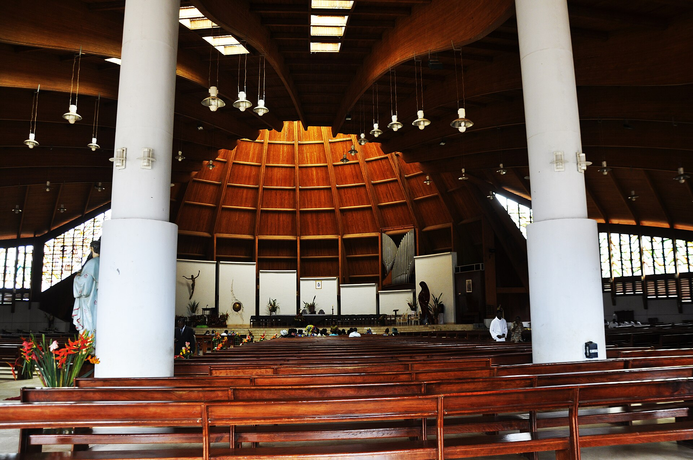

# 埃翁多传统信仰与森林—基督教祈福（Ewondo）

<!-- 来源：CC BY-SA 3.0 | https://commons.wikimedia.org/wiki/File:Basilique_Marie_-Reine_des_ap%C3%B4tres_de_Mvolye...JPG -->

## 概述

**埃翁多人（Ewondo）** 分布于喀麦隆中部（雅温得一带相关），属贝蒂—帕胡因大族群中的重要支系。公开概述记述：传统宇宙强调祖先与森林伦理；今日多数为基督徒——**Basilique de Mvolyé** 等为公开朝圣／教会地标叙述；**Abeng** 竖琴属公共音乐／文化层；**Beti-Ewondo cultural festivals** 为公开认同展演；祖先敬礼为 **CONCEPT**。本条目为教育概览；**不提供**入会、献牲或可冒充仪者的步骤。与芳／布维蒂、杜阿拉、巴米累克条目区分；本卡聚焦埃翁多，不作「泛贝蒂」合并。

## 核心观念（祈福 / 功德 / 祈祷如何被理解）

祈福常被理解为：通过对祖先的敬意与教堂祈祷，求健康、学业／都市顺遂与家庭平安；Basilique de Mvolyé 与文化节承载公开宗教—认同节奏。功德贴近：支持埃翁多语与城市社区慈善。访客的「福」体现为：尊重家庭礼仪；ancestors CONCEPT；不把首都周边写成「部落观光」。

## 典型仪式

### 1. Basilique de Mvolyé（公开层）
- **场合**：主日、朝圣与生命礼仪公开记述（**Basilique de Mvolyé**）。
- **主要步骤（概念层）**：理解基督教公开礼拜／朝圣地标层。**止于公开教会层**。
- **物品**：从略。
- **谁来举行**：教牧与会众；用户仅氛围／观礼，不可主持。

### 2. Abeng 竖琴与 Beti-Ewondo 文化节（公共文化层）
- **场合**：公开展演与文化日（**Abeng harp**；**Beti-Ewondo cultural festivals**）。
- **主要步骤（概念层）**：理解歌舞、竖琴与服饰作为认同载体。**区分舞台与封闭仪轨。**
- **物品**：从略。
- **谁来举行**：文化组织与艺人；用户可安静欣赏公开展演。

### 3. 祖先敬礼（CONCEPT）
- **场合**：家庭危机、丧葬公开记述。
- **主要步骤（概念层）**：**ancestors CONCEPT**——理解祖先在伦理中的位置。**禁止**复现祭仪。
- **物品**：从略。
- **谁来举行**：家庭与长者；用户不可扮演。

## 日常与节庆

Basilique de Mvolyé 与 Beti-Ewondo 文化节为公开入口。优先雅温得／中部省公开文化层。

## 注意与尊重

**勿强求仪者演示。** Ancestors CONCEPT。禁止把布维蒂等邻族仪轨张冠李戴。摄影须许可。

## 手机互动适合度（Three.js 评估草稿）

- **档位：** B 仅氛围或图文场景
- **敏感度：** 高
- **判断：** **仅氛围／无用户主持。** 都市—教会（Mvolyé）、Abeng 与文化节可说明；ancestors CONCEPT；祭仪不可操作化。
- **若做成互动：** 只做语言—信仰光谱与地标说明。
- **红线：** 禁止入会、献牲、冒充仪者、误植布维蒂通关。
- **评估状态：** 待后期统一评估

## 参考来源

- https://www.britannica.com/topic/Ewondo
- https://www.britannica.com/place/Yaounde
- https://www.britannica.com/place/Cameroon
