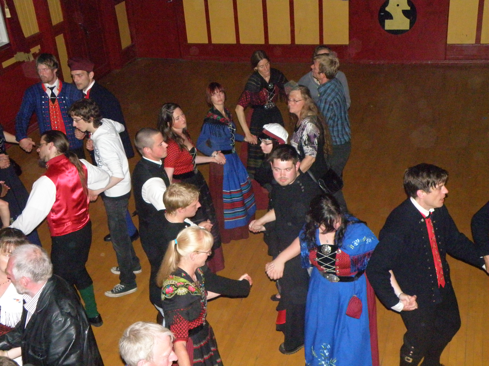

# 法罗民间祈福与链舞—奥拉夫节传统（Faroese）

<!-- 来源：CC BY-SA 3.0 | https://commons.wikimedia.org/wiki/File:2011_Faroese_Chain_Dance_in_Sjonleikarhusid_Torshavn.JPG -->

## 概述

**法罗人（Faroese）** 居住于北大西洋法罗群岛（Føroyar），为丹麦王国内的自治岛群；大英百科记述居民多属斯堪的纳维亚／维京殖民后裔，官方语言为法罗语与丹麦语，多数属福音信义宗（丹麦国教会传统）。Britannica 强调：十九世纪民俗学家建立书面法罗语之前，**早期口头文学**是现代民族主义与文化认同的重要基础。法罗国家博物馆（Tjóðsavnið）将 **法罗链舞（Føroyskur dansur／Faroese chain dance）** 列入岛内非物质文化遗产清单：舞者手拉手成链／环，无乐器伴奏，由领唱者（skipari）带领吟唱叙事民谣 **kvæði**，融合史诗叙事、舞步与曲调三重支柱。国庆 **Ólavsøka（奥拉夫节，约 7 月 28–29 日）** 纪念圣奥拉夫，含议会开幕礼拜游行、赛艇、音乐会，以及托尔斯港午夜合唱与链舞等公共庆祝。本条目聚焦民间节庆与文化祈福余绪，为教育概览；**不提供**可冒充教会圣事的礼仪脚本，亦不涉及任何捕猎／屠宰类传统的操作细节。

## 核心观念（祈福 / 功德 / 祈祷如何被理解）

在当代信义宗主流下，祈福常被理解为：教会礼拜中的祈祷与祝福，以及国庆、婚寿等场合以链舞—民谣巩固共同体记忆与语言尊严。功德贴近：参与舞社与学校传承、在 Ólavsøka 尊重议会与教堂公共礼仪、支持濒危口头传统的活态练习而非仅观光拍照。访客的「福」体现为：把法罗群岛看作拥有独特语言与中世纪舞蹈遗存的北大西洋社会，而非「丹麦附属风景明信片」。

## 典型仪式

### 1. 7 月 29 日 Ólavsøka 与 Løgting 议会游行（公共层）
- **场合**：每年 7 月 28–29 日（重心 **7 月 29 日**），首都托尔斯港（Tórshavn）。
- **主要步骤（概念层）**：官方介绍——运动员与市政等游行开幕；7 月 29 日议员、部长与教士列队至大教堂礼拜后前往 **Løgting（议会）**；首相年度演说；午夜广场合唱与链舞。**止于公共文化层**。
- **物品**：民族服装、教堂与议会外观（概念）。
- **谁来举行**：自治政府、教会与市民；访客可旁观公共活动并遵守秩序。

### 2. 法罗链舞与 kvæði 民谣（公共文化层）
- **场合**：舞季（公开记述约自十月至忏悔节）、舞社定期聚会、节庆、婚寿与学校课程。
- **主要步骤（概念层）**：博物馆记述——领唱掌控节奏；无乐器；手拉手链式移动并咏唱长篇叙事民谣 **kvæði**。**这是文化表演／传承，不是入会秘仪**。
- **物品**：舞池空间与民谣文本／曲调（概念）。
- **谁来举行**：舞社（如 Sláið Ring 联合会成员）、教师与家庭传承者。

### 3. 教会年节、航海祈祷叙事与生命礼仪祝福（概念层）
- **场合**：主日礼拜、坚振、婚丧；渔业／航海社群的平安祈祷叙事。
- **主要步骤（概念层）**：理解信义宗公共礼拜、民间节庆与**航海／渔业平安祈祷叙事**并存。**不提供**圣餐／圣事操作或海上「护航符咒」配方。
- **物品**：教堂与港湾外观（概念）。
- **谁来举行**：牧师与会众；家庭与渔民社群的公共祈愿。

## 日常与节庆

渔业与海洋气候塑造生活节奏；尊重教堂礼仪着装与午夜庆祝的拥挤安全。优先 Britannica、Tjóðsavnið 与 Visit Faroe Islands 官方叙述。

## 注意与尊重

**勿在礼拜进行中随意自拍直播。** 勿把链舞民谣商业采样却抹去法罗语与社群署名。勿将法罗文化简化为「维京主题乐园」。涉及海洋捕猎传统时仅作名称认知，不作操作。

## 手机互动适合度（Three.js 评估草稿）

- **档位：** C 可做致敬小品（非真仪）
- **敏感度：** 低
- **判断：** 峡湾城镇、链舞与 Ólavsøka 公共庆祝适合轻量致敬；教会圣事不可操作化。取 C：原创手势练习，明确非真仪／非真舞社入会。
- **若做成互动：** 手势练习示例——(1) 陀螺仪缓转眺望托尔斯港港湾说明卡；(2) 拖动将「手拉手」小人连成链并显示民谣说明（标注「致敬，非真仪」）；(3) 写下对「语言与口述传统」的一句祝福；(4) 点亮午夜节庆灯火象征团聚。禁止模拟圣餐或把真民谣通关当作入会。
- **红线：** 禁止模拟教会圣事、冒用舞社礼仪名称作胜负，或把任何捕猎传统做成操作关卡。
- **评估状态：** 待后期统一评估

## 参考来源

- https://www.tjodsavnid.fo/english-skrain-livandi-mentan/the-faroese-chaindance
- https://www.faroeislands.fo/the-big-picture/national-symbols/national-day
- https://visitfaroeislands.com/dk/whatson/events/event/st-olafs-national-celebration
- https://visitfaroeislands.com/about-vfi/history-governance-and-economy/quick-facts/national-symbols
