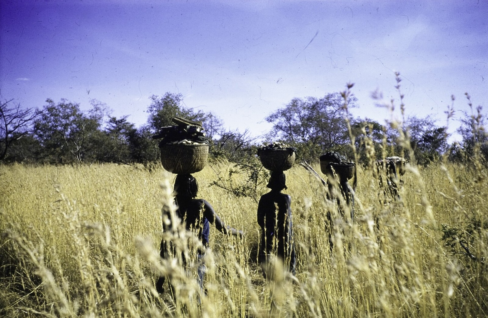

# 富尔传统信仰与达尔富尔祈福（Fur）

<!-- 来源：CC BY-SA 4.0 | https://commons.wikimedia.org/wiki/File:ASC_Leiden_-_NSAG_-_van_Dis_4_-_038_-_Four_women_are_carrying_wicker_baskets_-_Jebel_Marra_(Jabal_Marra),_West_Darfur,_Sudan_-_27_December_1961.tif -->

## 概述

**富尔人（Fur）** 分布于苏丹达尔富尔一带。公开叙述涉及农牧、苏丹伊斯兰化历史与社区伦理——**极高敏感，本卡仅概念层**。当代与武装冲突、流离失所交织。教育概览；**严禁**把战争写成可玩关卡，不提供祭祀操作。与努巴、扎格哈瓦等条目区分。

## 核心观念（祈福 / 功德 / 祈祷如何被理解）

祈福常被理解为：通过对土地、祖先／圣徒伦理与社区道德的正确关系，求雨水、丰收与家庭平安。功德贴近：支持人道援助、和平与反对种族清洗叙事娱乐化。访客的「福」体现为：**勿冲突观光**。

## 典型仪式

### 1. 农牧与雨水伦理（敏感，仅概念）
- **场合**：公开文化叙述。
- **主要步骤（概念层）**：理解水与土地的珍贵。**禁止**祭祀操作指南。
- **物品**：从略。
- **谁来举行**：家庭与社区。

### 2. 伊斯兰教与地方传统并存（公开层）
- **场合**：清真寺与社区公开生活。
- **主要步骤（概念层）**：理解信仰光谱。**止于公开层**。
- **物品**：从略。
- **谁来举行**：宗教权威与家庭。

### 3. 冲突与流离语境（概念层）
- **场合**：人权与新闻公开叙述。
- **主要步骤（概念层）**：阅读可靠公开信息，支持和平。**禁止**任何「战场打卡」。
- **物品**：不适用。
- **谁来举行**：不适用。

## 日常与节庆

以流散社群公开文化活动与人道语境为主；勿规划冲突区「朝圣」。

## 注意与尊重

**严禁战争娱乐化。** 尊重流离者隐私。

## 手机互动适合度（Three.js 评估草稿）

- **档位：** A 不建议做成操作型互动
- **敏感度：** 极高
- **判断：** 冲突与祭祀语境绝不可游戏化。
- **若做成互动：** 不建议；最多地理与和平教育图文。
- **红线：** 禁止战争模拟、祭祀通关、冒充长老。
- **评估状态：** 待后期统一评估

## 参考来源

- https://www.britannica.com/topic/Fur-people
- https://www.britannica.com/place/Darfur
- https://www.britannica.com/place/Sudan
