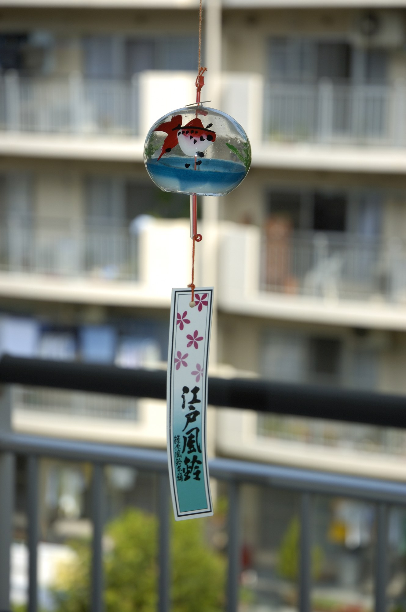

# 风铃（fūrin）

<!-- 来源：CC BY-SA 2.5 | https://commons.wikimedia.org/wiki/File:Fuurin.jpg -->

## 概述

风铃（*fūrin*）是**日本夏季的生活工艺与节景（A 民俗美学层）**：玻璃、铁等材质的铃身下垂纸短册，风过发声，是夏日的「听觉凉意」。工艺谱系包括**江户玻璃风铃**（日本政府刊物 *Highlighting Japan* 2014 年 7 月号记其吹制工艺）与**南部铁器风铃**等传统工艺类型（工艺媒体 Kogei Japonica 的概览与类型页）。叙述中常以「由寺院檐角的风铎到风铃」讲其渊源流变，但此演变尚缺博物馆一级的英文专条（**待核实**），本卡不写成结论。风铃在今日主流语境中是**夏季节景与工艺审美**，**不是完整宗教仪轨**，须防过称。社殿参拜的铃绪属神道参拜礼仪层（参拜语境见 `shinto.md`），与风铃是两种物件；风铃下垂的纸短册与七夕短册（`tanzaku-tanabata.md`）同名异用，勿混并。

## 核心观念（祈福 / 功德 / 祈祷如何被理解）

风铃的核心是**以声纳凉的感官心意**：一声清音，把「夏天正在过」的知觉轻轻拉回此刻。它没有功德语义、没有灵验结算，主流叙述也不把它当作祈愿或驱邪的手段；若说「福」，只在「今日尚安」的一声轻安。部分神社寺院夏季有悬满风铃的「风铃祭」，属节景与观光层（地方各异），不改风铃的工艺审美本色。产品中它适合做**留意此刻**的轻提醒，而非任何宗教功能件。

## 典型仪式

### 1. 夏日悬铃听风（概念层）
- **场合**：夏季（家庭檐下、窗边、店面）；风铃祭等季节活动。
- **主要步骤（概念层）**：将风铃悬于通风处；风动铃鸣，或以指轻拨纸短册触发一声；听一声，收一下心，即完成。
- **物品**：铃身（玻璃、铁等）＋纸短册。
- **谁来举行**：家庭与个人；无任何职务要求。

## 日常与节庆

风铃是**夏季限定**的生活风物：入夏悬出、夏末收起，是最常见的家庭节奏；风铃祭集中于盛夏，各地形态不一。它不作每日课诵式环节，也无节历义务。风铎渊源的演变叙述（**待核实**）不写成本卡结论；工艺史以 Kogei Japonica 与 *Highlighting Japan* 页为准。

## 注意与尊重

标明民俗美学层身份，不夸为宗教仪轨，不称驱邪法器。现实中檐下悬铃须留意邻里噪音（尤其夜间风动与纸片声），这是基本的相邻礼貌。物件上与神社铃绪、七夕短册**分物分语境**：铃绪在社殿参拜（`shinto.md`），短册在笹竹许愿（`tanzaku-tanabata.md`），风铃在夏日檐下。

## 手机互动适合度（Three.js 评估草稿）

- **档位：** C 可做致敬小品（非真仪）
- **敏感度：** 低
- **判断：** 「轻摇／轻点短册→一声玻璃清音」极轻，约 15 秒；夏季季节加强即可，天然不是每日任务。
- **若做成互动：** 手机手势练习（致敬小品，非民俗实务）：

1. 奶油色夏日窗边，一只玻璃风铃轻轻悬着。
2. 指尖轻点纸短册，或轻摇手机，铃身一晃。
3. 玻璃清音一串，浅浅的凉意像涟漪展开。
4. 界面留一句：今日小安。
- **红线：** 不做驱邪关卡、不设灵验反馈；不冒充宗教仪轨或神社参拜；夏季限定不强制定时通知；可附一句现实邻里噪音的礼貌提示。
- **评估状态：** 待后期统一评估

## 参考来源

- https://en.kogei-japonica.com/media/crafts/furin/
- https://en.kogei-japonica.com/media/crafts/furin-types/
- https://www.gov-online.go.jp/eng/publicity/book/hlj/html/201407/201407_04_en.html
