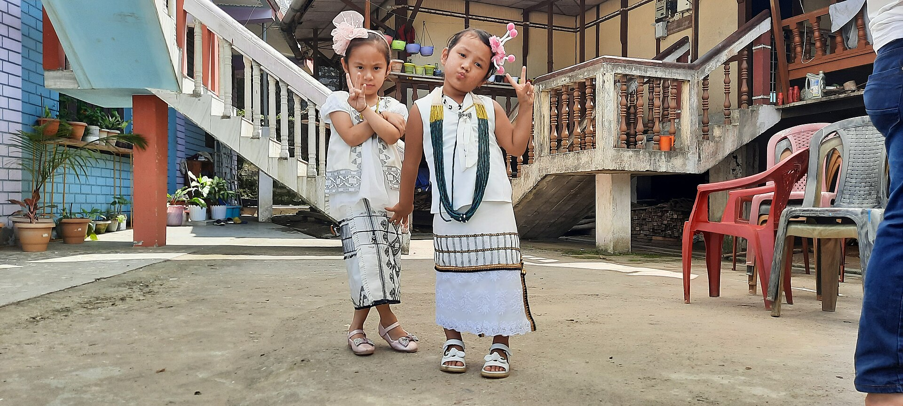

# 加洛传统信仰与东尼—波罗—基督教祈福（Galo）

<!-- 来源：CC BY-SA 4.0 | https://commons.wikimedia.org/wiki/File:Galo_tribe.jpg -->

## 概述

**加洛人（Galo）** 分布于印度阿鲁纳恰尔邦，与阿迪等达尼语支社群相关但自有边界。公开研究记述：传统宇宙含地方灵（常称 *uyu* 等公开民族志用语）与仪者（***nyibu***）中介；岁时可见 **Mopin Festival**（公开收获／福祉节庆层）与 **Popir dance**（公开节庆舞蹈层）；近年并存基督教改宗与本土信仰复兴（含东尼—波罗／Kargu Gamgi 等公开运动叙述）。本条目为教育概览；**Nyibu viewing-only restricted**（仪者礼仪仅观礼／受限）；**不提供**占卜操作、献牲或可冒充 *nyibu* 的步骤。与阿迪、阿帕塔尼、尼希条目可比较。

## 核心观念（祈福 / 功德 / 祈祷如何被理解）

祈福常被理解为：通过正确礼仪维持人与自然—灵力秩序的平衡，或通过教会崇拜求护佑；Mopin 承载公开岁时感恩与社群福祉叙事。功德贴近：支持语言与山地土地权利，反对把仪者写成「巫术秀」。访客的「福」体现为：不强迫演示、不猎奇占卜；Nyibu 仅观礼。

## 典型仪式

### 1. Mopin Festival（公开／概念层）
- **场合**：岁时收获／福祉节庆公开记述（**Mopin Festival**）。
- **主要步骤（概念层）**：理解节庆团聚、祝福与社群更新的公开层。**止于公开文化层**；**禁止**复现封闭祭仪。
- **物品**：从略。
- **谁来举行**：社群与文化组织；用户仅氛围／观礼，不可主持。

### 2. Popir dance（公开节庆层）
- **场合**：Mopin 等相关公开节庆。
- **主要步骤（概念层）**：理解 **Popir dance** 作为公开节庆舞蹈／认同表达。**止于观礼层**；不以学跳通关为目标。
- **物品**：节庆服饰外观（从略）。
- **谁来举行**：社群舞者；用户仅观礼。

### 3. Nyibu viewing-only restricted（高度敏感，仅概念／观礼）
- **场合**：疾病、农事危机公开记述。
- **主要步骤（概念层）**：**Nyibu viewing-only restricted**——理解仪者作为沟通中介。**禁止**复现占卜／献牲／吟诵；用户不可主持。
- **物品**：从略。
- **谁来举行**：被承认的 *nyibu*；外人／用户仅观礼或回避。

## 日常与节庆

Mopin／Popir 为公开入口；亦并存基督教堂会与本土复兴公共空间。优先加洛民族志公开层；注意与阿迪条目区分。

## 注意与尊重

**严禁献牲／肝占等操作化。** Nyibu 仅观礼／受限。勿煽动教派对立。摄影须许可。

## 手机互动适合度（Three.js 评估草稿）

- **档位：** B 仅氛围或图文场景
- **敏感度：** 高
- **判断：** **仅氛围／无用户主持。** Mopin／Popir 可说明；Nyibu viewing-only restricted；仪者操作不可游戏化。
- **若做成互动：** 只做节庆名称与信仰光谱说明卡。
- **红线：** 禁止占卜、献牲、冒充 *nyibu*、戏仿圣事、Mopin 祭仪通关。
- **评估状态：** 待后期统一评估

## 参考来源

- https://journals.sagepub.com/doi/10.1177/0262728015598701
- https://doi.org/10.36348/sjhss.2024.v09i07.002
- https://www.britannica.com/place/Arunachal-Pradesh
