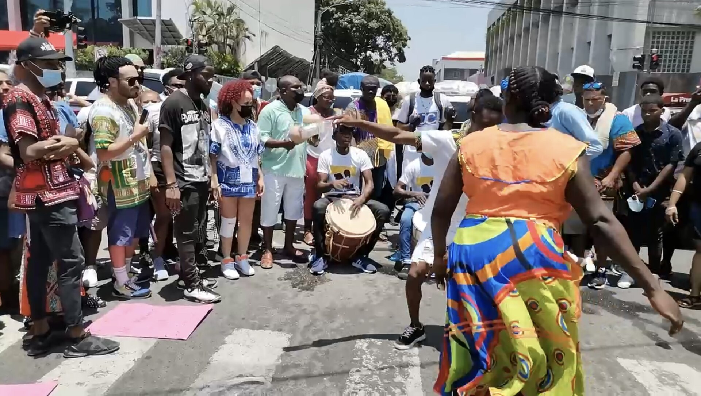

# 加里富纳祖先信仰与杜古礼（Garifuna／Dügü）

<!-- 来源：CC BY-SA 4.0 | https://commons.wikimedia.org/wiki/File:Manifestaci%C3%B3n_12_de_abril_del_pueblo_garifuna_en_Honduras.jpg -->

## 概述

**加里富纳（Garifuna；自称亦作 Garinagu）** 是分布于中美洲加勒比海岸——今洪都拉斯、伯利兹、危地马拉、尼加拉瓜沿岸村落，并有大量移居北美——的族群，其语言属阿拉瓦克语系，文化融合加勒比原住民与西／中非及罗马天主教元素。十八世纪末自圣文森特岛被英国放逐后，在中美洲海岸重建社群与礼仪生活。传统宗教以**祖先（gubida）关系**为核心：在世亲属须透过一系列由浅入深的礼仪，帮助亡者过渡并维持互惠；当不幸、病痛或噩梦被解读为祖先示警时，可能咨询 *buyei*（仪式／治疗权威）并举行大型疗愈礼 **dügü**（亦称 *adügürahani*）。联合国教科文组织将加里富纳的语言、舞蹈与音乐列入人类非物质文化遗产代表作名录。本条目为教育性概览；**不提供**附体引导、牲礼操作、buyei 科仪或可复现的疗愈脚本。

## 核心观念（祈福 / 功德 / 祈祷如何被理解）

祈福与痊愈常被理解为修复在世者与祖先之间的破裂关系：忽视纪念义务可能表现为厄运或病痛；履行团聚、奉献与歌乐，则使祖先喜悦并护佑家族。天主教神话框架与圣人崇敬常与祖先礼仪并存——许多实践者同时自认天主教徒。功德贴近：亲属互助（*agüriahani* 等互惠伦理）、尽力参加家族仪式、在离散处境中仍维系对家乡与祖灵的责任。访客的「福」体现为不把私人家族 dügü 当成可购票演出、不偷拍附体环节、不把鼓乐抽离为「可复制通灵派对」。

## 典型仪式

### 1. 丧后小型礼仪（守灵／沐浴亡者／弥撒层）
- **场合**：逝世后的守灵、安葬，以及数月到数年后的 *amuidahani*（为亡者「沐浴」）与 *lemesi*（弥撒／纪念聚会）等。
- **主要步骤（概念层）**：公开民族志描述守夜、安葬哀歌、向墓穴酹酒，以及日后以水与饮料象征性「沐浴」亡者、家庭聚餐与歌乐等。**止于概念**；不提供可复现科仪。
- **物品**：蜡烛、圣像外观、家屋祭台等。
- **谁来举行**：亲属；较大型者可能有 buyei 参与。

### 2. 楚古／喂食亡者（chugu，中等规模）
- **场合**：经 buyei 占卜／协商后，祖先要求「喂食」时举行，为期约一至两日。
- **主要步骤（概念层）**：公开材料提及备办大量传统食物、鼓乐歌舞、祭台与祖先享用后的处理方式等框架。**不提供**牲鸟操作、点火验示或附体诱导步骤。
- **物品**：鼓、摇铃、食物供桌外观。
- **谁来举行**：buyei 主持，家族成员参与。

### 3. 杜古大礼（dügü，限制性核心）
- **场合**：最严重的家族危机／祖先要求时，筹备可长达一年，在海滩仪式屋（*dabuyaba*／*gayunere*）举行约一周；强调全体亲属到齐（含海外成员）。
- **主要步骤（概念层）**：仅说明其功能为「以多日歌乐、奉献与家族团聚安抚祖先、疗愈在世者」；公开层可见渔归迎接、长时间舞蹈与供食等描述。**绝不展开**附体程序、牲礼清单或可操作剧本。
- **物品**：仪式屋、鼓、统一色服饰等外观。
- **谁来举行**：buyei 与家族；非公开售票活动。

## 日常与节庆

教科文组织名录强调语言、叙事歌（*úraga*）、鼓乐与舞蹈对文化存续的核心作用；伯利兹等地亦有面向公众的文化展演与鼓乐学校，但**展演≠授权参观私人 dügü**。当代离散社群中，礼仪频率与认同政治（非洲离散宗教对话、福音派拒斥传统等）正在变化——应以当事家族与 buyei 口径为准。

## 注意与尊重

**勿擅自进入** dabuyaba 或拍摄附体、牲礼与私密协商。勿把 punta 等公共可学舞蹈与 dügü 内圈混为一谈。勿在未受邀时「体验」祖先附体。勿将家族义务仪式写成旅游套餐。表述加里富纳宗教时，优先引用社群作者、民族志与教科文组织公开文本。

## 手机互动适合度（Three.js 评估草稿）

- **档位：** A 不可做成关卡
- **敏感度：** 高
- **判断：** dügü／chugu 以家族疗愈、祖先附体与牲礼为核心，且多为非公开邀请制；即便鼓乐舞蹈有公共文化层，亦不能把附体或「安抚 gubida」做成可通关操作。取 A：教育图文与尊重提示即可，不提供互动步骤链。
- **若做成互动：** 不提供操作步骤。
- **红线：** 禁止模拟附体、buyei 通灵、牲礼屠宰、dabuyaba 内圈程序，或以 dügü／chugu／真仪名称作胜负。
- **评估状态：** 待后期统一评估

## 参考来源

- https://www.encyclopedia.com/environment/encyclopedias-almanacs-transcripts-and-maps/garifuna-religion
- https://ich.unesco.org/en/RL/language-dance-and-music-of-the-garifuna-00001
- https://www.belize-glessimaresearch.org/wp-content/uploads/bsk-pdf-manager/2020/01/What-is-Dugu.pdf
- https://www.warasadrumschool.com/dugu-garifuna-spirituality/
