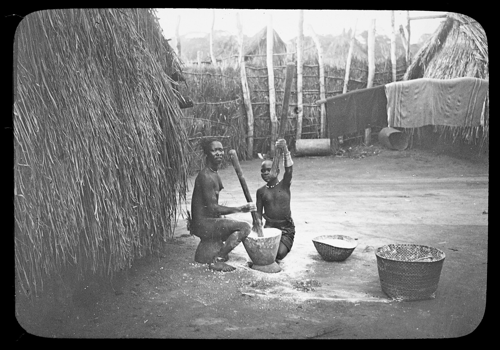

# 格巴亚传统信仰与祖灵祈福（Gbaya）

<!-- 来源：Public domain | https://commons.wikimedia.org/wiki/File:Afrique_Centrale._5,_Lieutenant_Lancrenon._Femmes_Bayas_pilant_le_manioc._Village_de_Carnot_-_(mission)_Lancrenon_;_(photogr.)_Lancrenon_;_(photogr._reprod._par)_Radiguet_et_Massiot_(pour_la_conf%C3%A9rence_donn%C3%A9e_par)..._-_btv1b532371997.jpg -->

## 概述

**格巴亚人（Gbaya）** 主要分布于中非共和国西部与喀麦隆东部，支系多样。公开概述记述：传统宇宙含祖先与地方灵力；今日并存基督教与本土实践；区域冲突与流散要求叙述克制。本条目为教育概览；**不提供**献牲、入会或可冒充仪者的步骤。与班达、曼贾等相关中非社群区分。

## 核心观念（祈福 / 功德 / 祈祷如何被理解）

祈福常被理解为：通过对祖先的敬意与教堂祈祷，求健康、狩猎／农作平安与和解。功德贴近：支持语言与和平教育。访客的「福」体现为：**高风险地区勿以采风名义前往**。

## 典型仪式

### 1. 祖先敬礼（概念层）
- **场合**：家庭危机、丧葬公开记述。
- **主要步骤（概念层）**：理解祖先在伦理中的位置。**禁止**复现祭仪。
- **物品**：从略。
- **谁来举行**：家庭与长者。

### 2. 教堂崇拜（概念层）
- **场合**：主日、生命礼仪。
- **主要步骤（概念层）**：理解基督教公开层。**止于公开教会层**。
- **物品**：从略。
- **谁来举行**：教牧与会众。

### 3. 农猎伦理与和解叙事（概念层）
- **场合**：岁时、冲突后公开记述。
- **主要步骤（概念层）**：理解互惠与和解努力。**禁止**战争仪轨复现。
- **物品**：从略。
- **谁来举行**：长老与宗教权威。

## 日常与节庆

优先中非／东喀麦隆公开文化层；注意安全语境。

## 注意与尊重

**冲突地区勿冒险。** 禁止献牲操作化。勿消费难民创伤。

## 手机互动适合度（Three.js 评估草稿）

- **档位：** A 不建议做成操作型互动
- **敏感度：** 极高
- **判断：** 冲突与祭仪语境不宜游戏化。
- **若做成互动：** 不建议；最多静态语言说明。
- **红线：** 禁止献牲、冒充仪者、虚拟「深入危险区」。
- **评估状态：** 待后期统一评估

## 参考来源

- https://www.britannica.com/topic/Gbaya
- https://www.britannica.com/place/Central-African-Republic
- https://www.britannica.com/place/Cameroon
