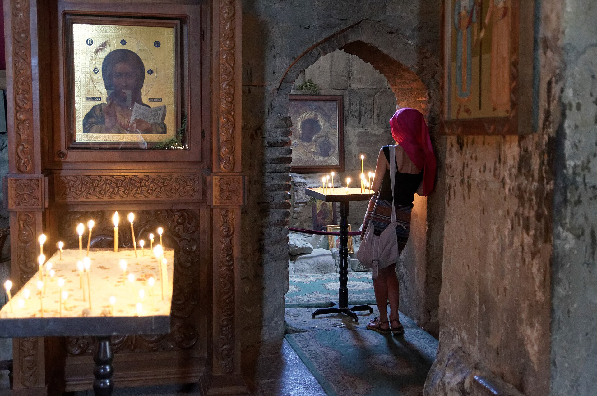

# 格鲁吉亚正教会祈祷与点烛（Georgian Orthodox Church）

<!-- 来源：CC BY 4.0 | https://commons.wikimedia.org/wiki/File:Mtskheta,_Jvari_Monastery,_Candlelight,_Georgia.jpg -->

## 概述

**格鲁吉亚正教会**（Georgian Orthodox Church）是东正教共融中的**自主（autocephalous）**教会，也是世界上最古老的基督教共同体之一。大英百科全书记述：格鲁吉亚人约在四世纪经圣尼诺（St. Nino）的传道接受基督教；教会首领长期使用「卡托利科斯—牧首」等称号。礼拜传统使用格鲁吉亚语与字母书写的经文与圣咏，并以金口若望等圣餐礼仪为常见形式。首都第比利斯与古都**姆茨赫塔（Mtskheta）** 一带教堂是信仰生活与民族记忆的重心；姆茨赫塔历史古迹（含 Svetitskhoveli、Jvari 等）列入联合国教科文组织**世界遗产**。对访客而言，最可见的公开虔敬包括：在圣像前**点烛祈祷**、划十字、亲吻圣像，以及站立参与圣礼的氛围。本条目为教育性概览，说明公开实践与参观礼仪；**不提供**圣事成圣祷文或可复现的圣餐／告解操作。

## 核心观念（祈福 / 功德 / 祈祷如何被理解）

在东正教—格鲁吉亚语境中，祈福通过**礼仪、斋戒、施舍、朝圣与个人祈祷**接近三一上帝。点烛常被理解为将持续的祈祷与「基督之光」的象征留在圣所：信众为自己或他人祈愿后离去，烛火仍在。圣像不是「偶像」，而是通向原型的窗；礼敬圣像即礼敬其所指向的基督与圣徒。功德贴近长期参与教会生活、守斋、周济与伦理悔改，而非旅游打卡。神圣礼仪（Divine Liturgy）是天国与尘世相交的崇拜核心，含读经、圣咏、奉献与圣餐；公开描述止于结构。祝福亦体现在司铎祝祷、节庆游行与家庭圣角（icon corner）中的灯烛。

## 典型仪式

### 1. 圣像前点烛与个人祈祷（公开可见层）
- **场合**：进入教堂或圣所侧廊；礼仪前后或平日开放时间。
- **主要步骤（概念层）**：在入口附近请购细烛；由已燃之火点燃；置于沙盘／烛台，同时默祷。可见信众划十字、亲吻圣像。访客可安静旁观或在允许时同样点烛，**无义务**模仿所有动作。止于公开姿态；非「许愿魔法」教程。
- **物品**：蜂蜡细烛、圣像、烛台。
- **谁来举行**：信众个人；教堂执事维持秩序。

### 2. 神圣礼仪（Divine Liturgy）（概念层）
- **场合**：主日与大庆；重要节日常极拥挤。
- **主要步骤（概念层）**：会众多站立；经课与圣咏（格鲁吉亚传统复调圣咏闻名）；祭台区（圣所）与圣像屏（iconostasis）区分空间；成圣与领圣体由圣职按教会规则施行。固定瞻礼常循儒略历计算（如圣诞在 1 月 7 日等公开记述）。**不收录**成圣祷全文或领圣体操作细则。
- **物品**：香、礼仪书、祭器、圣像屏。
- **谁来举行**：司铎、辅祭与唱诗班；会众回应。

### 3. 朝圣圣地与节期（概念层）
- **场合**：姆茨赫塔等圣地；圣母安息等大庆、帕斯哈（复活节）夜礼等。
- **主要步骤（概念层）**：朝圣、通宵守夜、游行与家庭筵席（*supra*）等文化—宗教交织实践。描述止于公开节庆与遗产地尊重。
- **物品**：节庆烛、游行圣像等（因堂区而异）。
- **谁来举行**：牧首区与各地堂区；朝圣者随俗。

## 日常与节庆

格鲁吉亚教堂内通常少长椅，信众可缓缓移动；礼中宜安静、手机静音。着装以端庄为要（常请妇女覆头、避免露出肩膀膝盖——以各堂告示为准）。摄影规定严格且多变，尤其礼仪进行时。侨民社群在海外亦维持格语礼仪。教会在民族认同中角色显著，讨论时应避免将信仰工具化为单纯政治符号。

## 注意与尊重

**勿闯入圣所／祭台区**，勿触碰圣桌与未经允许的圣物。圣餐仅按教会规矩领受，非信徒与未预备者勿自行上前。点烛时服从管理人员指引，勿把烛火当拍照道具戏弄。勿将格鲁吉亚正教与天主教、亚美尼亚使徒教会或东方亚述礼仪体系混为一谈。涉及修道院与妇女访客规则时，以当地告示为准。

## 手机互动适合度（Three.js 评估草稿）

- **档位：** A 不可做成关卡
- **敏感度：** 高
- **判断：** 神圣礼仪含成圣与领圣体；圣所禁入。点烛虽为访客可见公开姿态，但整卡以圣礼为核心传统，不宜做成可完成的礼拜／圣餐关卡。
- **若做成互动：** 不提供操作步骤。
- **红线：** 不模拟成圣祷、领圣体、闯入圣所或把「点烛成功」当成圣事通关；礼仪名称不作胜负。
- **评估状态：** 待后期统一评估

## 参考来源

- https://www.britannica.com/topic/Georgian-Orthodox-church
- https://whc.unesco.org/en/list/708/
- https://www.britannica.com/topic/Eastern-Orthodoxy
