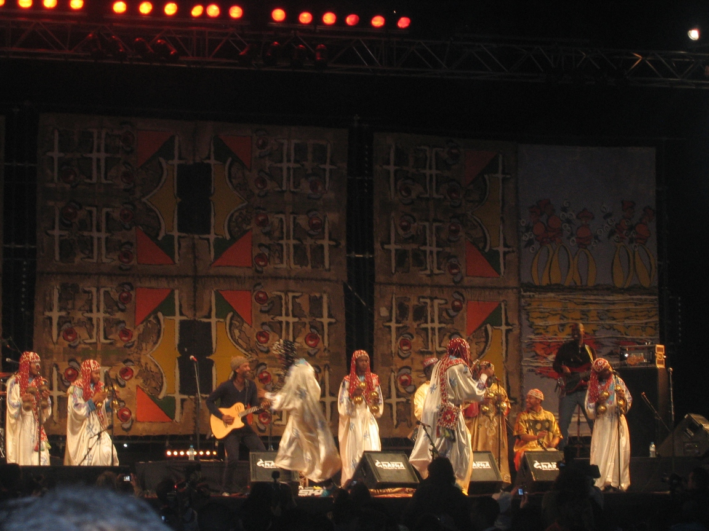

# 摩洛哥格纳瓦苏菲—非洲仪式音乐与疗愈传统（Gnawa）

<!-- 来源：CC BY-SA 3.0 | https://commons.wikimedia.org/wiki/File:Gnaoua_(Gnawa)_musicians_performing_during_the_2010_Gnaoua_festival_in_the_city_of_Essaouira,_Morocco.jpg -->

## 概述

**格纳瓦（Gnawa，亦作 Gnaoua）** 是摩洛哥重要的仪式音乐与兄弟会文化，源自至少可追溯至十六世纪以来西非／萨赫勒相关奴隶贸易史中的非洲社群，在马格里布与阿拉伯—伊斯兰、柏柏尔地方文化长期交融。教科文组织于 2019 年将「Gnawa」列入《人类非物质文化遗产代表作名录》，公开概述其兼含世俗表演与神圣兄弟会实践：歌词多具宗教内容，召唤祖先与灵力；城市语境中尤以通宵节奏与恍惚疗愈仪礼著称，乡村则多见向马拉布特圣徒献的共餐。乐器常见三弦拨弦琴（guembri／sintir）与金属响板（qraqeb／krakebs），城市服饰华彩刺绣、乡村多为白色衣着。马拉喀什、索维拉（Essaouira）、非斯、拉巴特等地节庆与兄弟会团体持续活跃。本条目与阿马齐格／柏柏尔、西非沃敦、伊斯兰苏菲条目区分马格里布格纳瓦传统；**不提供**附体诱导、通宵疗愈脚本、药物／剂量或可复现「开路」步骤。

## 核心观念（祈福 / 功德 / 祈祷如何被理解）

祈福常被理解为：透过节奏、召唤歌词与兄弟会共在，请祖先／灵力护持身心与家宅安宁；公开材料强调非洲祖源记忆与伊斯兰苏菲表述的交织。功德贴近：尊重师徒传承、参与兄弟会伦理与节庆共餐、以音乐服务社群而非消费奇观。访客的「福」体现为：把格纳瓦节庆当作活态遗产与历史正义议题的入口，而非「附身派对门票」。

## 典型仪式

### 1. 通宵节奏与恍惚疗愈仪（lila／限制性概念层）
- **场合**：城市兄弟会语境中的疗愈聚会；常通宵进行。
- **主要步骤（概念层）**：教科文组织公开概述以节奏、吟唱与恍惚状态结合祖先非洲实践、阿拉伯—穆斯林影响与柏柏尔展演，形成治疗性附身／通灵仪式表述。**止于文化—社会现象说明**；禁止任何诱导恍惚、角色扮演附体或「驱灵通关」。
- **物品**：guembri、响板、仪式服饰外观（概念）。
- **谁来举行**：受承认的师傅（maalem）与兄弟会成员；外人不得自称。

### 2. 乡村向马拉布特圣徒的共餐（公共／地方层）
- **场合**：乡村节期或地方圣徒纪念。
- **主要步骤（概念层）**：公开材料概述组织集体餐食献给马拉布特圣徒，强化社群互惠。**仅概念介绍**；不提供祭献清单操作化。
- **物品**：大鼓、响板、共餐场景外观（概念）。
- **谁来举行**：地方格纳瓦团体与村民。

### 3. 节庆舞台与公共音乐传承（公共文化层）
- **场合**：索维拉等城的格纳瓦音乐节及全国多地节庆。
- **主要步骤（概念层）**：协会化团体全年举办地方／国际演出，年轻一代学习歌词、乐器与一般文化实践。**止于公共音乐教育层**；舞台展演不等于真仪许可。
- **物品**：舞台乐器与服饰（概念）。
- **谁来举行**：音乐家与文化协会；游客可购票观演但勿冒充兄弟会。

## 日常与节庆

当代格纳瓦既是疗愈与兄弟会传统，也是摩洛哥国家文化身份与世界音乐产业的一部分。尊重兄弟会对摄影、录音与「体验式附体」的拒绝；勿把奴隶贸易历史简化为异国情调。优先教科文组织名录文本、摩洛哥文化遗产机构与格纳瓦社群口径。

## 注意与尊重

**勿把 mluk／灵力写成可收集关卡。** 勿购买「通宵附身体验」。涉及恍惚疗愈的实践仅作概念认知。勿与西非沃敦或海地伏都混为一谈。

## 手机互动适合度（Three.js 评估草稿）

- **档位：** A 不可做成关卡
- **敏感度：** 高
- **判断：** 索维拉港城与节庆外观可做极克制氛围，但通宵恍惚疗愈与附体表述不可互动化。取 A：不以任何「上身／疗愈成功」为进度。
- **若做成互动：** 不提供操作步骤。
- **红线：** 禁止模拟附体、驱灵、冒充 maalem，或以真仪／lila 名称作胜负。
- **评估状态：** 待后期统一评估

## 参考来源

- https://ich.unesco.org/en/RL/gnawa-01170
- https://ich.unesco.org/en/decisions/14.COM/10.B.26
- https://www.aljazeera.com/features/2015/12/3/gnawa-music-from-slavery-to-prominence
