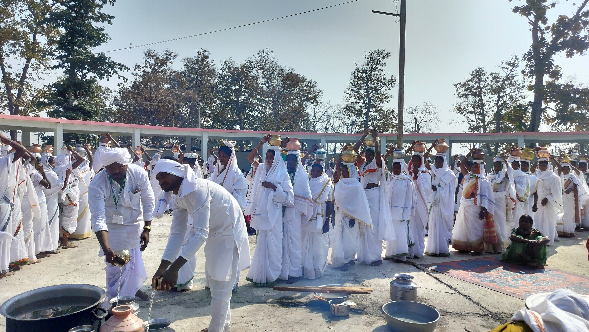

# 贡德人氏族神与祖先祈福传统（Gond／Koitur）

<!-- 来源：CC BY 4.0 | https://commons.wikimedia.org/wiki/File:Gond_tribal_women_offering_holy_water_to_their_deity_during_Keslapur_Nagoba_Jatara.jpg -->

## 概述

**贡德人（Gond；自称 Koi／Koitur）** 是南亚次大陆人数最多的表列部落群体之一，主要分布于印度中央邦、恰蒂斯加尔、马哈拉施特拉、奥里萨等地的丘陵与森林地带，多数方言属达罗毗荼语族的贡德语。大英百科与民族志综述一致指出：各支系文化不尽相同，但宗教核心普遍围绕**氏族与村落神祇崇拜**以及**祖先敬拜**。公开节庆入口含 **Keslapur Nagoba Jatara**（纳戈巴朝圣／集会公开层）与 **Madai fair**（地方集市—节庆层）；世袭吟游—乐师 **Pardhan** 以琴音传述史诗（**Pardhan epic**）；丧葬纪念柱（**funerary posts**）属 **HIGH SENSITIVITY**。本条目为教育概览；**不提供**献牲程序、咒语、巫蛊操作或任何可冒充祭司的步骤。

## 核心观念（祈福 / 功德 / 祈祷如何被理解）

祈福常被理解为：在 Persa Pen／Nagoba 与祖先护佑下，通过节庆、氏族义务与正确处理丧葬—入祖礼仪，使田地、牛群与家庭平安得蒙祝福。功德贴近：遵守外婚与氏族伦理、支持 Pardhan 史诗传承、参与村社岁时祭。访客的「福」体现为：承认贡德作为仍活着的阿迪瓦西宇宙观与口述艺术传统；funerary posts 仅远观概念。

## 典型仪式

### 1. Keslapur Nagoba Jatara（公开／概念层）
- **场合**：马哈拉施特拉等地公开记述的 Nagoba 朝圣／集会（**Keslapur Nagoba Jatara**）。
- **主要步骤（概念层）**：理解朝圣团聚、社群更新与公开敬拜方向。**止于公开文化层**；**禁止**复现献牲或祭司操作。
- **物品**：圣地外观（从略）。
- **谁来举行**：社群与仪式权威；用户仅氛围／观礼，不可主持。

### 2. Madai fair 与 Pardhan epic（公开社会／口述层）
- **场合**：地方 **Madai fair**（集市—节庆）；Pardhan 叙事音乐场合。
- **主要步骤（概念层）**：公开节庆中的歌舞、集市互惠与 **Pardhan epic** 口述传承。可在获邀时礼貌观礼。**不是**旅游强制「通关祈福」。
- **物品**：鼓乐、节日服饰、村落空地。
- **谁来举行**：devari、村长老、Pardhan 与村民。

### 3. Funerary posts HIGH SENSITIVITY（高度敏感层）
- **场合**：火葬或土葬后的超度／入祖义务；竖立纪念柱荣耀亡者（**funerary posts**）。
- **主要步骤（概念层）**：理解生命力与灵魂分途、祖先监察道德的观念。**HIGH SENSITIVITY — 仅概念层**；禁止描写可仿作的丧仪脚本。
- **物品**：纪念柱外观（远观）。
- **谁来举行**：家属与氏族；属内部义务。

## 日常与节庆

Keslapur Nagoba Jatara、Madai、Pardhan 叙事与地方农事历构成节奏；部分地区与印度教节庆叠合但解释框架仍属贡德自身。

## 注意与尊重

**勿擅自接近氏族圣地或探问圣矛藏处。** Funerary posts HIGH SENSITIVITY。勿要求演示献牲或附体。土地权利与表列部落政策议题须尊重当事社群表述。

## 手机互动适合度（Three.js 评估草稿）

- **档位：** B 仅氛围或图文场景
- **敏感度：** 高
- **判断：** **仅氛围／无用户主持。** Nagoba Jatara／Madai／Pardhan epic 公开层可说明；funerary posts HIGH SENSITIVITY；Persa Pen 献祭与丧葬入祖不宜互动化。
- **若做成互动：** 只做村落—林地风景与节庆／史诗说明卡。
- **红线：** 禁止模拟血祭、丧仪脚本、冒充祭司、纪念柱操作通关。
- **评估状态：** 待后期统一评估

## 参考来源

- https://www.britannica.com/topic/Gond
- https://www.encyclopedia.com/social-sciences-and-law/anthropology-and-archaeology/people/gond
- https://www.everyculture.com/wc/Germany-to-Jamaica/Gonds.html
