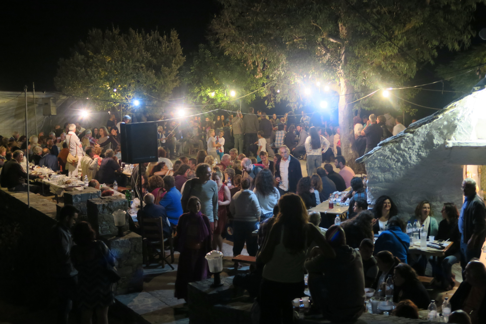

# 希腊民间东正教与村社主保节祈福（Greek folk／Panigiri）

<!-- 来源：CC BY 2.0 | https://commons.wikimedia.org/wiki/File:Panigiri,_Aghia_Sophia,_Kambos,_Ikaria,_Greece.jpg -->

## 概述

**希腊民间东正教** 在东正教礼仪年之外，以各村／各岛 **panigiri（主保节庆）** 最为人知：圣礼之后常有广场音乐、共食与舞蹈，是社区祈福与认同的公共层；部分地区 panigiri 可见 **Kourbani**——主保节共食肉食／社群宴饮的命名（**仅概念层**，非献牲操作）。北希腊等地另有 **Anastenaria（火上行走）** 作为公开民俗文化现象的记述——本条目仅作**非参与式教育文化注记**，**不提供**如何行走火堆的步骤，**亦不鼓励**模仿。**阿索斯圣山（Athos）** 等则代表更严格的修道朝圣极。本条目聚焦民间节庆与圣地朝圣公开层，与「希腊正教会」教理条目互补；**不提供**可冒充神职的礼仪脚本。

## 核心观念（祈福 / 功德 / 祈祷如何被理解）

祈福常被理解为：通过敬礼主保圣人、参与圣礼与村社欢庆，求护佑并更新邻里纽带。功德贴近：支持堂区慈善、岛屿小型社区韧性。访客的「福」体现为：区分礼拜段落与派对段落，礼拜中保持恭敬；对 Anastenaria 等民俗以尊重与非参与式学习为主。

## 典型仪式

### 1. Panigiri 主保节与 Kourbani 共食（概念层）
- **场合**：各村主保瞻礼（夏季尤盛）。
- **主要步骤（概念层）**：理解圣礼、游行／抬像与随后广场欢庆；**Kourbani** 作为 panigiri 场合的**社群共食肉食命名**（概念 only，无屠宰／仪轨 how-to）。**止于公开观礼层**。
- **物品**：从略。
- **谁来举行**：堂区、村社与信众。

### 2. Anastenaria 火上行走（公共民俗文化注记，非操作）
- **场合**：特定地方社区的公开民俗记述（北希腊等地）。
- **主要步骤（概念层）**：仅说明其为地方民间信仰—节庆相关的**公共文化现象**。**严禁**复现步骤、鼓励参与或写成「通关挑战」。教育取向：尊重＋非参与式学习。
- **物品**：从略。
- **谁来举行**：地方传承社群内部事宜；外人止于文化认识。

### 3. 阿索斯等修道院朝圣（概念层）
- **场合**：常年朝圣；**Athos（阿索斯）** 等有严格准入。
- **主要步骤（概念层）**：理解拜访修院、祈祷、住宿规则的**朝圣命名**。**遵守性别与着装限制**；勿冒险违规。
- **物品**：从略。
- **谁来举行**：朝圣者；修士接待规范内。

## 日常与节庆

可与保加利亚、塞尔维亚、乌克兰民间东正教比较巴尔干「主保—广场」结构；阿索斯规则极严，勿冒险违规。东正教大节与生命礼仪仍以教会内圣事为准。

## 注意与尊重

**圣礼中勿饮酒喧哗。** 阿索斯等圣地严禁违规闯入。勿把圣像当合影道具粗暴对待。**对 Anastenaria：尊重、不参与、不鼓励、不写 how-to。** Kourbani 禁止操作化。

## 手机互动适合度（Three.js 评估草稿）

- **档位：** C 可做轻度公共节庆致敬
- **敏感度：** 中
- **判断：** 岛屿广场与教堂外观可互动；圣事、阿索斯内部与火上行走不可操作化。
- **若做成互动：** 节日地图＋文化说明。
- **红线：** 禁止戏仿圣体血、虚拟闯入圣山禁区、模拟火上行走闯关。
- **评估状态：** 待后期统一评估

## 参考来源

- https://ayla.culture.gr/catalogue/ta-panigiria-tis-ikarias-2022/
- https://ayla.culture.gr/catalogue/to-panigyri-tou-agiou-petrou-sta-spata/
- https://ayla.culture.gr/6731-2/
- https://archivecollections.visitgreece.gr/entities/multimedia/ea58cdf6-6b8c-4c99-9832-46dacf489541
- https://ich.unesco.org/en/BSP/polyphonic-caravan-researching-safeguarding-and-promoting-the-epirus-polyphonic-song-01611
- https://doi.org/10.1179/030701379790206493
- https://doi.org/10.1515/9781400884360
