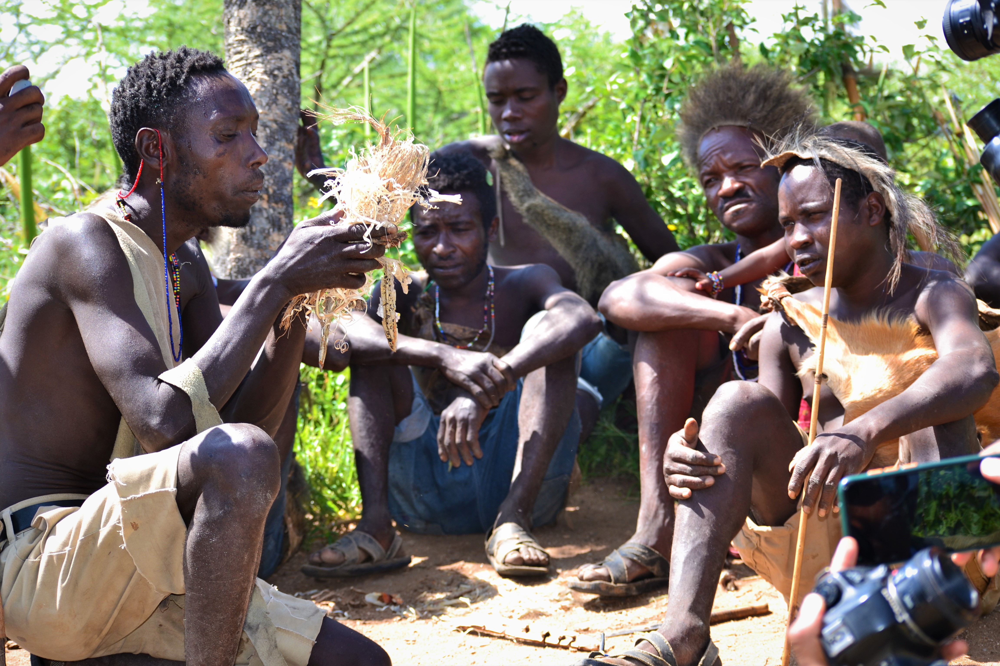

# 哈扎传统信仰与采集—祖灵祈福（Hadza）

<!-- 来源：CC BY-SA 4.0 | https://commons.wikimedia.org/wiki/File:Starting_of_fire_by_Hadza_man.jpg -->

## 概述

**哈扎人（Hadza／Hadzabe）** 分布于坦桑尼亚埃亚西湖附近，为东非著名采集狩猎社群之一，语言孤立。公开民族志记述：传统宇宙强调土地、祖先与共享伦理；今日面临土地压力、旅游与传教影响。本条目为教育概览；**不提供**狩猎操作、致幻／疗愈或可冒充仪者的步骤；**拒绝**把哈扎写成「时光旅行」消费品。

## 核心观念（祈福 / 功德 / 祈祷如何被理解）

祈福常被理解为：通过对土地与共享规范的正确关系，求食物、健康与社群延续。功德贴近：支持土地权利与知情同意的研究／探访。访客的「福」体现为：**默认不组织狩猎旅游**；若受邀则听从社群规则。

## 典型仪式

### 1. 土地与共享伦理（概念层）
- **场合**：采集—分配公开记述。
- **主要步骤（概念层）**：理解共享与地点尊重。**禁止**复现仪式化狩猎表演要求。
- **物品**：从略。
- **谁来举行**：家庭与营地群体。

### 2. 命名与生命过渡（概念层）
- **场合**：生命史公开记述。
- **主要步骤（概念层）**：理解社群祝福叙事。**止于概念**。
- **物品**：从略。
- **谁来举行**：亲族。

### 3. 基督教／外部宗教接触层（概念层）
- **场合**：传教与城镇接触公开记述。
- **主要步骤（概念层）**：理解信仰光谱变化。**止于公开层**。
- **物品**：从略。
- **谁来举行**：各相关权威。

## 日常与节庆

优先严肃民族志；警惕「原始人一日游」产业。

## 注意与尊重

**土地权利优先于观光。** 禁止强迫表演狩猎／歌舞。摄影须明确同意。

## 手机互动适合度（Three.js 评估草稿）

- **档位：** A 不建议做成操作型互动
- **敏感度：** 极高
- **判断：** 旅游剥削风险极高，不宜游戏化。
- **若做成互动：** 不建议；最多静态土地权利说明。
- **红线：** 禁止狩猎通关、强迫表演、把人写成动物奇观。
- **评估状态：** 待后期统一评估

## 参考来源

- https://www.britannica.com/topic/Hadza
- https://www.britannica.com/place/Lake-Eyasi
- https://www.britannica.com/place/Tanzania
