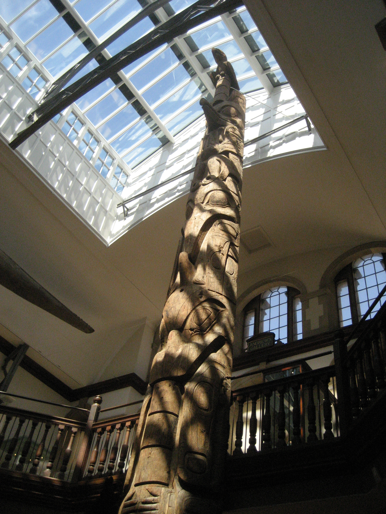

# 海达传统信仰与夸富宴／氏族礼仪概观（Haida）

<!-- 来源：CC BY-SA 4.0 | https://commons.wikimedia.org/wiki/File:Haida_totem_pole_from_Tanu_2.jpg -->

## 概述

**海达（Haida）** 是北美洲西北海岸原住民民族，传统家园主要在今加拿大不列颠哥伦比亚省 **海达瓜依（Haida Gwaii，旧称夏洛特女王群岛）** 及美国阿拉斯加威尔士王子岛南部（Kaigani Haida）。百科与民族志公开材料指出：海达社会组织以母系两个大组别（moiety）及众多地方谱系／氏族为单位，各谱系拥有资源地、村址、首领名号、歌曲、纹章与仪式权利。传统经济以渔猎（尤其鲑鱼等）为基础；精神世界中动物常被理解为具社会秩序、可变形的「另一类人」，乌鸦（Raven）在叙事中具有文化英雄／变形者地位。核心公共礼仪是 **potlatch（夸富宴／送礼宴）**：透过宴请、演说、歌舞与财物赠予，公开见证命名、建房、立杆、继承与悼亡等生命事件，确认等级与互惠。殖民时期夸富宴曾遭禁止，二十世纪后期以来社群推动复振。本条目与特林吉特、黑足、夸富宴泛称条目区分海达地方传统；**不提供**氏族纹章使用权、悼亡操办、萨满／治疗脚本或可复现夸富宴步骤。

## 核心观念（祈福 / 功德 / 祈祷如何被理解）

祈福常被理解为：向猎物之主与赐予财富的存在献礼、以正确礼仪维持人与非人存在的互惠，使渔猎与氏族安宁得护持。功德贴近：举办或参与见证性宴礼、履行氏族义务、以馈赠巩固关系而非私人囤积声望消费。访客的「福」体现为：把图腾柱与夸富宴理解为法律—社会—精神一体的公开见证，而非「炫富派对」或可购买的原住民符号。

## 典型仪式

### 1. 夸富宴／送礼宴（potlatch，概念—社会层）
- **场合**：建房、儿童命名与文身、立杆、悼亡与首领继承等需公开确认权利与关系的时刻。
- **主要步骤（概念层）**：不列颠百科等概述邀请宾客、演说、按社会地位分发礼物，并以宴饮与展演完成见证。**止于制度与文化意义说明**；禁止任何「办一场夸富宴」操作指南或角色扮演通关。
- **物品**：馈赠财物、舞蹈与纹章展示外观（概念）。
- **谁来举行**：有相应名号与义务的氏族成员及受邀见证者；外人不得主持或冒用纹章。

### 2. 对猎物之主与财富存在的祈祷／献礼（概念层）
- **场合**：传统渔猎与求丰语境。
- **主要步骤（概念层）**：公开民族志概述向掌管动物与财富的存在祷告并献礼。**仅宇宙观层**；不提供祷词背诵或狩猎「开运」步骤。
- **物品**：从略。
- **谁来举行**：传统知识持有者；当代实践以社群规范为准。

### 3. 悼亡纪念宴与当代复振（公共文化层）
- **场合**：公开材料提及当代纪念宴、迁碑／结束正式丧期等与教会实践交织的场合。
- **主要步骤（概念层）**：社群在长者指导下完成纪念与「放下悲痛」的公共过渡。**止于尊重性概述**；禁止模拟丧礼或使用真实氏族歌曲／名号。
- **物品**：纪念场景外观（概念）。
- **谁来举行**：家属、长者与宗教／文化领袖。

## 日常与节庆

今日海达文化在语言复振、艺术、法律诉讼与环境守护（如海达瓜依遗产保护）中高度可见。博物馆与旅游中的图腾柱、雕刻必须置于殖民掠夺与归还语境理解。未经授权使用氏族 crest（纹章）即侵权与冒犯。优先海达民族政府、长者口径与权威百科，而非商业「图腾灵性」。

## 注意与尊重

**勿把 potlatch 写成可刷声望的送礼小游戏。** 勿购买或冒用海达纹章、歌曲与名号。涉及悼亡、继承与限制性知识仅作概念认知。勿与特林吉特或其他西北海岸民族混称而取消海达主权叙事。

## 手机互动适合度（Three.js 评估草稿）

- **档位：** A 不可做成关卡
- **敏感度：** 高
- **判断：** 海岸村景与博物馆教育外观或可极克制展示，但夸富宴、纹章权利、悼亡与变形神话均不宜互动化。取 A：不以任何「完成送礼／继承名号／召唤乌鸦」为进度。
- **若做成互动：** 不提供操作步骤。
- **红线：** 禁止模拟夸富宴、冒用 crest／歌曲／首领名号、扮演悼亡或萨满，或以真仪名称作胜负。
- **评估状态：** 待后期统一评估

## 参考来源

- https://www.britannica.com/topic/Haida
- https://www.britannica.com/topic/potlatch
- https://www.encyclopedia.com/environment/encyclopedias-almanacs-transcripts-and-maps/haida-religious-traditions
- https://www.everyculture.com/North-America/Haida-Religion-and-Expressive-Culture.html
