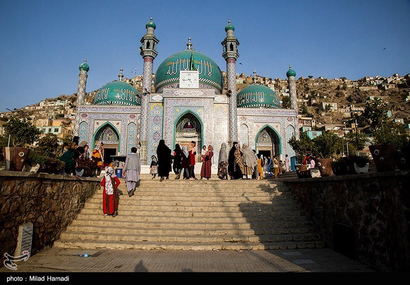

# 哈扎拉十二伊玛目什叶与阿富汗民间祈福（Hazara）

<!-- 来源：CC BY 4.0 | https://commons.wikimedia.org/wiki/File:Sakhi_Shrine2021-10-31_12.jpg -->

## 概述

**哈扎拉人（Hazara）** 主要分布于阿富汗中部哈扎拉贾特及巴基斯坦奎达等流散地，多数为十二伊玛目什叶派穆斯林。公开概述记述：**Hosseiniyeh／Takyakhana**（侯赛因尼亚／聚会堂）为社群礼拜与穆哈兰姆纪念中心；**Nazar** 祝福食物／施饭构成公开施舍层；圣地朝谒如 **Ziyarat-e Sakhi**（萨希朝谒，流散地公开记述）承载敬爱圣裔叙事；**Ashura viewing-only sensitive**（阿舒拉仅观礼／敏感）。历史上遭受迫害与当代安全风险使纪念常与正义—哀悼相连。本条目为教育概览；**不提供**自笞等身体苦修操作、政治动员或可冒充教法权威的步骤。

## 核心观念（祈福 / 功德 / 祈祷如何被理解）

祈福常被理解为：通过礼拜、Hosseiniyeh 中的双月哀悼纪念、Nazar 施饭与对伊玛目的介祷，求忍耐、护佑与冤屈得申。功德贴近：支持教育、难民互助与反歧视。访客的「福」体现为：**不把阿舒拉写成血腥奇观**；Ashura viewing-only。

## 典型仪式

### 1. Hosseiniyeh／Takyakhana 与 Nazar 祝福食物（公开／概念层）
- **场合**：日常聚礼、穆哈兰姆公厨、流散地堂区。
- **主要步骤（概念层）**：理解 **Hosseiniyeh／Takyakhana** 作为认同与纪念中心；**Nazar** 祝福食物／施饭为公开施舍层。**止于公开社会层**。
- **物品**：从略。
- **谁来举行**：社群组织与教长；用户仅氛围／观礼，不可主持。

### 2. Ziyarat-e Sakhi（圣地朝谒概念层）
- **场合**：流散地与地区公开记述的圣裔相关朝谒。
- **主要步骤（概念层）**：理解 **Ziyarat-e Sakhi** 等作为敬爱与还愿叙事。**止于概念／远观**；禁止编造介祷配方。
- **物品**：从略。
- **谁来举行**：信众与地方权威；用户不主持。

### 3. Ashura viewing-only sensitive（敏感，仅观礼）
- **场合**：伊斯兰教历一月阿舒拉／穆哈兰姆。
- **主要步骤（概念层）**：**Ashura viewing-only sensitive**——理解诵悼、游行、公厨等公开纪念。**禁止**任何自伤操作化描写；用户仅观礼。
- **物品**：从略。
- **谁来举行**：社区与宗教权威；外人／用户仅观礼或回避。

## 日常与节庆

优先 Britannica 哈扎拉／什叶派公开层；安全地区旅行须极度谨慎。

## 注意与尊重

**严禁自伤仪轨的可操作或猎奇影像消费。** 勿在迫害叙事上二次伤害。禁止政治煽动。Ashura viewing-only。

## 手机互动适合度（Three.js 评估草稿）

- **档位：** B 仅氛围或图文场景
- **敏感度：** 高
- **判断：** **仅氛围／无用户主持。** Hosseiniyeh／Nazar／Ziyarat-e Sakhi 可说明；Ashura viewing-only sensitive；哀悼自伤与完整礼拜不可操作化。
- **若做成互动：** 只做文化地理＋什叶纪念概念（无暴力通关）。
- **红线：** 禁止自伤、礼拜通关、消费迫害创伤、政治动员。
- **评估状态：** 待后期统一评估

## 参考来源

- https://www.britannica.com/topic/Hazara
- https://www.britannica.com/topic/Shiiah
- https://www.britannica.com/place/Afghanistan
