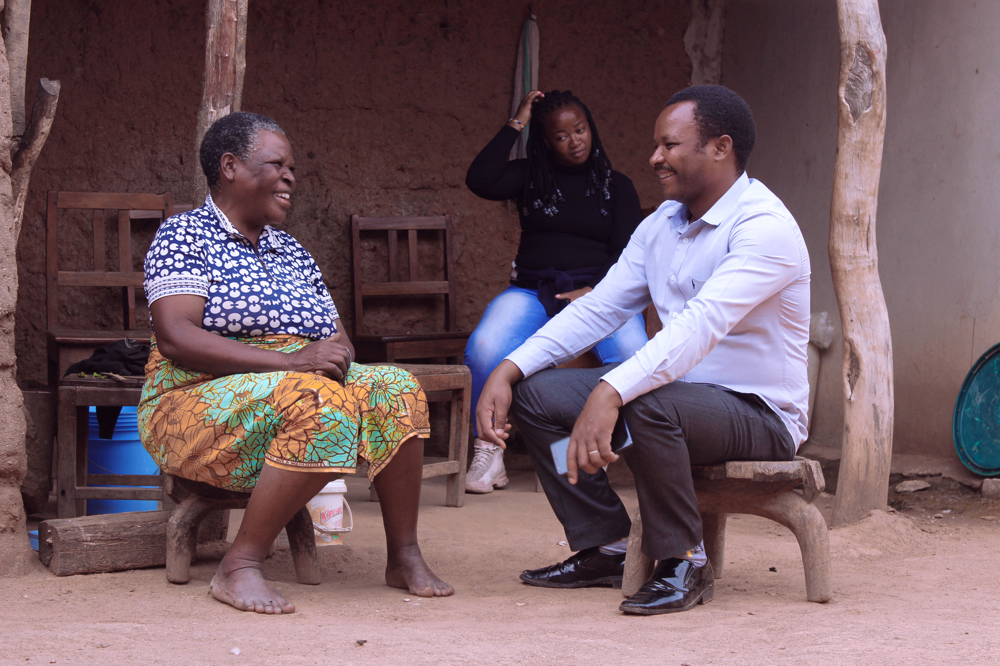

# 赫赫传统信仰与祖灵—基督教祈福（Hehe）

<!-- 来源：CC BY-SA 4.0 | https://commons.wikimedia.org/wiki/File:Exchanging_ideas_while_having_fun_at_home_in_a_special_place_that_is_traditionally_prepared_with_Hehe_traditional_seats_from_Iringa_-_Tanzania,_chairs_known_as_vigoda_(hehe_slang)_from_Hehe_tribe.jpg -->

## 概述

**赫赫人（Hehe）** 主要分布于坦桑尼亚伊林加高原一带。公开概述记述：传统宇宙强调祖先与酋长权威伦理；**Kalenga／Mkwawa heritage**（卡伦加／姆克瓦瓦抗殖民与酋长遗产公开史）见于地方纪念；岁时可见 **Kuhongela** 收获感恩公开层；祖先敬意常称 **Mahoka** 等相关公开概念（**Mahoka ancestral CONCEPT**）。今日多数受基督教影响，农牧与高原生计塑造节庆。本条目为教育概览；**不提供**献牲或可冒充仪者的步骤。与苏库马、尼亚姆韦齐、贝纳等条目区域不同，不可合并。

## 核心观念（祈福 / 功德 / 祈祷如何被理解）

祈福常被理解为：通过对祖先（Mahoka CONCEPT）的敬意、Kuhongela 收获感恩与教堂祈祷，求雨水、健康与社群和解。功德贴近：支持赫赫语与高原农业教育；尊重 Kalenga／Mkwawa 历史纪念。访客的「福」体现为：尊重历史纪念，不把抗殖民史写成战争游戏。

## 典型仪式

### 1. Kalenga／Mkwawa heritage（公开遗产／概念层）
- **场合**：伊林加高原公开史与文化纪念。
- **主要步骤（概念层）**：理解 **Kalenga／Mkwawa heritage** 作为酋长权威与抗殖民记忆的公开层。**止于历史—文化说明**；不以战争闯关。
- **物品**：从略。
- **谁来举行**：社群与文化机构；用户仅氛围／观礼，不可主持。

### 2. Kuhongela harvest（公开节庆层）
- **场合**：农事收获周期公开记述。
- **主要步骤（概念层）**：理解 **Kuhongela** 作为收获感恩与社群互惠公开层。**止于公开文化层**；禁止复现封闭祭仪。
- **物品**：从略。
- **谁来举行**：家庭与社群；用户仅观礼。

### 3. Mahoka ancestral CONCEPT（祖先概念层）
- **场合**：家庭危机、丧葬、伦理教导公开记述。
- **主要步骤（概念层）**：**Mahoka ancestral CONCEPT**——理解祖先在伦理中的位置。**禁止**复现祭仪；用户不可主持。
- **物品**：从略。
- **谁来举行**：家庭与长者；外人／用户仅概念认知。

## 日常与节庆

优先伊林加高原公开文化层；注意与邻近高原族群区分。教堂崇拜与 Kuhongela 公开层可并行理解。

## 注意与尊重

**勿消费殖民战争创伤。** 禁止献牲操作化。Mahoka 仅 CONCEPT。摄影须许可。

## 手机互动适合度（Three.js 评估草稿）

- **档位：** B 仅氛围或图文场景
- **敏感度：** 高
- **判断：** **仅氛围／无用户主持。** Kalenga／Mkwawa、Kuhongela 可说明；Mahoka ancestral CONCEPT；祭仪与战争不可游戏化。
- **若做成互动：** 只做地理—信仰光谱说明。
- **红线：** 禁止献牲、冒充仪者、战争闯关。
- **评估状态：** 待后期统一评估

## 参考来源

- https://www.britannica.com/topic/Hehe
- https://www.britannica.com/place/Iringa
- https://www.britannica.com/place/Tanzania
