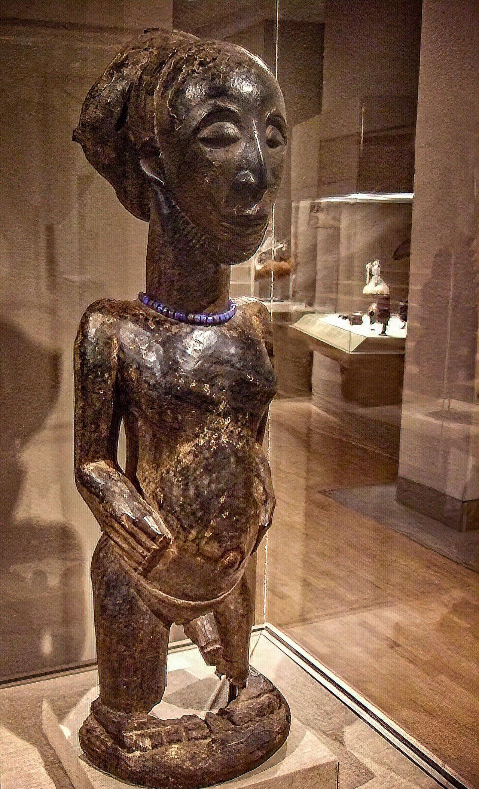

# 赫姆巴传统信仰与祖先雕像祈福（Hemba）

<!-- 来源：CC BY-SA 4.0 | https://commons.wikimedia.org/wiki/File:Standing_Male_ancestor_figure_(singiti)_Hemba_peoples_Niombo_group_late_19th-early_20th_century_Dallas_Museum_of_Art.jpg -->

## 概述

**赫姆巴人（Hemba）** 分布于刚果民主共和国东南（坦噶尼喀湖西侧相关地带）。公开艺术史以祖先雕像闻名——**极高敏感，本卡仅概念提及，绝不提供操作或「激活」描写**。今日并存基督教。教育概览；**严禁**法器／雕像仪轨操作化。与松格、卢巴、永贝等中非艺术—宗教条目区分。

## 核心观念（祈福 / 功德 / 祈祷如何被理解）

祈福常被理解为：通过对祖先的敬意与教堂祈祷，求健康、丰收与社群秩序。功德贴近：支持去殖民艺术返还中的来源社群声音。访客的「福」体现为：不把祖先雕像写成可收集装备。

## 典型仪式

### 1. 祖先敬礼（概念层）
- **场合**：家庭危机、丧葬公开记述。
- **主要步骤（概念层）**：理解祖先在伦理中的位置。**禁止**复现祭仪。
- **物品**：从略。
- **谁来举行**：家庭与长者。

### 2. 祖先雕像传统（极高敏感，仅概念）
- **场合**：公开艺术史／民族志叙述。
- **主要步骤（概念层）**：知晓存在祖先雕像传统。**禁止**任何操作化、仿制通关。
- **物品**：从略。
- **谁来举行**：家族仪式权威（内部）。

### 3. 教堂崇拜（概念层）
- **场合**：主日、生命礼仪。
- **主要步骤（概念层）**：理解基督教公开层。**止于公开教会层**。
- **物品**：从略。
- **谁来举行**：教牧与会众。

## 日常与节庆

优先刚果东南公开研究；警惕艺术品黑市叙事。

## 注意与尊重

**严禁雕像猎奇与非法交易美化。** 关注文物返还。摄影须许可。

## 手机互动适合度（Three.js 评估草稿）

- **档位：** A 不建议做成操作型互动
- **敏感度：** 极高
- **判断：** 祖先雕像不可游戏化。
- **若做成互动：** 不建议；最多静态艺术伦理说明。
- **红线：** 禁止雕像通关、献牲、冒充仪者。
- **评估状态：** 待后期统一评估

## 参考来源

- https://www.britannica.com/topic/Hemba
- https://www.britannica.com/place/Democratic-Republic-of-the-Congo
- https://www.britannica.com/topic/African-art
