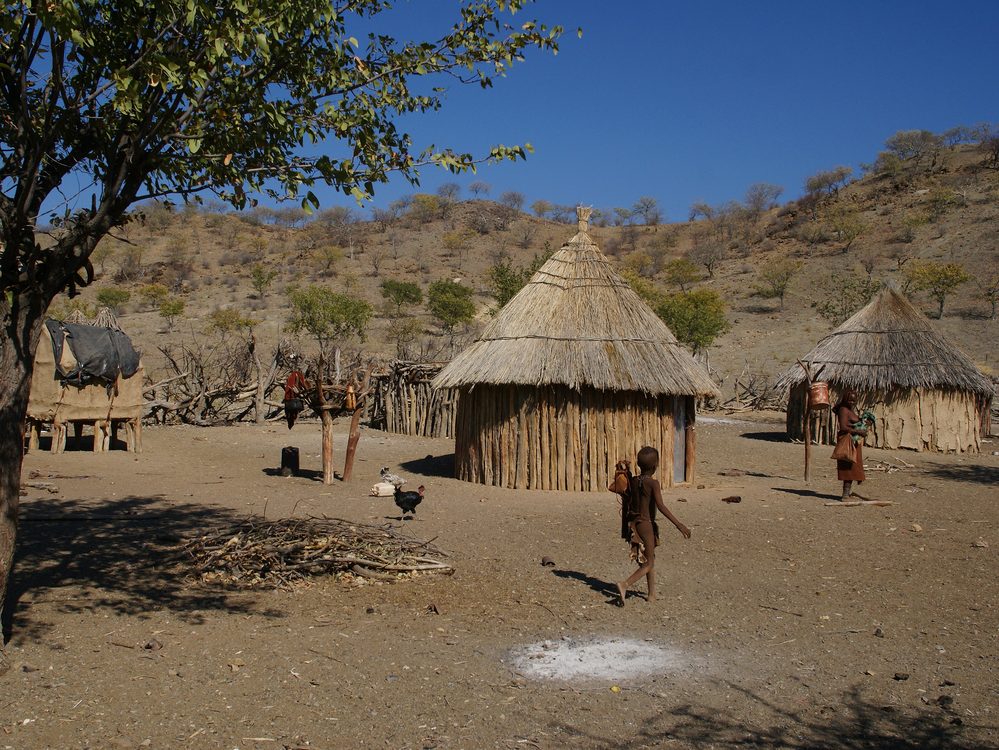

# 希姆巴／圣火与祖先之道（Himba／Okuruwo）

<!-- 来源：CC BY-SA 4.0 | https://commons.wikimedia.org/wiki/File:Himba_village.jpg -->

## 概述

**希姆巴人（OvaHimba）** 是纳米比亚西北 Kaokoveld 与安哥拉边境一带的班图语族牧民，语言为 OtjiHimba（赫雷罗语变体）。大英百科在 **Herero** 条下指出希姆巴为密切相关群体之一。公开民族志与纳米比亚活态博物馆等教育材料记述：希姆巴信仰创造者 **Mukuru**（较遥远），更日常的是祖先灵作为中介赐福或降祸；每个家宅（*onganda*）在主屋与畜栏之间保有 **okuruwo（圣火）**，由火守护者照管，象征活人与祖先的连结。纳米比亚相关非物质文化遗产材料亦概述 Okuruwo 实践见于婚礼、命名、割礼、迁居与求福等场合。本条目为教育性概览；**不提供**圣火点燃／祈祷操作、割礼或成丁步骤、疗愈脚本或任何可复现仪轨。

## 核心观念（祈福 / 功德 / 祈祷如何被理解）

祈福常被理解为：透过祖先向 Mukuru 转达祈求，求雨、牛群繁殖与家宅平安；Mukuru 主要赐福，祖先则可福可祸。功德贴近：维持圣火不熄、履行氏族义务、由指定男性（公开材料称 *Ondangere* 等职分）代表家宅呼请祖先。访客的「福」体现为：把圣火理解为不可擅入的家庭圣地，而非旅游「许愿营火」。

## 典型仪式

### 1. Okuruwo 圣火照管与呼请祖先（限制性公共知识层）
- **场合**：家宅日常与危机、求福、疗愈与重要生命礼仪。
- **主要步骤（概念层）**：教育材料概括圣火应保持阴燃／延续，火守护者代表家庭与祖先沟通；相关非遗材料提到颂祖与洒水等象征行为。**仅概念介绍**；禁止任何操作教程。
- **物品**：圣火位置、mopane 等薪材在公开记述中被提及；现场细节从略。
- **谁来举行**：火守护者／家宅有职分者；外人不得主持。

### 2. 生命礼仪中的祖先祝福（概念层）
- **场合**：公开材料列举传统婚礼、命名、迎新生儿、割礼、迁入新家宅、为新财物求福等。
- **主要步骤（概念层）**：在圣火处由职分者呼请祖先赐福。**不提供**步骤；涉及身体切割的礼仪仅作名称层提及。
- **物品**：从略。
- **谁来举行**：氏族／家宅指定者与亲属。

### 3. 牧畜、家宅空间与双系氏族生活（概念层）
- **场合**：半游牧季节迁徙与扩展家庭共居。
- **主要步骤（概念层）**：圣火与神圣畜群共同维系「人与祖先的正当关系」这一公开叙事；继承常呈现母系财产与父系社会地位等复杂规则。**仅概念介绍**。
- **物品**：圆形家宅、畜栏外观（概念）。
- **谁来举行**：扩展家庭全体在习俗框架内参与。

## 日常与节庆

赭石黄油妆、发型与饰物标识年龄与社会地位，常被摄影文化消费；请把外观与圣火信仰分开理解。尊重纳米比亚法律、希姆巴社群对摄影与圣地的规范，以及旱季牧畜迁徙的现实需求。

## 注意与尊重

**勿把 okuruwo 写成可打卡的「许愿火塘」。** 勿模仿圣火祈祷或购买「希姆巴仪式体验」。涉及成丁与身体改造的礼仪仅作概念认知。优先希姆巴／赫雷罗社群与纳米比亚文化机构口径。

## 手机互动适合度（Three.js 评估草稿）

- **档位：** A 不可做成关卡
- **敏感度：** 高
- **判断：** 圣火是家宅与祖先通道的核心，旅游化模拟极易冒犯；成丁等礼仪亦不可互动。取 A：只读牧区地理与尊重指引，不提供火塘操作。
- **若做成互动：** 不提供操作步骤。仅可考虑只读 Kaokoveld 地图、Mukuru／祖先中介概念词条与「禁止模拟 okuruwo」警示。
- **红线：** 禁止模拟圣火祈祷、冒充火守护者、复现割礼／成丁，或以真仪名称作胜负。
- **评估状态：** 待后期统一评估

## 参考来源

- https://www.britannica.com/topic/Herero
- https://www.lcfn.info/ovahimba/information/ethnology
- https://ich.unesco.org/doc/download.php?versionID=83949
