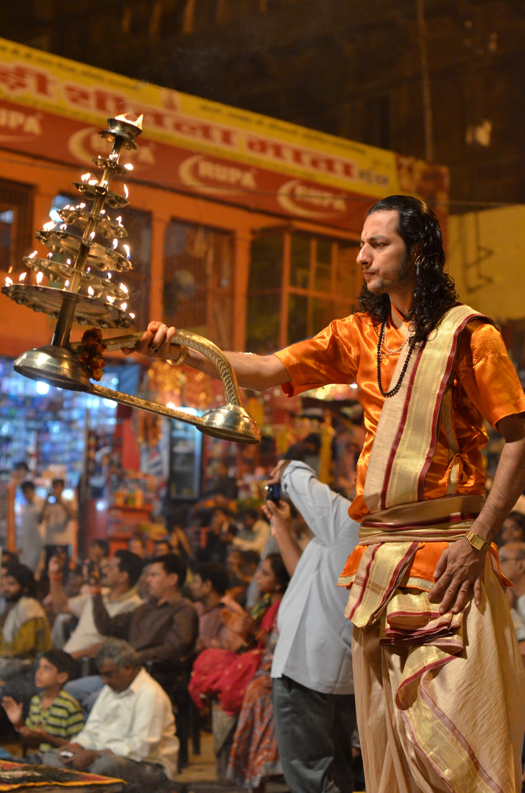

# 印度教

<!-- 来源：CC BY 2.0 | https://commons.wikimedia.org/wiki/File:Ceremony_aarti,_Hindu_Puja_India_b.jpg -->

## 概述

印度教内部流派、神祇与地方习俗极为繁复，却常共享一套以**奉献（bhakti）**和仪轨来维系人神关系的生活节奏。家庭神龛与神庙中的 *puja*（普迦）、渊源更古的火祭 *yajna*、亲见圣像时的 *darshan*，以及为满愿而持守的誓愿斋戒 *vrata*，是理解“祈福—感恩—还愿”的重要钥匙。崇拜可以把神当作贵客来唤醒、沐浴、献食与旋灯（***aarti***），使日常时间充满与神圣的往来；供养之后领受 ***prasada***（福食／已献供物）是广泛可见的恩宠循环。

## 核心观念（祈福 / 功德 / 祈祷如何被理解）

神透过形象（*murti*）临在，信徒以花、果、香、灯与颂歌表达敬意。*Darshan* 强调“看见也被看见”的相互目光，本身即是恩宠体验。业（*karma*）与法（*dharma*）的框架下，善行、布施与誓愿可积累福德、清偿心愿或净化身心；最终取向亦可指向解脱（*moksha*）。因此祈福不必然是功利交易，而常是责任、情感与宇宙秩序的再对齐。不同派别对祭司角色与家庭自修的比重不同，但“供养—领受 *prasada*”的循环与 *aarti* 旋灯广泛可见。

## 典型仪式

### 1. 普迦（puja）与 Aarti、Prasad
- **场合**：家庭每日晨昏；神庙定时崇拜；节日延长版。
- **主要步骤**：唤醒圣像；象征性沐浴与着装；献花、香、灯、食；行 ***aarti*** 旋灯；绕行；分发 ***prasada***（福食）。保留 puja 作为核心框架。
- **物品**：*thali* 盘、灯盏、香、花、水、食品、钟铃。
- **谁来举行**：家庭成员；神庙由 *pujari* 主持，信众排队领受。

### 2. 火祭（yajna / homa）
- **场合**：婚礼、新居／神像开光、公共祈雨祈福、特定吠陀仪轨日。
- **主要步骤**：筑火坛；祭司高声诵曼陀罗；以酥油、谷物等投入圣火，象征供物上达。保留 yajna 命名；不提供可复现投火教程。
- **物品**：圣火、木柴、酥油、祭匙、祭坛界线。
- **谁来举行**：受训祭司主导；赞助家庭在场随喜。

### 3. 誓愿（vrata）与圣见（darshan）
- **场合**：埃卡达希等斋日、女神节期、朝圣季节。
- **主要步骤**：发愿持斋或完成指定善行；期满赴神庙求 *darshan*；常伴布施穷人。保留 vrata／darshan 命名。
- **物品**：视誓愿而定的灯、衣、食物等。
- **谁来举行**：个人或妇女团体尤常见；朝圣可举家同行。

## 日常与节庆

家庭 *puja* 是最普遍的日常宗教行为。排灯节、霍利节、九夜节、湿婆之夜等，把公共狂欢与严格斋戒并置。诞生、婚礼、丧礼皆嵌入祝祷与净化。南印度与北印度庙制、饮食禁忌差异显著，旅人宜入乡问俗。

当代城市中，简化版十五分钟家庭崇拜与大型电视／网络法会并存；但火祭与部分神庙内殿规定仍强调专业与洁净规则。理解印度教祈福，需要把“恩宠体验”和“义务性达磨”放在同一视野，而不是只看许愿清单。

巡礼（*yatra*）把身体行走转化为祈福：河岸、山寺与四大僧伽道场吸引成千上万誓言者。旅途中的艰难本身常被理解为奉献的一部分。

## 注意与尊重

种姓、性别与神庙准入规定各地不同，非印度教徒可能无法进入内殿。勿用手触摸圣像或抢拍祭司动作。密咒与部分性力派仪轨有传承限制，公开材料仅能概念介绍。素食／血食供养因神祇而异，切勿想当然混用。

## 手机互动适合度（Three.js 评估草稿）

- **档位：** C 可做致敬小品（非真仪）
- **敏感度：** 中
- **判断：** 旋灯 aarti、献花与排队求 darshan 是神庙访客常见短互动；完整火祭与内殿触碰则不可。取灯花致敬小品，严格避开祭司科仪。
- **若做成互动：** 手机手势练习（致敬小品，非 pujari 科仪）：

1. 绕圆形拖拽一盏灯作 arti 意象。
2. 献上花朵到托盘。
3. 点按领取 prasada 说明卡（非真圣餐化）。
4. 标题如「灯旋一瞥」，不用“完成普迦”作胜负。
- **红线：** 禁止触摸圣像、复现 homa 曼陀罗投火或密咒关卡。
- **评估状态：** 待后期统一评估

## 参考来源

- https://ich.unesco.org/en/RL/durga-puja-in-kolkata-00703
- https://www.metmuseum.org/-/media/files/learn/for-educators/publications-for-educators/sseasia.pdf
- https://www.britishmuseum.org/collection/object/A_2026-3006-1-56
